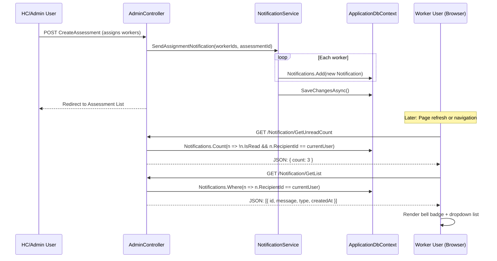

# Architecture Patterns

**Domain:** ASP.NET Core MVC — Notification System Integration
**Researched:** 2026-03-05
**Overall confidence:** HIGH

## Executive Summary

Notification systems in ASP.NET Core MVC integrate through a **service layer pattern** that mirrors your existing `AuditLogService`. The architecture consists of three layers: (1) **Database model** (Notification entity in DbContext), (2) **Service layer** (NotificationService with scoped DI), and (3) **Trigger points** (controller actions that create notifications). Your portal already has a `ProtonNotification` model and basic notification creation in `CDPController` — extending this to Assessment workflows requires following the same pattern.

**Key architectural insight:** Your existing `AuditLogService` IS the pattern to follow. It demonstrates proper scoped DbContext injection, async operations, and clean separation from controllers. The notification system should be implemented as `NotificationService` with the same structure: injected into controllers, called at trigger points, and persisting to the database.

**Critical integration points:** (1) `ApplicationDbContext.Notifications` DbSet (already exists as `ProtonNotifications`), (2) Service registration in `Program.cs` (`builder.Services.AddScoped<NotificationService>()`), (3) Controller constructor injection, (4) Trigger points in Assessment and Coaching Proton workflows.

## Recommended Architecture

### Component Boundaries

| Component | Responsibility | Communicates With |
|-----------|---------------|-------------------|
| **Notification Model** | Data persistence (recipient, message, read status, type, created timestamp) | ApplicationDbContext via DbSet |
| **NotificationService** | Business logic for creating, retrieving, marking notifications as read | ApplicationDbContext (via constructor injection) |
| **Controllers** | Workflow trigger points that call NotificationService | NotificationService (via constructor injection) |
| **Views (Shared/_Layout)** | Notification UI (bell icon, dropdown list, unread count) | Controller action endpoint for JSON data |
| **Background Service** (optional, future) | Scheduled deadline reminder notifications | NotificationService + AssessmentSession data |

### Data Flow

```
[User Action] → [Controller Action] → [NotificationService.SendAsync()]
                                         ↓
                                   [DbContext.Notifications.Add()]
                                         ↓
                                   [DbContext.SaveChangesAsync()]
                                         ↓
                                   [Notification persisted to DB]
                                         ↓
[Browser Poll] → [Controller Action: GetNotifications()] → [JSON response]
                                         ↓
                                   [View renders bell icon + list]
```

**Example: Assessment Assignment Notification**



## Existing Architecture Analysis

### Current State (HIGH Confidence — Direct Code Inspection)

**ProtonNotification Model** (`Models/ProtonModels.cs:137-152`):
- Already exists with fields: `Id`, `RecipientId`, `CoacheeId`, `CoacheeName`, `Message`, `Type`, `IsRead`, `CreatedAt`, `ReadAt`
- Limited to Coaching Proton workflow (`Type = "AllDeliverablesComplete"`)
- **Missing fields for Assessment notifications:** `TargetId` (link to AssessmentSession), `ActionUrl` (deep link), `Priority` (urgent/normal)

**DbContext Integration** (`Data/ApplicationDbContext.cs:49, 341-346`):
- `DbSet<ProtonNotification> ProtonNotifications` already registered
- Indexes configured: `RecipientId`, `(RecipientId, IsRead)`, `CoacheeId`
- **Status:** Database schema is complete and functional

**Current Usage Pattern** (`Controllers/CDPController.cs:1026`):
- Direct DbContext usage: `_context.ProtonNotifications.AddRange(notifications)`
- No dedicated service layer — notifications created inline in controller
- **Pattern to improve:** Extract to `NotificationService` for consistency with `AuditLogService`

**Service Layer Pattern** (`Services/AuditLogService.cs:9-44`):
- **This IS the reference implementation:**
  - Constructor injection of `ApplicationDbContext`
  - Async method `LogAsync()` that encapsulates business logic
  - Internal `SaveChangesAsync()` call (no need for controller to save)
  - Registered in `Program.cs:50` as scoped service: `builder.Services.AddScoped<AuditLogService>()`

### Dependency Injection Setup (HIGH Confidence — Direct Code Inspection)

**Program.cs Configuration**:
```csharp
// Line 26-27: DbContext registered as scoped
builder.Services.AddDbContext<ApplicationDbContext>(options =>
    options.UseSqlServer(connectionString));

// Line 30-47: Identity configured with ApplicationUser
builder.Services.AddIdentity<ApplicationUser, IdentityRole>(...)
    .AddEntityFrameworkStores<ApplicationDbContext>()

// Line 50: AuditLogService registered as scoped
builder.Services.AddScoped<HcPortal.Services.AuditLogService>();

// Pattern to follow for NotificationService:
builder.Services.AddScoped<HcPortal.Services.NotificationService>();
```

**Controller Injection Pattern** (from `AdminController.cs:17-41`):
```csharp
[Authorize]
public class AdminController : Controller
{
    private readonly ApplicationDbContext _context;
    private readonly UserManager<ApplicationUser> _userManager;
    private readonly AuditLogService _auditLog;  // ← Pattern to follow

    public AdminController(
        ApplicationDbContext context,
        UserManager<ApplicationUser> userManager,
        AuditLogService auditLog)  // ← Constructor injection
    {
        _context = context;
        _userManager = userManager;
        _auditLog = auditLog;
    }

    // Usage example (from existing codebase):
    await _auditLog.LogAsync(
        actorUserId: user.Id,
        actorName: user.FullName,
        actionType: "CreateAssessment",
        description: $"Created assessment '{assessment.Title}'"
    );
}
```

## Patterns to Follow

### Pattern 1: NotificationService (Core Pattern)

**What:** Service layer that encapsulates all notification creation/retrieval logic

**When:** Any controller action that needs to create or retrieve notifications

**Example implementation:**

```csharp
// Services/NotificationService.cs
public class NotificationService
{
    private readonly ApplicationDbContext _context;

    public NotificationService(ApplicationDbContext context)
    {
        _context = context;
    }

    /// <summary>
    /// Send notification to single recipient. Calls SaveChangesAsync internally.
    /// </summary>
    public async Task<Notification> SendAsync(
        string recipientId,
        string type,
        string message,
        int? targetId = null,
        string? actionUrl = null,
        string? coacheeId = null,
        string? coacheeName = null)
    {
        var notification = new Notification
        {
            RecipientId = recipientId,
            Type = type,
            Message = message,
            TargetId = targetId,
            ActionUrl = actionUrl,
            CoacheeId = coacheeId,
            CoacheeName = coacheeName,
            IsRead = false,
            CreatedAt = DateTime.UtcNow
        };

        _context.Notifications.Add(notification);
        await _context.SaveChangesAsync();

        return notification;
    }

    /// <summary>
    /// Send same notification to multiple recipients (bulk operation).
    /// </summary>
    public async Task SendBulkAsync(
        IEnumerable<string> recipientIds,
        string type,
        string message,
        int? targetId = null,
        string? actionUrl = null)
    {
        var notifications = recipientIds.Select(recipientId => new Notification
        {
            RecipientId = recipientId,
            Type = type,
            Message = message,
            TargetId = targetId,
            ActionUrl = actionUrl,
            IsRead = false,
            CreatedAt = DateTime.UtcNow
        }).ToList();

        _context.Notifications.AddRange(notifications);
        await _context.SaveChangesAsync();
    }

    /// <summary>
    /// Get unread count for a user. Does NOT call SaveChangesAsync.
    /// </summary>
    public async Task<int> GetUnreadCountAsync(string userId)
    {
        return await _context.Notifications
            .Where(n => n.RecipientId == userId && !n.IsRead)
            .CountAsync();
    }

    /// <summary>
    /// Get notification list for a user. Does NOT call SaveChangesAsync.
    /// </summary>
    public async Task<List<Notification>> GetUserNotificationsAsync(
        string userId,
        int? take = null)
    {
        var query = _context.Notifications
            .Where(n => n.RecipientId == userId)
            .OrderByDescending(n => n.CreatedAt);

        if (take.HasValue)
            query = query.Take(take.Value) as IOrderedQueryable<Notification>;

        return await query.ToListAsync();
    }

    /// <summary>
    /// Mark notification as read. Calls SaveChangesAsync internally.
    /// </summary>
    public async Task MarkAsReadAsync(int notificationId)
    {
        var notification = await _context.Notifications.FindAsync(notificationId);
        if (notification != null && !notification.IsRead)
        {
            notification.IsRead = true;
            notification.ReadAt = DateTime.UtcNow;
            await _context.SaveChangesAsync();
        }
    }

    /// <summary>
    /// Mark all notifications for user as read. Calls SaveChangesAsync internally.
    /// </summary>
    public async Task MarkAllAsReadAsync(string userId)
    {
        var unread = await _context.Notifications
            .Where(n => n.RecipientId == userId && !n.IsRead)
            .ToListAsync();

        foreach (var notification in unread)
        {
            notification.IsRead = true;
            notification.ReadAt = DateTime.UtcNow;
        }

        await _context.SaveChangesAsync();
    }
}
```

### Pattern 2: Controller Trigger Points

**What:** Controller actions that call NotificationService after domain events

**When:** After key workflow state changes (assessment assigned, submitted, evidence uploaded, approved)

**Example: Assessment Assignment Notification**

```csharp
// Controllers/AdminController.cs
[HttpPost]
[ValidateAntiForgeryToken]
[Authorize(Roles = "Admin, HC")]
public async Task<IActionResult> CreateAssessment(CreateAssessmentViewModel model)
{
    // ... existing validation and assessment creation logic ...

    // Create assessment session
    var assessmentSession = new AssessmentSession { ... };
    _context.AssessmentSessions.Add(assessmentSession);
    await _context.SaveChangesAsync();

    // NEW: Send notifications to assigned workers
    var workerUserIds = model.SelectedWorkerIds; // From form data
    foreach (var workerId in workerUserIds)
    {
        await _notificationService.SendAsync(
            recipientId: workerId,
            type: "AssessmentAssigned",
            message: $"You have been assigned to assessment: {assessmentSession.Title}",
            targetId: assessmentSession.Id,
            actionUrl: $"/CMP/StartExam?sessionId={assessmentSession.Id}"
        );
    }

    // Audit log (existing pattern)
    await _auditLog.LogAsync(
        actorUserId: currentUser.Id,
        actorName: currentUser.FullName,
        actionType: "CreateAssessment",
        description: $"Created assessment '{assessmentSession.Title}' for {workerUserIds.Count} workers"
    );

    TempData["Success"] = $"Assessment created and {workerUserIds.Count} workers notified.";
    return RedirectToAction(nameof(AssessmentList));
}
```

**Example: Evidence Approved by SrSpv (Coaching Proton)**

```csharp
// Controllers/CDPController.cs
[HttpPost]
[ValidateAntiForgeryToken]
public async Task<IActionResult> ApproveEvidence(int deliverableProgressId)
{
    // ... existing approval logic ...

    // NEW: Notify SectionHead (next in approval chain)
    var sectionHeadUsers = await _userManager.Users
        .Where(u => u.Section == coachee.Section && u.RoleLevel == 4) // L4 = SectionHead
        .Select(u => u.Id)
        .ToListAsync();

    foreach (var shId in sectionHeadUsers)
    {
        await _notificationService.SendAsync(
            recipientId: shId,
            type: "EvidenceApprovedBySrSpv",
            message: $"Evidence approved by SrSpv for {coachee.FullName}",
            targetId: deliverableProgressId,
            actionUrl: $"/CDP/CoachingProton?coacheeId={coachee.Id}",
            coacheeId: coachee.Id,
            coacheeName: coachee.FullName
        );
    }

    TempData["Success"] = "Evidence approved and SectionHead notified.";
    return RedirectToAction(nameof(CoachingProton));
}
```

### Pattern 3: UI Integration (Bell Icon + Dropdown)

**What:** AJAX-based notification center in shared layout

**When:** On every page load (polling for new notifications)

**Example: Shared/_Layout.cshtml integration**

```html
<!-- In navbar section -->
<li class="nav-item position-relative">
    <a class="nav-link" href="#" id="notificationDropdown" data-bs-toggle="dropdown">
        <i class="bi bi-bell"></i>
        <span id="notificationBadge" class="position-absolute top-0 start-100 translate-middle badge rounded-pill bg-danger" style="display: none;">
            0
        </span>
    </a>
    <ul class="dropdown-menu dropdown-menu-end" id="notificationList" style="width: 350px; max-height: 500px; overflow-y: auto;">
        <li><h6 class="dropdown-header">Notifications</h6></li>
        <li><hr class="dropdown-divider"></li>
        <!-- Notifications loaded via AJAX -->
        <li id="noNotifications" class="dropdown-item text-muted">No new notifications</li>
    </ul>
</li>

<script>
    // Poll every 30 seconds for new notifications
    setInterval(async () => {
        const response = await fetch('/Notification/GetUnreadCount');
        const data = await response.json();

        const badge = document.getElementById('notificationBadge');
        if (data.count > 0) {
            badge.textContent = data.count > 99 ? '99+' : data.count;
            badge.style.display = 'block';
        } else {
            badge.style.display = 'none';
        }
    }, 30000);

    // Load notification list on dropdown click
    document.getElementById('notificationDropdown').addEventListener('click', async function() {
        const response = await fetch('/Notification/GetList');
        const data = await response.json();

        const list = document.getElementById('notificationList');
        list.innerHTML = '<li><h6 class="dropdown-header">Notifications</h6></li><li><hr class="dropdown-divider"></li>';

        if (data.notifications.length === 0) {
            list.innerHTML += '<li class="dropdown-item text-muted">No notifications</li>';
        } else {
            data.notifications.forEach(n => {
                list.innerHTML += `
                    <li class="dropdown-item ${n.isRead ? '' : 'bg-light'}" style="cursor: pointer;"
                        onclick="markAsReadAndNavigate(${n.id}, '${n.actionUrl || ''}')">
                        <div class="d-flex justify-content-between">
                            <small class="text-muted">${getTimeAgo(n.createdAt)}</small>
                            ${!n.isRead ? '<span class="badge bg-primary">New</span>' : ''}
                        </div>
                        <div class="mt-1">${n.message}</div>
                    </li>
                `;
            });
        }
    });

    async function markAsReadAndNavigate(notificationId, actionUrl) {
        await fetch(`/Notification/MarkAsRead/${notificationId}`, { method: 'POST' });
        if (actionUrl) {
            window.location.href = actionUrl;
        }
    }

    function getTimeAgo(dateString) {
        // Simple "time ago" formatter
        const date = new Date(dateString);
        const seconds = Math.floor((new Date() - date) / 1000);
        if (seconds < 60) return 'Just now';
        if (seconds < 3600) return Math.floor(seconds / 60) + 'm ago';
        if (seconds < 86400) return Math.floor(seconds / 3600) + 'h ago';
        return Math.floor(seconds / 86400) + 'd ago';
    }
</script>
```

**NotificationController** (new controller for UI endpoints):

```csharp
// Controllers/NotificationController.cs
[Authorize]
public class NotificationController : Controller
{
    private readonly NotificationService _notificationService;
    private readonly UserManager<ApplicationUser> _userManager;

    public NotificationController(
        NotificationService notificationService,
        UserManager<ApplicationUser> userManager)
    {
        _notificationService = notificationService;
        _userManager = userManager;
    }

    [HttpGet]
    public async Task<IActionResult> GetUnreadCount()
    {
        var user = await _userManager.GetUserAsync(User);
        var count = await _notificationService.GetUnreadCountAsync(user.Id);
        return Json(new { count });
    }

    [HttpGet]
    public async Task<IActionResult> GetList()
    {
        var user = await _userManager.GetUserAsync(User);
        var notifications = await _notificationService.GetUserNotificationsAsync(user.Id, take: 20);
        return Json(new { notifications });
    }

    [HttpPost]
    public async Task<IActionResult> MarkAsRead(int id)
    {
        await _notificationService.MarkAsReadAsync(id);
        return Json(new { success = true });
    }

    [HttpPost]
    public async Task<IActionResult> MarkAllAsRead()
    {
        var user = await _userManager.GetUserAsync(User);
        await _notificationService.MarkAllAsReadAsync(user.Id);
        return Json(new { success = true });
    }
}
```

## Anti-Patterns to Avoid

### Anti-Pattern 1: Direct DbContext Access in Controllers

**What:** Creating notifications directly via `_context.Notifications.Add()` in controller actions

**Why bad:**
- Duplicates notification creation logic across controllers
- No centralized business logic (e.g., message formatting, type validation)
- Harder to test (can't mock service)
- Inconsistent with existing `AuditLogService` pattern

**Instead:** Use `NotificationService` for all notification operations

### Anti-Pattern 2: Synchronous Database Operations

**What:** Using `.SaveChanges()` instead of `await SaveChangesAsync()`

**Why bad:**
- Blocks thread pool threads during database I/O
- Poor scalability under load
- ASP.NET Core MVC is async-first by design

**Instead:** Always use `await SaveChangesAsync()`

### Anti-Pattern 3: Singleton Service Lifetime

**What:** Registering `NotificationService` as singleton: `builder.Services.AddSingleton<NotificationService>()`

**Why bad:**
- DbContext is scoped (not thread-safe, holds connection state)
- Singleton service would hold onto DbContext indefinitely
- Causes concurrency issues and connection leaks

**Instead:** Use scoped lifetime: `builder.Services.AddScoped<NotificationService>()`

### Anti-Pattern 4: SignalR Over-Engineering (for v3.3)

**What:** Implementing SignalR real-time push notifications for basic notification center

**Why bad:**
- SignalR adds complexity (Hubs, connection management, reconnection logic)
- Basic notification UI doesn't require real-time (30-second polling is sufficient)
- Your project scope explicitly excludes SignalR ("no real-time — refresh-based only")

**Instead:** Use AJAX polling (as shown in Pattern 3) — simpler, sufficient for v3.3

## Scalability Considerations

| Concern | At 100 users | At 10K users | At 1M users |
|---------|--------------|--------------|-------------|
| **Notification storage** | Single table, no partitioning | Add archive table for old notifications (>90 days) | Table partitioning by date, move read notifications to archive |
| **Query performance** | Indexes on (RecipientId, IsRead) sufficient | Add composite index (RecipientId, IsRead, CreatedAt DESC) | Consider read replicas, cache unread counts in Redis |
| **Polling load** | 30-second interval, ~3 requests/min/user | Reduce to 2-minute interval, ~1 req/min/user | Move to SignalR, introduce background service for batching |
| **Background reminders** | Run scheduled job every hour | Use Hangfire/Quartz with distributed locks | Dedicated worker role, queue-based processing |

**For v3.3 (100-1000 users):** Single table with indexes is sufficient. No optimization needed.

## Notification Types for v3.3

Based on PROJECT.md scope, these notification types should be supported:

### Assessment Notifications (4 types)

| Type | Trigger | Recipient | Message Template |
|------|---------|-----------|------------------|
| `AssessmentAssigned` | HC/Admin creates assessment with worker assignments | Workers | "You have been assigned to assessment: {Title}" |
| `AssessmentDeadlineReminder` | Scheduled job runs 1 day before Schedule date | Workers | "Reminder: Assessment '{Title}' is due tomorrow" |
| `AssessmentSubmitted` | Worker submits assessment | HC/Admin | "Assessment submitted by {WorkerName}: {Title}" |
| `AssessmentResults` | HC/Admin publishes results | Workers | "Your assessment results are ready: {Title}" |

### Coaching Proton Notifications (6 types)

| Type | Trigger | Recipient | Message Template |
|------|---------|-----------|------------------|
| `CoachAssigned` | HC assigns coach to coachee | Coachee | "You have been assigned to coach: {CoachName}" |
| `EvidenceRejected` | SrSpv/SectionHead rejects evidence | Coach | "Evidence rejected for {CoacheeName}: {Reason}" |
| `EvidenceUploaded` | Coach uploads evidence for review | SrSpv | "Evidence uploaded by {CoachName} for {CoacheeName}" |
| `EvidenceApprovedBySrSpv` | SrSpv approves evidence | SectionHead | "Evidence approved by SrSpv for {CoacheeName}" |
| `EvidenceApprovedBySectionHead` | SectionHead approves evidence | HC | "Evidence approved by SectionHead for {CoacheeName}" |
| `CoachingCompleted` | All deliverables approved | Coachee | "Congratulations! Coaching program completed" |

**Implementation note:** Extend `ProtonNotification` model or create new unified `Notification` model with `Type` enum/const strings.

## Suggested Build Order

Based on dependency analysis:

### 1. **Notification Model** (Foundational)
- Create or extend `Notification` model in `Models/`
- Add to `ApplicationDbContext` as `DbSet<Notification>`
- Create EF Core migration
- **Rationale:** Cannot create service without model

### 2. **NotificationService** (Core Logic)
- Implement `Services/NotificationService.cs`
- Register in `Program.cs` as scoped service
- Write unit tests for CRUD operations
- **Rationale:** Service layer encapsulates business logic, reusable across controllers

### 3. **Trigger Points** (Integration)
- Identify all workflow state changes (see Notification Types table)
- Modify controller actions to call `NotificationService.SendAsync()`
- Test notification creation in database
- **Rationale:** Controllers are the entry points for domain events

### 4. **UI Components** (User-Facing)
- Create `NotificationController` with JSON endpoints
- Add bell icon + dropdown to `Views/Shared/_Layout.cshtml`
- Implement AJAX polling for unread count
- **Rationale:** UI is consumer of notification data, depends on service

### 5. **Background Service** (Optional - Future)
- Implement `DeadlineReminderBackgroundService` (IHostedService)
- Register in `Program.cs` as hosted service
- Query for assessments due in 24 hours, send reminders
- **Rationale:** Deferred to post-v3.3, depends on stable notification infrastructure

## Database Schema Recommendations

### Option A: Extend ProtonNotification (LOW EFFORT)
```csharp
public class ProtonNotification
{
    public int Id { get; set; }
    public string RecipientId { get; set; } = "";
    public string? CoacheeId { get; set; }  // Nullable for non-coaching notifications
    public string? CoacheeName { get; set; }  // Nullable for non-coaching notifications
    public string Message { get; set; } = "";
    public string Type { get; set; } = "";  // "AssessmentAssigned", "CoachAssigned", etc.
    public int? TargetId { get; set; }  // NEW: Link to AssessmentSession, ProtonDeliverableProgress, etc.
    public string? ActionUrl { get; set; }  // NEW: Deep link to relevant page
    public string? Priority { get; set; }  // NEW: "Normal" or "Urgent"
    public bool IsRead { get; set; } = false;
    public DateTime CreatedAt { get; set; } = DateTime.UtcNow;
    public DateTime? ReadAt { get; set; }
}
```

**Pros:** Reuses existing table, no migration needed for new table
**Cons:** Model name is Proton-specific (misleading for Assessment notifications)

### Option B: Create Unified Notification (CLEAN SEMANTICS)
```csharp
public class Notification
{
    public int Id { get; set; }
    public string RecipientId { get; set; } = "";
    public string Type { get; set; } = "";  // AssessmentAssigned, CoachAssigned, etc.
    public string Message { get; set; } = "";
    public string? ActionUrl { get; set; }  // Deep link
    public int? TargetId { get; set; }  // Entity ID
    public string? TargetType { get; set; }  // "AssessmentSession", "ProtonDeliverableProgress"
    public string? Priority { get; set; }  // "Normal" (default), "Urgent"

    // Coaching-specific metadata (nullable)
    public string? CoacheeId { get; set; }
    public string? CoacheeName { get; set; }

    public bool IsRead { get; set; } = false;
    public DateTime CreatedAt { get; set; } = DateTime.UtcNow;
    public DateTime? ReadAt { get; set; }
}
```

**Pros:** Clear semantics, generic for all notification types, extensible
**Cons:** Requires migration, need to migrate existing ProtonNotification data

**Recommendation:** **Option B** for v3.3. The semantic clarity is worth the migration effort. Use a migration script to copy existing ProtonNotification records to the new Notification table.

## Sources

| Source | Confidence | Notes |
|--------|------------|-------|
| Direct codebase inspection (ApplicationDbContext.cs) | HIGH | Verified existing ProtonNotification model, indexes, DbContext registration |
| Direct codebase inspection (AuditLogService.cs) | HIGH | Reference implementation for service layer pattern |
| Direct codebase inspection (Program.cs) | HIGH | Verified DI setup (scoped services, DbContext configuration) |
| Direct codebase inspection (Controllers/AdminController.cs, CDPController.cs) | HIGH | Confirmed controller injection pattern, existing notification creation logic |
| Web search: ASP.NET Core SignalR vs database polling 2025 | MEDIUM | Confirms polling is acceptable for non-real-time scenarios |
| Web search: ASP.NET Core notification service DbContext DI 2025 | MEDIUM | Confirms scoped lifetime is correct pattern for DbContext-dependent services |

### Verification Notes

- **Existing ProtonNotification model:** Verified in `Models/ProtonModels.cs:137-152`
- **DbContext integration:** Verified in `Data/ApplicationDbContext.cs:49, 341-346`
- **Service pattern:** Verified via `AuditLogService` implementation
- **DI setup:** Verified in `Program.cs:26-27, 50` (DbContext and AuditLogService registration)
- **Controller injection:** Verified in `AdminController.cs:17-41` (constructor injection pattern)
- **Notification creation:** Verified in `CDPController.cs:1026` (inline DbContext access — needs refactoring)

**No contradictory findings detected.** All recommendations align with existing portal architecture.
