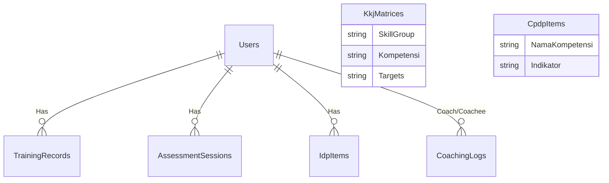

# Dokumentasi Database PortalHC_KPB

Dokumen ini memetakan struktur database yang digunakan dalam aplikasi PortalHC_KPB.

## 1. Informasi Server & Database

*   **Nama Database (Dev)**: `HcPortalDB_Dev`
*   **Platform**: SQL Server (LocalDB / SQLEXPRESS)
*   **Connection String (Dev)**: `Server=localhost\SQLEXPRESS;Database=HcPortalDB_Dev;User Id=hcportal_dev;Password=Dev123456!;TrustServerCertificate=True;MultipleActiveResultSets=true`

## 2. Ringkasan Daftar Tabel

Berikut adalah daftar tabel fisik yang ada di dalam database `HcPortalDB_Dev`:

| No | Nama Tabel (SQL) | Entity Model (C#) | Deskripsi Utama |
|:---:|---|---|---|
| 1 | `Users` | `ApplicationUser` | Menyimpan data akun login, profil karyawan, NIP, Jabatan, dan Role. |
| 2 | `AspNetRoles` | `IdentityRole` | Daftar Role akses (Admin, HC, Coach, Coachee, dll). |
| 3 | `TrainingRecords` | `TrainingRecord` | Histori pelatihan/training karyawan (Capability Building). |
| 4 | `CoachingLogs` | `CoachingLog` | Catatan sesi coaching/mentoring antara Coach dan Coachee. |
| 5 | `KkjMatrices` | `KkjMatrixItem` | Master data matriks kompetensi (KKJ) dan target level per jabatan. |
| 6 | `CpdpItems` | `CpdpItem` | Master data katalog pengembangan kompetensi (Silabus, Indikator). |
| 7 | `AssessmentSessions`| `AssessmentSession`| Penjadwalan dan skor assessment (OJT, OTS, dll). |
| 8 | `IdpItems` | `IdpItem` | Rencana pengembangan individual (Individual Development Plan). |
| 9 | `AspNetUserRoles` | - | Tabel relasi many-to-many antara Users dan Roles. |

---

## 3. Detail Tabel & Mapping

### 1. Tabel Users (Identity)
*   **SQL Table**: `Users` (Custom dari `AspNetUsers`)
*   **Model**: `ApplicationUser.cs`
*   **Fungsi**: Menyimpan data akun pengguna, profil karyawan, jabatan, dan role.
*   **Kolom Penting**:
    *   `Id` (PK, string guid)
    *   `FullName`, `NIP`
    *   `Position` (Jabatan)
    *   `Section` (Bagian: RFCC, NGP, dll)
    *   `Unit` (Unit Kerja spesifik)
    *   `RoleLevel` (Int: 1=Admin ... 6=Coachee)
*   **Penggunaan Halaman**:
    *   **Login**: Autentikasi user.
    *   **CDP / Progress**: Menampilkan profil user (Nama, Posisi, Unit).
    *   **CMP / Records**: Filter data berdasarkan Section/Unit user.
    *   **BP / Talent Profile**: Menampilkan detail profil talent.

### 2. Tabel TrainingRecords
*   **SQL Table**: `TrainingRecords`
*   **Model**: `TrainingRecord.cs`
*   **Fungsi**: Menyimpan riwayat pelatihan/training karyawan (Capability Building).
*   **Relasi**: `UserId` -> `Users.Id`
*   **Kolom Penting**:
    *   `Judul` (Nama Training)
    *   `Kategori` (PROTON, OJT, MANDATORY)
    *   `Tanggal`, `ValidUntil`
    *   `Status` (Passed, Valid, Expiring)
    *   `CertificateType`, `SertifikatUrl`
*   **Penggunaan Halaman**:
    *   **CMP / Records**:
        *   Menampilkan list worker & status training (Sudah/Belum).
        *   Menghitung persentase kelengkapan training.
    *   **CMP / WorkerDetail**: Menampilkan detail histori training satu karyawan.

### 3. Tabel CoachingLogs
*   **SQL Table**: `CoachingLogs`
*   **Model**: `CoachingLog.cs`
*   **Fungsi**: Mencatat sesi coaching antara Coach dan Coachee (Proton Coaching/Mentoring).
*   **Relasi**:
    *   `CoachId` -> `Users.Id` (Logical, indexed)
    *   `CoacheeId` -> `Users.Id` (Logical, indexed)
*   **Kolom Penting**:
    *   `TrackingItemId` (Referen ke item kompetensi, saat ini manual)
    *   `SubKompetensi`, `Deliverables`
    *   `CatatanCoach`, `CoacheeCompetencies`
    *   `Kesimpulan`, `Result`
*   **Penggunaan Halaman**:
    *   **CDP / Coaching**: Menampilkan histori coaching log user (sebagai coach maupun coachee).

### 4. Tabel KkjMatrices (Master Data)
*   **SQL Table**: `KkjMatrices`
*   **Model**: `KkjMatrixItem` (in `KkjModels.cs`)
*   **Fungsi**: Master data matriks kompetensi (KKJ) dan target level per jabatan.
*   **Kolom Penting**:
    *   `SkillGroup`, `SubSkillGroup`
    *   `Kompetensi`, `Indeks`
    *   `Target_{Jabatan}` (Column dinamis per jabatan, misal `Target_SectionHead`, `Target_Operator_GSH_8_11`)
*   **Penggunaan Halaman**:
    *   **CMP / KKJ**: Menampilkan tabel matriks kompetensi secara penuh.

### 5. Tabel CpdpItems (Master Data)
*   **SQL Table**: `CpdpItems`
*   **Model**: `CpdpItem` (in `KkjModels.cs`)
*   **Fungsi**: Master data mapping kompetensi ke indikator perilaku dan silabus (Catalog).
*   **Kolom Penting**:
    *   `NamaKompetensi`
    *   `IndikatorPerilaku`, `DetailIndikator`
    *   `Silabus`, `TargetDeliverable`
*   **Penggunaan Halaman**:
    *   **CMP / Mapping**: Menampilkan tabel katalog pengembangan kompetensi (CPDP).

### 6. Tabel AssessmentSessions
*   **SQL Table**: `AssessmentSessions`
*   **Model**: `AssessmentSession.cs`
*   **Fungsi**: Menyimpan jadwal dan status assessment karyawan.
*   **Relasi**: `UserId` -> `Users.Id`
*   **Status Implementasi**:
    *   Tabel **SUDAH ADA** di database.
    *   Halaman **CMP / Assessment** saat ini masih menggunakan **Mock Data (Hardcoded)** di Controller, belum mengambil dari database ini.
*   **Kolom Penting**: `Title`, `Category`, `Schedule`, `Status`, `Score`.

### 7. Tabel IdpItems
*   **SQL Table**: `IdpItems`
*   **Model**: `IdpItem.cs`
*   **Fungsi**: Item individual development plan (rencana pengembangan).
*   **Relasi**: `UserId` -> `Users.Id`
*   **Status Implementasi**:
    *   Tabel **SUDAH ADA** di database.
    *   Halaman **CDP / Progress** saat ini menggunakan model `TrackingItem` (Non-DB) dengan data hardcoded untuk visualisasi progress.
    *   Tabel ini disiapkan untuk fitur IDP yang dinamis di masa depan.

---

## 4. Catatan Tambahan

### Entitas Non-Tabel (View Models)
Berikut adalah model yang terlihat di kode tetapi **TIDAK** memiliki tabel database (data masih hardcoded/dummy):

1.  **TrackingItem**: Digunakan di `CDPController` > `Progress` untuk menampilkan progress tracking (Safe Work Practice, dll). Data di-generate manual di kode.
2.  **CareerHistory**: Digunakan di `BPController` > `TalentProfile`. Data masih dummy.
3.  **PerformanceRecord**: Digunakan di `BPController` > `TalentProfile`. Data masih dummy.
4.  **PointActivity**: Digunakan di `BPController` > `PointSystem`. Data masih dummy.
5.  **EligibilityCriteria**: Digunakan di `BPController` > `EligibilityValidator`. Data masih dummy.

### Diagram Relasi Sederhana

