# 📋 HC Portal KPB - Development Workplan

> **Dokumen perencanaan pengembangan lengkap untuk deployment ke server internal Kilang Pertamina Balikpapan**

---

## 📊 Ringkasan Status Saat Ini

### Posisi Pengembangan Website

| Aspek | Status | Progress |
|-------|--------|----------|
| **Frontend UI/UX** | ✅ Selesai | 90% |
| **Navigasi & Routing** | ✅ Selesai | 100% |
| **Role-Based Access Control** | ✅ Selesai | 100% |
| **Authentication System** | ✅ Selesai | 100% |
| **Mock Data** | ⚠️ Perlu Migrasi | Sementara |
| **Database SQL Server** | ❌ Belum | 0% |
| **CRUD Operations** | ❌ Belum | 0% |
| **File Upload System** | ❌ Belum | 0% |

### Tahap Development: **HIGH-FIDELITY PROTOTYPE → PRE-PRODUCTION**

Website ini saat ini berada di tahap **Prototype** yang sudah sangat matang secara visual dan navigasi. Untuk go-live, diperlukan migrasi ke database production dan implementasi CRUD operations.

---

## 🖥️ Target Infrastruktur Deployment

| Komponen | Spesifikasi | Keterangan |
|----------|-------------|------------|
| **Web App** | Windows Server + IIS | On-premise server internal KPB |
| **Server** | VM / Server fisik (2 vCPU, 8 GB RAM) | Cukup untuk 400-600 users |
| **Database** | SQL Server 2022 | Enterprise standard |
| **Storage** | TBD dengan Tim Server Admin | Untuk file sertifikat & dokumen |
| **Backup** | Manual Backup | Perlu SOP backup rutin |
| **Monitoring** | Manual | Rekomendasi: tambahkan logging |
| **SSL** | Auto renew | ✅ Ready |

---

## 🗺️ Roadmap Development


---

## 📋 PHASE 1: Database Migration & Setup (7 hari)
**Status: CRITICAL | Prioritas Tertinggi**

### 1.1 Persiapan SQL Server 2022

**Koordinasi dengan Tim Server Admin KPB:**
- [ ] Konfirmasi akses ke SQL Server 2022
- [ ] Buat database baru: `HcPortalDB`
- [ ] Buat SQL user: `hcportal_app` dengan permission yang sesuai
- [ ] Dokumentasi connection string

**Connection String Format:**
```
Server=<SERVER_NAME>;Database=HcPortalDB;User Id=hcportal_app;Password=<PASSWORD>;TrustServerCertificate=True;
```

### 1.2 Migrasi dari SQLite ke SQL Server

| Step | Deskripsi | Deliverable |
|------|-----------|-------------|
| 1 | Ubah dependency di `HcPortal.csproj` | NuGet package SQL Server |
| 2 | Update connection string di `appsettings.json` | Config file |
| 3 | Jalankan migrasi EF Core | Schema database |
| 4 | Seed data awal (Roles, Users) | Data master |

### 1.3 Entity Models yang Perlu Dibuat

| Model | Tabel | Status Saat Ini |
|-------|-------|-----------------|
| `ApplicationUser` | `AspNetUsers` | ✅ Sudah ada |
| `TrainingRecord` | `TrainingRecords` | ⚠️ Mock data |
| `CoachingLog` | `CoachingLogs` | ⚠️ Mock data |
| `AssessmentSession` | `AssessmentSessions` | ⚠️ Mock data |
| `IdpItem` | `IdpItems` | ⚠️ Mock data |
| `KkjMatrix` | `KkjMatrices` | ⚠️ Mock data |

### 1.4 Deliverables Phase 1
- [ ] SQL Server database aktif
- [ ] EF Core migrations berhasil
- [ ] Seed data untuk testing
- [ ] Connection terverifikasi

---

## 📋 PHASE 2: CRUD Operations & Service Layer (10 hari)
**Status: HIGH | Fondasi Fungsionalitas**

### 2.1 Arsitektur Service Layer

```
Controllers/          → Terima request, panggil service
Services/
├── Interfaces/
│   ├── ITrainingService.cs
│   ├── ICoachingService.cs
│   ├── IAssessmentService.cs
│   └── IIdpService.cs
├── TrainingService.cs
├── CoachingService.cs
├── AssessmentService.cs
└── IdpService.cs
```

### 2.2 CRUD per Modul

#### Modul CMP (Competency Management Platform)

| Feature | Create | Read | Update | Delete |
|---------|--------|------|--------|--------|
| Capability Records | ✅ | ✅ | ✅ | ✅ |
| Assessment | ✅ | ✅ | ✅ | ❌ |
| KKJ Matrix | ❌ | ✅ | ❌ | ❌ |
| Mapping | ❌ | ✅ | ❌ | ❌ |

#### Modul CDP (Development Platform)

| Feature | Create | Read | Update | Delete |
|---------|--------|------|--------|--------|
| IDP Plan | ✅ | ✅ | ✅ | ❌ |
| Coaching Log | ✅ | ✅ | ✅ | ✅ |
| Progress | ❌ | ✅ | ✅ | ❌ |

#### Modul BP (Business Partner)

| Feature | Create | Read | Update | Delete |
|---------|--------|------|--------|--------|
| Talent Profile | ❌ | ✅ | ✅ | ❌ |
| Point System | ⚡ Auto | ✅ | ❌ | ❌ |
| Eligibility | ⚡ Auto | ✅ | ❌ | ❌ |

### 2.3 Deliverables Phase 2
- [ ] Service layer terimplementasi
- [ ] CRUD operations berfungsi
- [ ] Form validations (client & server)
- [ ] Error handling & user feedback

---

## 📋 PHASE 3: File Upload & Storage (5 hari)
**Status: MEDIUM | Fitur Sertifikat**

### 3.1 Koordinasi Storage dengan Tim Server Admin

**Pertanyaan untuk Tim Server Admin:**
1. Di mana lokasi storage untuk file upload? (Network share / Local disk)
2. Berapa kapasitas yang dialokasikan?
3. Apakah ada kebijakan khusus untuk file PDF/gambar?
4. Bagaimana akses permission dari IIS?

### 3.2 Implementasi File Upload

| Fitur | Format | Max Size | Lokasi |
|-------|--------|----------|--------|
| Sertifikat Training | PDF | 5 MB | `/Uploads/Certificates/` |
| Evidence Assessment | PDF/JPG | 10 MB | `/Uploads/Evidence/` |
| Foto Profil | JPG/PNG | 2 MB | `/Uploads/Profiles/` |

### 3.3 Deliverables Phase 3
- [ ] File upload berfungsi
- [ ] Validasi file type & size
- [ ] Storage path dikonfigurasi
- [ ] Integrasi dengan database

---

## 📋 PHASE 4: Approval Workflow (5 hari)
**Status: MEDIUM | Business Logic**

### 4.1 Alur Approval Berjenjang

```mermaid
flowchart LR
    A[User Submit] --> B[Sr. Supervisor]
    B -->|Approve| C[Section Head]
    B -->|Reject| A
    C -->|Approve| D[HC Admin]
    C -->|Reject| B
    D -->|Approve| E[✅ Selesai]
    D -->|Reject| C
```



### 4.2 Fitur yang Memerlukan Approval

| Fitur | Level Approval | Notifikasi |
|-------|----------------|------------|
| IDP Plan | 3 Level | Email/In-app |
| Training Request | 2 Level | Email/In-app |
| Coaching Log | 1 Level | In-app |

### 4.3 Deliverables Phase 4
- [ ] Approval workflow terimplementasi
- [ ] Status tracking per item
- [ ] Notifikasi approver

---

## 📋 PHASE 5: Testing & UAT (7 hari)
**Status: HIGH | Quality Assurance**

### 5.1 Jenis Testing

| Type | Scope | Tool |
|------|-------|------|
| **Unit Test** | Services, Validators | xUnit |
| **Integration** | API Endpoints | Postman |
| **UAT** | User Flow | Manual Testing |
| **Performance** | Load Test | JMeter (optional) |

### 5.2 UAT Checklist per Role

| Role | Test Case |
|------|-----------|
| **HC** | Section selection, view all workers, export report |
| **Section Head** | Team view, approval workflow, dashboard |
| **Sr Supervisor** | Unit filter, team management |
| **Coach** | Coaching log, coachee progress |
| **Coachee** | Personal training, certificates |

### 5.3 Deliverables Phase 5
- [ ] Unit tests passing
- [ ] UAT sign-off dari stakeholders
- [ ] Bug fixes completed
- [ ] Performance acceptable

---

## 📋 PHASE 6: IIS Deployment (3 hari)
**Status: HIGH | Go-Live**

### 6.1 Pre-Deployment Checklist

| Item | Status | Owner |
|------|--------|-------|
| SSL Certificate | ✅ Auto renew | Server Admin |
| IIS Installed | [ ] | Server Admin |
| .NET 8 Runtime | [ ] | Server Admin |
| Connection String | [ ] | Developer |
| App Pool Config | [ ] | Server Admin |

### 6.2 Deployment Steps

```powershell
# 1. Build untuk Production
dotnet publish -c Release -o ./publish

# 2. Copy ke server
# (koordinasi dengan Server Admin)

# 3. Konfigurasi IIS
# - Buat Application Pool
# - Buat Site baru
# - Bind ke domain/IP internal
```

### 6.3 Post-Deployment Verification

- [ ] Website accessible
- [ ] Login berfungsi
- [ ] Database terkoneksi
- [ ] File upload berfungsi
- [ ] SSL aktif

---

## ⏱️ Timeline Summary

| Phase | Durasi | Target Mulai | Target Selesai |
|-------|--------|--------------|----------------|
| **Phase 1:** Database | 7 hari | Minggu 1 | Minggu 1 |
| **Phase 2:** CRUD | 10 hari | Minggu 2 | Minggu 3 |
| **Phase 3:** File Upload | 5 hari | Minggu 3 | Minggu 4 |
| **Phase 4:** Approval | 5 hari | Minggu 4 | Minggu 5 |
| **Phase 5:** Testing | 7 hari | Minggu 5 | Minggu 6 |
| **Phase 6:** Deployment | 3 hari | Minggu 6 | Minggu 6 |
| **TOTAL** | **~37 hari** | | **~6-7 minggu** |

---

## 📝 Action Items Segera

### Untuk Developer:
1. [ ] Siapkan script migrasi SQLite → SQL Server
2. [ ] Buat template service layer
3. [ ] Dokumentasi API endpoints

### Untuk Tim Server Admin KPB:
1. [ ] Konfirmasi akses SQL Server 2022
2. [ ] Tentukan lokasi storage untuk file upload
3. [ ] Siapkan server Windows + IIS
4. [ ] Install .NET 8 Runtime

### Untuk PM/Stakeholder:
1. [ ] Tentukan prioritas modul (full atau phased rollout)
2. [ ] Jadwalkan UAT dengan end users
3. [ ] Siapkan dokumentasi user training

---

## ❓ Keputusan yang Perlu Diambil

> [!IMPORTANT]
> Beberapa keputusan teknis yang perlu segera ditentukan:

1. **Rollout Strategy?**
   - Full implementation (semua modul sekaligus)
   - Phased rollout (CMP → CDP → BP)

2. **Notification System?**
   - Email notification (perlu SMTP server)
   - In-app notification saja
   - Tidak ada notifikasi

3. **Backup Schedule?**
   - Daily
   - Weekly
   - Sesuai kebijakan IT KPB

4. **User Training?**
   - Training langsung
   - Video tutorial
   - Dokumentasi manual

---

## 🎯 Success Criteria

Website dianggap **Production-Ready** jika:

- [ ] Semua CRUD operations berfungsi
- [ ] Role-based access control terverifikasi
- [ ] File upload/download berfungsi
- [ ] Approval workflow berjalan
- [ ] Performance acceptable (< 3 detik load time)
- [ ] UAT sign-off dari stakeholders
- [ ] SOP backup tersedia
- [ ] User training completed

---

*Workplan dibuat: 6 Februari 2026*
*Diupdate terakhir: 6 Februari 2026*
