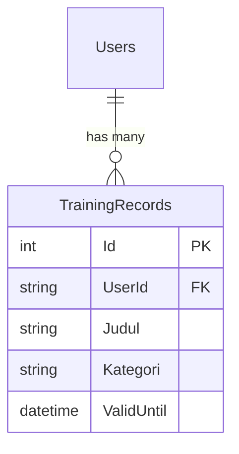
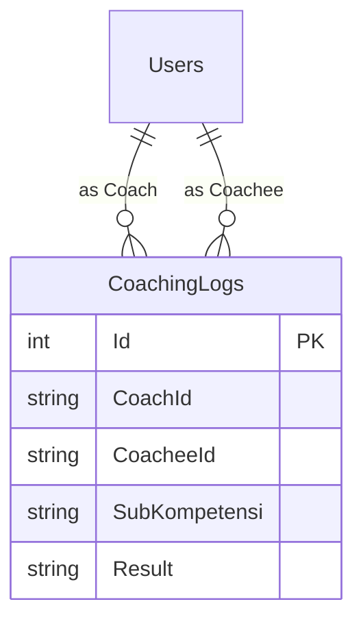
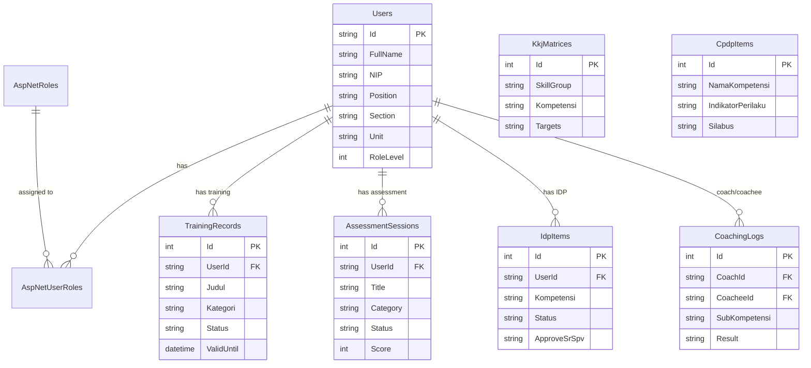

# 📊 Pemetaan Database PortalHC_KPB

Dokumentasi lengkap tentang struktur database website **PortalHC_KPB**.

---

## 🗄️ Informasi Database

| Property | Value |
|----------|-------|
| **Nama Database** | `HcPortalDB_Dev` |
| **Platform** | SQL Server (SQLEXPRESS) |
| **Entity Framework** | ASP.NET Core Identity + Custom Entities |
| **Total Tabel** | **9 Tabel** |

---

## 📋 Ringkasan Semua Tabel

| No | Nama Tabel SQL | Entity Model (C#) | Modul | Status |
|:--:|----------------|-------------------|-------|--------|
| 1 | `Users` (custom name) | `ApplicationUser` | Semua | ✅ Aktif |
| 2 | `AspNetRoles` | `IdentityRole` | Semua | ✅ Aktif |
| 3 | `AspNetUserRoles` | - (junction table) | Semua | ✅ Aktif |
| 4 | `TrainingRecords` | `TrainingRecord` | CMP | ✅ Aktif |
| 5 | `KkjMatrices` | `KkjMatrixItem` | CMP | ✅ Aktif |
| 6 | `CpdpItems` | `CpdpItem` | CMP | ✅ Aktif |
| 7 | `AssessmentSessions` | `AssessmentSession` | CMP | ⚠️ DB Ready, View Mock |
| 8 | `CoachingLogs` | `CoachingLog` | CDP | ✅ Aktif |
| 9 | `IdpItems` | `IdpItem` | CDP | ⚠️ DB Ready, View Mock |

---

## 📑 Detail Setiap Tabel

---

### 1️⃣ Tabel: `Users` (Identity Users)

**File Model:** [ApplicationUser.cs](file:///c:/Users/rinoa/Desktop/PortalHC_KPB/Models/ApplicationUser.cs)

#### Fungsi
Menyimpan data akun pengguna, profil karyawan, jabatan, section/unit, dan role level untuk RBAC.
> **Catatan:** Tabel ini bernama `Users` di database (bukan default `AspNetUsers`) karena konfigurasi custom di `ApplicationDbContext`.

#### Kolom Utama

| Kolom | Tipe Data | Deskripsi |
|-------|-----------|-----------|
| `Id` | `nvarchar(450)` PK | GUID unik user |
| `UserName` | `nvarchar(256)` | Username login |
| `Email` | `nvarchar(256)` | Email user |
| `PasswordHash` | `nvarchar(max)` | Hash password |
| `FullName` | `nvarchar(max)` | Nama lengkap karyawan |
| `NIP` | `nvarchar(max)` | Nomor Induk Pegawai |
| `Position` | `nvarchar(max)` | Jabatan (Operator, Panelman, Section Head, dll) |
| `Section` | `nvarchar(max)` | Bagian: RFCC, DHT/HMU, NGP, GAST |
| `Unit` | `nvarchar(max)` | Unit kerja spesifik |
| `Directorate` | `nvarchar(max)` | Direktorat |
| `JoinDate` | `datetime2` | Tanggal bergabung |
| `RoleLevel` | `int` | Level RBAC (1-6): 1=Admin, 2=HC, 3=Dir/VP/Manager, 4=SectionHead/SrSpv, 5=Coach, 6=Coachee |

#### Digunakan di Halaman

| Halaman | URL/Route | Penggunaan |
|---------|-----------|------------|
| **Login** | `/Account/Login` | Autentikasi user |
| **CDP Index** | `/CDP/Index` | Menampilkan profil user (Nama, Posisi, Unit) |
| **CDP Progress** | `/CDP/Progress` | Menampilkan progress learning user |
| **CDP Coaching** | `/CDP/Coaching` | Menampilkan log coaching (sebagai Coach atau Coachee) |
| **CMP Records** | `/CMP/Records` | Filter data berdasarkan Section/Unit user |
| **CMP WorkerDetail** | `/CMP/WorkerDetail/{id}` | Menampilkan detail training per worker |
| **BP TalentProfile** | `/BP/TalentProfile` | Menampilkan profil talent user |

---

### 2️⃣ Tabel: `AspNetRoles`

#### Fungsi
Menyimpan daftar role akses sistem (bagian dari ASP.NET Identity).

#### Kolom Utama

| Kolom | Tipe Data | Deskripsi |
|-------|-----------|-----------|
| `Id` | `nvarchar(450)` PK | GUID role |
| `Name` | `nvarchar(256)` | Nama role: Admin, HC, Coach, Coachee, SectionHead, SrSupervisor |
| `NormalizedName` | `nvarchar(256)` | Nama role uppercase |

#### Digunakan di Halaman
- **Semua halaman**: Untuk otorisasi role-based access control

---

### 3️⃣ Tabel: `AspNetUserRoles`

#### Fungsi
Junction table (many-to-many) antara Users dan Roles.

#### Kolom Utama

| Kolom | Tipe Data | Deskripsi |
|-------|-----------|-----------|
| `UserId` | `nvarchar(450)` FK | Referensi ke Users.Id |
| `RoleId` | `nvarchar(450)` FK | Referensi ke AspNetRoles.Id |

---

### 4️⃣ Tabel: `TrainingRecords`

**File Model:** [TrainingRecord.cs](file:///c:/Users/rinoa/Desktop/PortalHC_KPB/Models/TrainingRecord.cs)

#### Fungsi
Menyimpan riwayat pelatihan/training karyawan untuk modul **Capability Building**.

#### Kolom Utama

| Kolom | Tipe Data | Deskripsi |
|-------|-----------|-----------|
| `Id` | `int` PK | ID auto-increment |
| `UserId` | `nvarchar(450)` FK | Referensi ke Users.Id |
| `Judul` | `nvarchar(max)` | Nama training |
| `Kategori` | `nvarchar(max)` | Kategori: PROTON, OJT, MANDATORY |
| `Tanggal` | `datetime2` | Tanggal training |
| `Penyelenggara` | `nvarchar(max)` | Internal, Licensor, NSO |
| `Status` | `nvarchar(max)` | Passed, Wait Certificate, Valid, Expiring |
| `SertifikatUrl` | `nvarchar(max)` | URL file sertifikat |
| `ValidUntil` | `datetime2` | Tanggal kadaluarsa sertifikat |
| `CertificateType` | `nvarchar(max)` | Permanent, Annual, 3-Year |

#### Relasi

#### Digunakan di Halaman

| Halaman | URL/Route | Penggunaan |
|---------|-----------|------------|
| **CMP Records** | `/CMP/Records` | List worker & status training (Sudah/Belum), persentase kelengkapan |
| **CMP WorkerDetail** | `/CMP/WorkerDetail/{id}` | Detail histori training satu karyawan |
| **CDP (Coach/Coachee View)** | `/CMP/Records` | Menampilkan training personal |

---

### 5️⃣ Tabel: `KkjMatrices`

**File Model:** [KkjModels.cs](file:///c:/Users/rinoa/Desktop/PortalHC_KPB/Models/KkjModels.cs) → Class `KkjMatrixItem`

#### Fungsi
Master data matriks kompetensi (KKJ) dan target level per jabatan.

#### Kolom Utama

| Kolom | Tipe Data | Deskripsi |
|-------|-----------|-----------|
| `Id` | `int` PK | ID auto-increment |
| `No` | `int` | Nomor urut display |
| `SkillGroup` | `nvarchar(max)` | Grup skill: Generic, Specific |
| `SubSkillGroup` | `nvarchar(max)` | Sub-grup: Technical Operation, HSSE, dll |
| `Indeks` | `nvarchar(max)` | Kode indeks kompetensi |
| `Kompetensi` | `nvarchar(max)` | Nama kompetensi |
| `Target_SectionHead` | `nvarchar(max)` | Target level Section Head (1-5 atau -) |
| `Target_SrSpv_GSH` | `nvarchar(max)` | Target level Sr Supervisor GSH |
| `Target_ShiftSpv_GSH` | `nvarchar(max)` | Target level Shift Supervisor GSH |
| `Target_Panelman_GSH_12_13` | `nvarchar(max)` | Target Panelman GSH grade 12-13 |
| `Target_Panelman_GSH_14` | `nvarchar(max)` | Target Panelman GSH grade 14 |
| `Target_Operator_GSH_8_11` | `nvarchar(max)` | Target Operator GSH grade 8-11 |
| `Target_Operator_GSH_12_13` | `nvarchar(max)` | Target Operator GSH grade 12-13 |
| `Target_ShiftSpv_ARU` | `nvarchar(max)` | Target level Shift Supervisor ARU |
| `Target_Panelman_ARU_12_13` | `nvarchar(max)` | Target Panelman ARU grade 12-13 |
| `Target_Panelman_ARU_14` | `nvarchar(max)` | Target Panelman ARU grade 14 |
| `Target_Operator_ARU_8_11` | `nvarchar(max)` | Target Operator ARU grade 8-11 |
| `Target_Operator_ARU_12_13` | `nvarchar(max)` | Target Operator ARU grade 12-13 |
| `Target_SrSpv_Facility` | `nvarchar(max)` | Target Sr Supervisor Facility |
| `Target_JrAnalyst` | `nvarchar(max)` | Target Jr Analyst |
| `Target_HSE` | `nvarchar(max)` | Target HSE Officer |

#### Digunakan di Halaman

| Halaman | URL/Route | Penggunaan |
|---------|-----------|------------|
| **CMP KKJ** | `/CMP/Kkj` | Menampilkan tabel matriks kompetensi lengkap per jabatan |

---

### 6️⃣ Tabel: `CpdpItems`

**File Model:** [KkjModels.cs](file:///c:/Users/rinoa/Desktop/PortalHC_KPB/Models/KkjModels.cs) → Class `CpdpItem`

#### Fungsi
Master data katalog pengembangan kompetensi (CPDP) - mapping kompetensi ke indikator perilaku dan silabus.

#### Kolom Utama

| Kolom | Tipe Data | Deskripsi |
|-------|-----------|-----------|
| `Id` | `int` PK | ID auto-increment |
| `No` | `nvarchar(max)` | Nomor display (bisa "5.1", "5.2", dll) |
| `NamaKompetensi` | `nvarchar(max)` | Nama kompetensi |
| `IndikatorPerilaku` | `nvarchar(max)` | Indikator perilaku level |
| `DetailIndikator` | `nvarchar(max)` | Detail/deskripsi indikator |
| `Silabus` | `nvarchar(max)` | Silabus training |
| `TargetDeliverable` | `nvarchar(max)` | Target deliverable |
| `Status` | `nvarchar(max)` | Status item |

#### Digunakan di Halaman

| Halaman | URL/Route | Penggunaan |
|---------|-----------|------------|
| **CMP Mapping** | `/CMP/Mapping` | Menampilkan katalog pengembangan kompetensi (CPDP) |

---

### 7️⃣ Tabel: `AssessmentSessions`

**File Model:** [AssessmentSession.cs](file:///c:/Users/rinoa/Desktop/PortalHC_KPB/Models/AssessmentSession.cs)

#### Fungsi
Menyimpan jadwal dan status assessment karyawan (OJT, OTS, IHT, dll).

> ⚠️ **Status**: Tabel sudah aktif di database, tapi halaman masih menggunakan **Mock Data** di controller.

#### Kolom Utama

| Kolom | Tipe Data | Deskripsi |
|-------|-----------|-----------|
| `Id` | `int` PK | ID auto-increment |
| `UserId` | `nvarchar(450)` FK | Referensi ke Users.Id |
| `Title` | `nvarchar(max)` | Judul assessment |
| `Category` | `nvarchar(max)` | Kategori: Assessment OJ, IHT, Licencor, OTS, Mandatory HSSE Training |
| `Type` | `nvarchar(max)` | Sama dengan Category |
| `Schedule` | `datetime2` | Jadwal assessment |
| `DurationMinutes` | `int` | Durasi dalam menit |
| `Status` | `nvarchar(max)` | Open, Upcoming, Completed |
| `Progress` | `int` | Progress 0-100 |
| `BannerColor` | `nvarchar(max)` | Warna banner (bg-primary, bg-success, dll) |
| `Score` | `int` | Skor assessment (nullable) |
| `IsTokenRequired` | `bit` | Apakah butuh token untuk mengikuti |

#### Digunakan di Halaman

| Halaman | URL/Route | Penggunaan | Status Data |
|---------|-----------|------------|-------------|
| **CMP Assessment** | `/CMP/Assessment` | Menampilkan dashboard assessment | ⚠️ Mock Data |

---

### 8️⃣ Tabel: `CoachingLogs`

**File Model:** [CoachingLog.cs](file:///c:/Users/rinoa/Desktop/PortalHC_KPB/Models/CoachingLog.cs)

#### Fungsi
Mencatat sesi coaching/mentoring antara Coach dan Coachee untuk program PROTON.

#### Kolom Utama

| Kolom | Tipe Data | Deskripsi |
|-------|-----------|-----------|
| `Id` | `int` PK | ID auto-increment |
| `TrackingItemId` | `int` | Referensi ke item kompetensi (manual) |
| `CoachId` | `nvarchar(450)` | ID Coach (FK logical ke Users) |
| `CoachName` | `nvarchar(max)` | Nama Coach |
| `CoachPosition` | `nvarchar(max)` | Jabatan Coach |
| `CoacheeId` | `nvarchar(450)` | ID Coachee (FK logical ke Users) |
| `CoacheeName` | `nvarchar(max)` | Nama Coachee |
| `SubKompetensi` | `nvarchar(max)` | Sub-kompetensi yang dilatih |
| `Deliverables` | `nvarchar(max)` | Target deliverable |
| `Tanggal` | `datetime2` | Tanggal sesi coaching |
| `CoacheeCompetencies` | `nvarchar(max)` | Catatan kompetensi coachee |
| `CatatanCoach` | `nvarchar(max)` | Catatan dari coach |
| `Kesimpulan` | `nvarchar(max)` | Mandiri / PerluDikembangkan |
| `Result` | `nvarchar(max)` | NeedImprovement / Suitable / Good / Excellence |
| `Status` | `nvarchar(max)` | Draft, Submitted |
| `CreatedAt` | `datetime2` | Waktu dibuat |
| `UpdatedAt` | `datetime2` | Waktu diupdate |

#### Relasi

#### Digunakan di Halaman

| Halaman | URL/Route | Penggunaan |
|---------|-----------|------------|
| **CDP Coaching** | `/CDP/Coaching` | Menampilkan histori coaching log user (sebagai coach maupun coachee) |

---

### 9️⃣ Tabel: `IdpItems`

**File Model:** [IdpItem.cs](file:///c:/Users/rinoa/Desktop/PortalHC_KPB/Models/IdpItem.cs)

#### Fungsi
Menyimpan item Individual Development Plan (IDP) - rencana pengembangan individual karyawan.

> ⚠️ **Status**: Tabel sudah aktif di database, tapi halaman CDP/Progress masih menggunakan model `TrackingItem` (Non-DB) dengan data hardcoded.

#### Kolom Utama

| Kolom | Tipe Data | Deskripsi |
|-------|-----------|-----------|
| `Id` | `int` PK | ID auto-increment |
| `UserId` | `nvarchar(450)` FK | Referensi ke Users.Id |
| `Kompetensi` | `nvarchar(max)` | Nama kompetensi |
| `SubKompetensi` | `nvarchar(max)` | Sub-kompetensi |
| `Deliverable` | `nvarchar(max)` | Target deliverable |
| `Aktivitas` | `nvarchar(max)` | Aktivitas pengembangan |
| `Metode` | `nvarchar(max)` | Metode: Coaching, Internal Training, External Training, dll |
| `DueDate` | `datetime2` | Deadline |
| `Status` | `nvarchar(max)` | Not Started, In Progress, Completed |
| `Evidence` | `nvarchar(max)` | Path file bukti |
| `ApproveSrSpv` | `nvarchar(max)` | Approval Sr Supervisor |
| `ApproveSectionHead` | `nvarchar(max)` | Approval Section Head |
| `ApproveHC` | `nvarchar(max)` | Approval HC |

#### Digunakan di Halaman

| Halaman | URL/Route | Penggunaan | Status Data |
|---------|-----------|------------|-------------|
| **CDP Progress** | `/CDP/Progress` | Menampilkan progress IDP | ⚠️ Planned (saat ini mock) |

---

## 🔗 Diagram Relasi Database

---

## 🏗️ Mapping per Modul

### Modul CMP (Competency Management Program)

| Halaman | Tabel Database | Fungsi |
|---------|----------------|--------|
| `/CMP/Kkj` | `KkjMatrices` | Matriks kompetensi |
| `/CMP/Mapping` | `CpdpItems` | Katalog pengembangan |
| `/CMP/Assessment` | `AssessmentSessions` | Jadwal assessment |
| `/CMP/Records` | `TrainingRecords`, `Users` | Daftar training worker |
| `/CMP/WorkerDetail` | `TrainingRecords`, `Users` | Detail training worker |

### Modul CDP (Career Development Program)

| Halaman | Tabel Database | Fungsi |
|---------|----------------|--------|
| `/CDP/Index` | `Users` | Dashboard profil user |
| `/CDP/Dashboard` | `Users` | Overview karir |
| `/CDP/Coaching` | `CoachingLogs` | Log coaching/mentoring |
| `/CDP/Progress` | `IdpItems` (planned) | Progress IDP |

### Modul BP (Business Partner)

| Halaman | Tabel Database | Fungsi |
|---------|----------------|--------|
| `/BP/TalentProfile` | `Users` | Profil talent & karir |
| `/BP/PointSystem` | - (mock data) | Sistem poin |
| `/BP/EligibilityValidator` | - (mock data) | Validasi eligibilitas |

---

## 📝 Entitas Non-Database (View Models)

Model berikut **TIDAK** memiliki tabel database (data masih hardcoded/dummy):

| Model | Lokasi Penggunaan | Deskripsi |
|-------|-------------------|-----------|
| `TrackingItem` | CDPController > Progress | Progress tracking (Safe Work Practice, dll) |
| `CareerHistory` | BPController > TalentProfile | Riwayat karir |
| `PerformanceRecord` | BPController > TalentProfile | Riwayat performa |
| `PointActivity` | BPController > PointSystem | Aktivitas poin |
| `EligibilityCriteria` | BPController > EligibilityValidator | Kriteria eligibilitas |

---

## 📁 Lokasi File Penting

| Kategori | Path |
|----------|------|
| **Models** | `Models/*.cs` |
| **Controllers** | `Controllers/*.cs` |
| **Database Context** | `Data/ApplicationDbContext.cs` |
| **SQL Scripts** | `Database/*.sql` |
| **Migrations** | `Migrations/*.cs` |
| **Connection String** | `appsettings.Development.json` |
