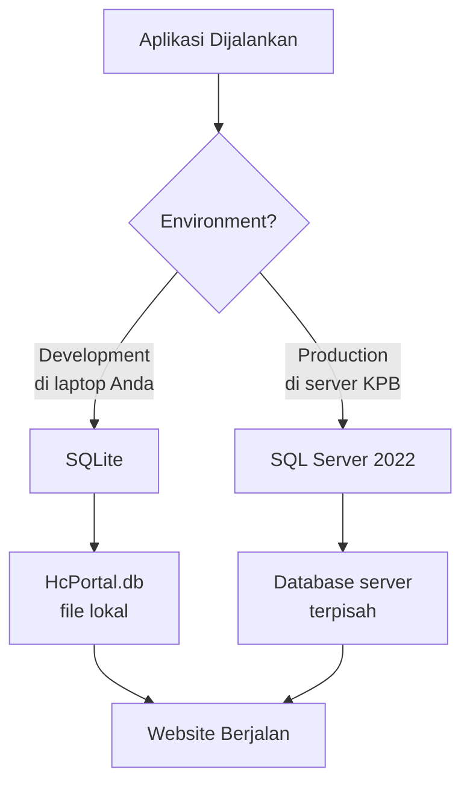

# ✅ Opsi A Selesai - Database Setup Guide

> **Dokumentasi lengkap perubahan yang dilakukan untuk mendukung SQL Server 2022**

---

## 📋 Ringkasan Perubahan

| File | Perubahan | Tujuan |
|------|-----------|--------|
| `HcPortal.csproj` | ➕ Package SQL Server | Tambah support SQL Server |
| `appsettings.Production.json` | ✨ File baru | Config untuk production |
| `Program.cs` | 🔄 Logic database | Auto-switch dev/prod |

---

## 🔍 Detail Perubahan

### 1️⃣ HcPortal.csproj - Tambah Package SQL Server

**Sebelum:**
```xml
<ItemGroup>
  <PackageReference Include="Microsoft.EntityFrameworkCore.Sqlite" Version="8.0.0" />
</ItemGroup>
```

**Sesudah:**
```xml
<ItemGroup>
  <PackageReference Include="Microsoft.EntityFrameworkCore.Sqlite" Version="8.0.0" />
  <PackageReference Include="Microsoft.EntityFrameworkCore.SqlServer" Version="8.0.0" /> ← BARU!
</ItemGroup>
```

**Penjelasan:**
- SQLite tetap ada untuk development
- SQL Server ditambahkan untuk production
- Kedua package bisa hidup berdampingan

---

### 2️⃣ appsettings.Production.json - Config Production

**File Baru:**
```json
{
  "ConnectionStrings": {
    "DefaultConnection": "Server=YOUR_SQL_SERVER_NAME;Database=HcPortalDB;User Id=hcportal_app;Password=YOUR_PASSWORD;TrustServerCertificate=True;MultipleActiveResultSets=true"
  }
}
```

**Penjelasan Connection String:**

| Parameter | Nilai | Keterangan |
|-----------|-------|------------|
| `Server` | `YOUR_SQL_SERVER_NAME` | Nama/IP SQL Server dari Tim Admin |
| `Database` | `HcPortalDB` | Nama database yang akan dibuat |
| `User Id` | `hcportal_app` | Username untuk koneksi aplikasi |
| `Password` | `YOUR_PASSWORD` | Password dari Tim Admin |
| `TrustServerCertificate` | `True` | Untuk internal server |
| `MultipleActiveResultSets` | `true` | Optimasi performa |

**⚠️ PENTING:** File ini masih template! Nanti akan diisi setelah dapat info dari Tim Server Admin.

---

### 3️⃣ Program.cs - Auto-Switch Database

**Sebelum:**
```csharp
// Selalu pakai SQLite
builder.Services.AddDbContext<ApplicationDbContext>(options =>
    options.UseSqlite(connectionString));
```

**Sesudah:**
```csharp
// Cek environment dulu
if (builder.Environment.IsDevelopment())
{
    // Development: Gunakan SQLite
    builder.Services.AddDbContext<ApplicationDbContext>(options =>
        options.UseSqlite(connectionString));
}
else
{
    // Production: Gunakan SQL Server
    builder.Services.AddDbContext<ApplicationDbContext>(options =>
        options.UseSqlServer(connectionString));
}
```

**Penjelasan:**
- Aplikasi otomatis deteksi environment
- Development (di laptop Anda) → SQLite
- Production (di server KPB) → SQL Server
- **TIDAK PERLU UBAH KODE** saat deploy!

---

## 🎯 Cara Kerja Sistem Dual Database



---

## 🧪 Cara Test Lokal (Masih Pakai SQLite)

### Test 1: Build Project
```powershell
dotnet build
```

**Expected Result:**
```
Build succeeded.
3 Warning(s)  ← Ini normal, bukan error
0 Error(s)
```

✅ **Status:** PASSED (sudah ditest)

### Test 2: Jalankan Website
```powershell
dotnet run
```

**Expected Result:**
```
Now listening on: http://localhost:5000
```

Buka browser → `http://localhost:5000` → Website jalan normal

---

## 📊 Perbandingan Development vs Production

| Aspek | Development (Sekarang) | Production (Nanti) |
|-------|------------------------|---------------------|
| **Database** | SQLite | SQL Server 2022 |
| **File** | `HcPortal.db` | Database di server |
| **Config** | `appsettings.json` | `appsettings.Production.json` |
| **Lokasi** | Laptop Anda | Server KPB |
| **User** | 1 (Anda) | 400-600 pekerja |

---

## 🔜 Next Steps

### Untuk Anda (Developer):

1. **Test website masih jalan:**
   ```powershell
   dotnet run
   ```
   Pastikan login, navigasi, semua fitur masih OK.

2. **Siapkan list tabel yang diperlukan:**
   - Review mock data di Controllers
   - Buat daftar entity yang perlu database

### Untuk Tim Server Admin KPB:

Kirim request dengan info berikut:

**Subject: Request Setup Database HC Portal**

```
Kepada Tim Server Admin KPB,

Mohon bantuan untuk setup database production HC Portal:

1. SQL Server 2022 Info:
   - Nama server / IP address
   - Port (default: 1433)
   
2. Database Setup:
   - Buat database baru: HcPortalDB
   - Buat user: hcportal_app
   - Grant permission: db_owner atau sesuai policy
   
3. Storage:
   - Lokasi untuk file upload (sertifikat, dokumen)
   - Estimasi kapasitas: 10-20 GB
   
4. Timeline:
   - Target kapan bisa mulai testing koneksi?

Terima kasih.
```

---

## ❓ FAQ

**Q: Apakah website masih bisa jalan di laptop saya?**  
A: Ya! Masih pakai SQLite seperti biasa.

**Q: Kapan mulai pakai SQL Server?**  
A: Setelah dapat info dari Tim Server Admin dan update `appsettings.Production.json`.

**Q: Apakah data SQLite bisa dipindah ke SQL Server?**  
A: Bisa! Nanti kita buat script migrasi data.

**Q: Bagaimana cara switch ke SQL Server untuk testing?**  
A: Jalankan dengan environment Production:
```powershell
$env:ASPNETCORE_ENVIRONMENT="Production"
dotnet run
```

**Q: Apakah perlu install SQL Server di laptop?**  
A: Tidak perlu! Development tetap pakai SQLite.

---

## ✅ Checklist Opsi A

- [x] Package SQL Server ditambahkan
- [x] Config production dibuat
- [x] Program.cs diupdate
- [x] Build berhasil
- [ ] Test website jalan
- [ ] Request ke Tim Server Admin
- [ ] Dapat connection string
- [ ] Test koneksi SQL Server

---

## 🎉 Status: OPSI A SELESAI!

Website Anda sekarang **siap untuk SQL Server** tanpa merusak development environment yang sudah ada.

**Next:** Tunggu info dari Tim Server Admin, lalu kita lanjut ke Phase 1.2 (Migrasi Database).

---

*Dokumentasi dibuat: 6 Februari 2026*
