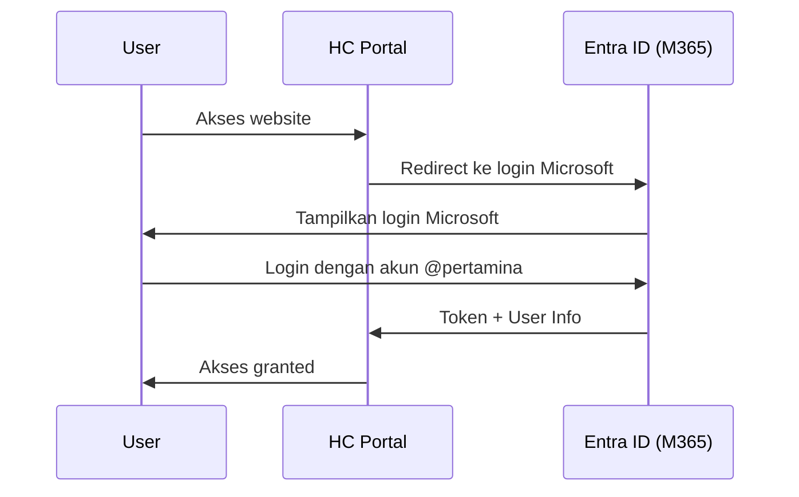

# 💰 HC Portal - Opsi Deployment & Analisis Biaya

> **Dokumen ini berisi opsi deployment dengan integrasi Microsoft 365 E3 dan perkiraan biaya infrastruktur.**

---

## ✅ Keuntungan Microsoft 365 E3 yang Sudah Dimiliki

Karena semua pekerja sudah memiliki **Microsoft 365 E3** berbayar, Anda mendapat keuntungan besar:

| Komponen | Status | Keterangan |
|----------|--------|------------|
| **Microsoft Entra ID P1** | ✅ Included | SSO, MFA, Conditional Access |
| **Single Sign-On (SSO)** | ✅ Included | Login dengan akun Microsoft |
| **Multi-Factor Auth** | ✅ Included | Keamanan tambahan |
| **Conditional Access** | ✅ Included | Policy-based access |
| **Device Management** | ✅ Included | Via Intune |

> [!TIP]
> Dengan M365 E3, **TIDAK perlu beli lisensi Azure AD/Entra ID tambahan**. SSO sudah siap pakai!

---

## 🏗️ Opsi Deployment

### Opsi A: Full Azure Cloud ☁️
**Terbaik untuk:** Akses global, otomatis scaling, managed service

| Komponen | Service | Est. Biaya/Bulan (USD) | Est. IDR* |
|----------|---------|------------------------|-----------|
| Web App | App Service B2 | $55 | Rp 880.000 |
| Database | Azure SQL S1 | $30 | Rp 480.000 |
| Storage | Blob 50GB | $5 | Rp 80.000 |
| Backup | Geo-redundant | $10 | Rp 160.000 |
| SSL Cert | Free (managed) | $0 | Rp 0 |
| **TOTAL** | | **~$100/bulan** | **~Rp 1.6 juta** |

**Untuk Production (lebih tinggi):**
| Komponen | Service | Est. Biaya/Bulan (USD) | Est. IDR* |
|----------|---------|------------------------|-----------|
| Web App | App Service P1v4 | $199 | Rp 3.2 juta |
| Database | Azure SQL S3 | $150 | Rp 2.4 juta |
| Storage + Backup | | $20 | Rp 320.000 |
| **TOTAL** | | **~$370/bulan** | **~Rp 5.9 juta** |

---

### Opsi B: Server Internal Pertamina 🏢
**Terbaik untuk:** Data sensitif, kontrol penuh, compliance internal

| Komponen | Kebutuhan | Status |
|----------|-----------|--------|
| Server | Min 4 vCPU, 8GB RAM | ❓ Perlu konfirmasi |
| OS | Windows Server 2022 | ❓ Lisensi ada? |
| SQL Server | Standard/Express | ❓ Lisensi ada? |
| IIS | Web Server | ✅ Free (built-in) |
| SSL Cert | Internal CA atau DigiCert | ❓ Sudah ada? |

**Estimasi Biaya Infrastruktur (jika beli baru):**
| Item | Biaya (USD) | Keterangan |
|------|-------------|------------|
| Windows Server 2022 | ~$1,000 one-time | Per server license |
| SQL Server Standard | ~$3,700 one-time | Per 2-core pack |
| SSL Certificate | ~$200/year | DigiCert OV |

> [!NOTE]
> Jika Pertamina sudah punya lisensi Windows Server & SQL Server via Enterprise Agreement, biaya infrastruktur **bisa $0**.

---

### Opsi C: Hybrid (Recommended) 🔀
**Terbaik untuk:** Fleksibilitas, database di internal, web di cloud

| Layer | Location | Service |
|-------|----------|---------|
| Web Application | Azure | App Service B2/P1v4 |
| Authentication | Cloud | M365 E3 Entra ID |
| Database | Internal | SQL Server on-prem |
| File Storage | Hybrid | Internal + Azure Blob |

**Estimasi Biaya:**
- Azure App Service: ~$55-199/bulan
- Database: $0 (jika pakai lisensi internal)
- **Total: ~$55-199/bulan atau Rp 880.000 - Rp 3.2 juta**

---

## 🔐 Implementasi SSO dengan Microsoft 365 E3

### Arsitektur SSO


### Kode Integrasi (Program.cs)
```csharp
builder.Services.AddAuthentication(OpenIdConnectDefaults.AuthenticationScheme)
    .AddMicrosoftIdentityWebApp(builder.Configuration.GetSection("AzureAd"));
```

### Konfigurasi (appsettings.json)
```json
{
  "AzureAd": {
    "Instance": "https://login.microsoftonline.com/",
    "TenantId": "YOUR_PERTAMINA_TENANT_ID",
    "ClientId": "YOUR_APP_CLIENT_ID",
    "CallbackPath": "/signin-oidc"
  }
}
```

---

## 📊 Perbandingan Total Cost of Ownership (TCO) - 1 Tahun

| Skenario | Setup Cost | Biaya/Tahun | Total Tahun 1 |
|----------|------------|-------------|---------------|
| **Opsi A: Azure Cloud** | $0 | $1,200 - $4,440 | $1,200 - $4,440 |
| **Opsi B: Internal** | $0 - $4,700* | ~$200 (SSL) | $200 - $4,900 |
| **Opsi C: Hybrid** | $0 | $660 - $2,400 | $660 - $2,400 |

*Jika sudah punya lisensi Windows Server & SQL Server, setup cost = $0

---

## ❓ PERTANYAAN UNTUK ANDA

Untuk melanjutkan, saya membutuhkan informasi berikut:

### 📋 Infrastruktur & Lisensi

| No | Pertanyaan | Opsi Jawaban |
|----|------------|--------------|
| 1 | Apakah Pertamina sudah punya **server internal** yang bisa digunakan? | Ya / Tidak / Perlu cek |
| 2 | Apakah ada lisensi **Windows Server & SQL Server** yang sudah dimiliki? | Ya (Enterprise Agreement) / Tidak |
| 3 | Apakah ada **IT Policy** yang mengharuskan data di server internal? | Ya / Tidak |
| 4 | Berapa **jumlah user** yang akan mengakses HC Portal? | [angka] user |

### 🔐 Keamanan & Akses

| No | Pertanyaan | Opsi Jawaban |
|----|------------|--------------|
| 5 | Apakah HC Portal perlu diakses dari **luar jaringan Pertamina** (VPN/Internet)? | Internal only / Internet |
| 6 | Siapa yang akan mengelola **Azure tenant** untuk app registration? | IT Pusat / IT Lokal / Saya |
| 7 | Apakah domain email pekerja **@pertamina.com** atau subdomain? | Domain: ____________ |

### 📱 Integrasi & Fitur

| No | Pertanyaan | Opsi Jawaban |
|----|------------|--------------|
| 8 | Apakah HC Portal perlu **integrasi** dengan sistem HR lain (SAP, etc.)? | Ya / Tidak |
| 9 | Apakah perlu fitur **mobile app** di masa depan? | Ya / Tidak |
| 10 | Budget maksimal untuk infrastruktur **per bulan**? | Rp ____________ |

---

## 🎯 Rekomendasi Berdasarkan Skenario

| Jika kondisi Anda... | Rekomendasi |
|---------------------|-------------|
| Data harus di internal + ada server | **Opsi B** (Full Internal) |
| Tidak ada server + budget fleksibel | **Opsi A** (Azure Cloud) |
| Ingin fleksibel + keamanan | **Opsi C** (Hybrid) |
| User < 100, budget terbatas | **Opsi B** dengan SQL Express (Free) |

---

*Estimasi biaya per Januari 2026. Kurs: 1 USD = Rp 16.000*  
*Harga aktual dapat berbeda tergantung region dan volume licensing*
