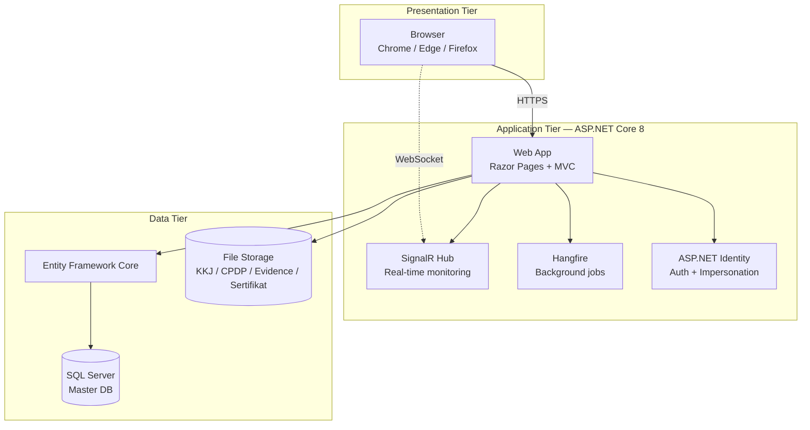

# Arsitektur Sistem HC Portal — Gambar Teknik

## Konteks (Eksekutif)

HC Portal adalah aplikasi web 3-tier yang menyatukan workflow pengelolaan kompetensi (Competency Management, Career Development, PROTON Coaching) ke dalam satu platform tunggal. Arsitektur dipilih agar mendukung akses multi-role (Pekerja, Coach, Atasan, HC), monitoring real-time, audit trail menyeluruh, dan integrasi dengan dokumen kompetensi yang sebelumnya tersebar di Excel dan paperwork.

## Diagram Arsitektur 3-Tier

## Komponen Utama (Teknis)

| Layer | Komponen | Fungsi | Justifikasi |
|-------|----------|--------|-------------|
| Presentation | Razor Pages + Bootstrap 5 | Server-rendered UI, responsive | Konsisten Pertamina internal tooling, low front-end maintenance |
| Application | ASP.NET Core 8 | Web framework | Long-term support, performant, sesuai standar IT Pertamina |
| Application | SignalR | Real-time push (assessment monitoring) | Native ASP.NET, no third-party broker |
| Application | Hangfire | Background job (reminder, notifikasi expired sertifikat) | Persisted job storage di SQL, no external scheduler |
| Application | ASP.NET Identity | Otentikasi + role-based access + impersonation | Built-in, audit-ready, integrasi LDAP siap |
| Data | Entity Framework Core | ORM | Code-first migration, type-safe query |
| Data | SQL Server | RDBMS master data | Standar Pertamina, backup/restore matang |
| Storage | File System | Upload KKJ/CPDP/Evidence/Sertifikat | Path versioned dengan timestamp + GUID + filename |

## Karakteristik Non-Fungsional

| Aspek | Penanganan |
|-------|-----------|
| Skalabilitas | Vertical scale-up di server Dev 10.55.3.3; horizontal scaling tersedia bila migrasi ke load-balanced production |
| Keamanan | HTTPS only, anti-forgery token, role-based authorization, audit log seluruh aksi CRUD, impersonation dengan banner peringatan |
| Reliability | Database backup harian, file storage backup mingguan, maintenance mode untuk patching |
| Observability | Audit log per user-action, log file aplikasi, Hangfire dashboard |

## Modul Fungsional (Mapping ke Fitur Impactful)

| Modul | Fitur §3.4 yang Didukung |
|-------|-------------------------|
| CMP — Competency Management | Assessment Online (01), KKJ & Matriks (04), Sertifikat (05) |
| CDP — Career Development / PROTON | PROTON Coaching (02), IDP / Plan (03) |
| Modul HC (Admin) | Data Pekerja (07), Reporting / Analytics (06), input ke semua modul |
| Sistem (cross-cutting) | Notifikasi, Audit Log, Maintenance — out of scope §3.4 narrative |

## Justifikasi Pemilihan Stack

1. **ASP.NET Core 8** — standar internal Pertamina untuk web internal; long-term support sampai 2026; integrasi mudah dengan Active Directory.
2. **SQL Server** — sesuai lisensi korporat; tooling backup/restore matang; tim IT familiar.
3. **Bootstrap 5 + Razor Pages** — server-rendered, tidak butuh SPA tooling; mempercepat development dan deployment internal.
4. **SignalR** — built-in ke ASP.NET; tidak perlu broker eksternal (Redis/RabbitMQ); ideal untuk monitoring assessment volume KPB.
5. **Hangfire** — persisted job di SQL DB; dashboard built-in; eliminasi cron eksternal.
