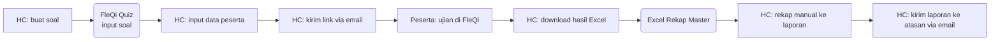
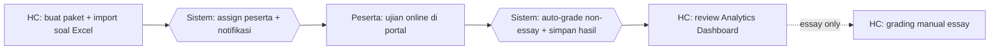

# Process Flow — Assessment Online

## Konteks (Eksekutif)

Assessment kompetensi adalah aktivitas pengukuran kemampuan teknis pekerja CSU Process terhadap matriks KKJ. Sebelum HC Portal, proses ini melibatkan tiga aplikasi (FleQi Quiz, Excel master, rekap manual) dengan banyak titik koordinasi HC–peserta–atasan. HC Portal menyatukan seluruh siklus assessment (buat paket → assign → ujian → grading → laporan) dalam satu portal dengan auto-grading dan dashboard real-time.

## Flow SEBELUM — Workflow Manual (8 Step, 3 Tools)

## Flow SESUDAH — HC Portal (4 Step, 1 Portal)

## Tabel Komparasi Step

| Aspek | Sebelum | Sesudah | Improvement |
|-------|---------|---------|-------------|
| Jumlah step HC | 6 step | 2 step (3 bila essay) | **-50% s.d. -67%** |
| Tools yang dipakai | FleQi Quiz + Excel Master + Email + Word laporan | 1 portal | **-75% tools** |
| Waktu rekap hasil (estimasi) | ~2 jam manual Excel per paket | ~5 menit (otomatis) | **~95% lebih cepat** |
| Real-time monitoring HC | Tidak ada | Ada (SignalR) | **kualitatif: visibility baru** |
| Audit trail aksi | Tidak ada | Lengkap (audit log) | **kualitatif: compliance** |
| Risiko data hilang | Tinggi (Excel scattered, email lost) | Rendah (DB terpusat + backup) | **kualitatif: data integrity** |
| Auto-grading | Manual | Otomatis untuk single/multiple choice | **kualitatif: akurasi 100% non-essay** |

## Issue yang Diselesaikan

Mapping ke `09-tabel-issue-resolved.md`: **A** (tools terfragmentasi), **B** (no single source of truth), **C** (no audit trail), **D** (reporting ad-hoc).

## Benefit

**Kuantitatif (estimasi):**
- Pengurangan step proses HC: -50% s.d. -67%
- Pengurangan jumlah tools: 4 tools → 1 portal (-75%)
- Pengurangan waktu rekap hasil: ~95%
- Real-time monitoring: 0 → tersedia (SignalR)

**Kualitatif:**
- Single source of truth untuk hasil assessment per pekerja
- Audit trail menyeluruh (siapa buat paket, siapa assign, kapan peserta submit)
- Visibility manajemen via Analytics Dashboard
- Eliminasi risiko file Excel rekap hilang/rusak
- Auto-grading menghilangkan human error pada soal single/multiple choice
