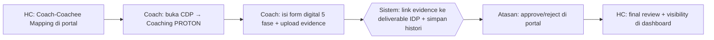

# Process Flow — PROTON Coaching

## Konteks (Eksekutif)

PROTON adalah metodologi coaching 5 fase (Purpose, Realita, Options, To-do, Outcome & Next-step) yang digunakan HC KPB untuk mengembangkan kompetensi coachee. Sebelum HC Portal, sesi coaching dicatat di form cetak, bukti coaching dikirim via WhatsApp / email, dan progress deliverable di-track manual oleh HC. HC Portal menyediakan form digital 5 fase + upload evidence + auto-link ke deliverable IDP + workflow approval terstruktur.

## Flow SEBELUM — Paperwork + Channel Manual (9 Step, 4 Tools)

```mermaid
flowchart LR
    HC0[HC: assign coachee-coach via email] --> CO1[Coach: jadwalkan sesi]
    CO1 --> CO2[Coach: print form PROTON]
    CO2 --> FORM(Form PROTON cetak)
    FORM --> CO3[Coach: isi 5 fase manual]
    CO3 --> CO4[Coach: foto bukti / upload WhatsApp]
    CO4 --> WA(WhatsApp / Email)
    WA --> CO5[Coach: simpan form di map fisik]
    CO5 --> ARSIP(Arsip fisik)
    ARSIP --> HC1[HC: track progress manual via WA]
    HC1 --> AT1[Atasan: approval lisan / WA]
```

## Flow SESUDAH — HC Portal (5 Step, 1 Portal)

## Tabel Komparasi Step

| Aspek | Sebelum | Sesudah | Improvement |
|-------|---------|---------|-------------|
| Jumlah step Coach | 5 step | 2 step | **-60% step** |
| Tools yang dipakai | Form cetak + WhatsApp + Email + Arsip fisik | 1 portal | **-75% tools** |
| Bukti coaching | File terserak (WA media, email attachment) | Tersimpan terpusat + linked ke deliverable | **kualitatif: traceable** |
| Workflow approval | Lisan / WA, no trail | Coach→Atasan(Reviewer)→HC dengan status history | **kualitatif: governance** |
| Histori sesi coachee | Tidak terstruktur (map fisik) | Timeline digital lengkap (Histori PROTON) | **kualitatif: longitudinal view** |
| Waktu rekap progress (estimasi HC) | ~3 jam per bulan per coach | ~10 menit (otomatis dari dashboard) | **~95% lebih cepat** |

## Issue yang Diselesaikan

Mapping ke `09-tabel-issue-resolved.md`: **A** (tools terfragmentasi), **C** (no audit trail), **E** (workflow tanpa tracking).

## Benefit

**Kuantitatif (estimasi):**
- Pengurangan step Coach: -60%
- Pengurangan tools: 4 → 1 portal (-75%)
- Pengurangan waktu rekap progress HC: ~95%
- Histori coaching tersedia 100% (sebelumnya ~ tidak terlacak)

**Kualitatif:**
- Single source of truth untuk seluruh sesi PROTON + evidence
- Auto-link evidence ke deliverable IDP — Coach upload sekali, deliverable progress otomatis update
- Workflow approval bertingkat (Coach → Atasan → HC) terdokumentasi
- Eliminasi risiko form fisik hilang / coretan tidak terbaca
- Atasan dan HC mendapat visibility coaching per coachee secara real-time
