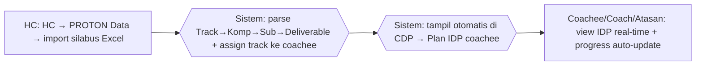

# Process Flow — IDP / Plan

## Konteks (Eksekutif)

Individual Development Plan (IDP) adalah rencana pengembangan kompetensi per coachee, terdiri dari struktur Track → Kompetensi → Sub-Kompetensi → Deliverable. Sebelum HC Portal, IDP disusun HC di Excel template lalu didistribusikan via email dengan tracking progress manual; perubahan struktur memerlukan re-distribusi file. HC Portal menggunakan menu PROTON Data — HC upload silabus Excel sekali, dan IDP langsung tampil di halaman Plan IDP coachee dengan progress auto-update dari deliverable.

## Flow SEBELUM — Excel + Email (7 Step, 3 Tools)

## Flow SESUDAH — HC Portal (3 Step, 1 Portal)

## Tabel Komparasi Step

| Aspek | Sebelum | Sesudah | Improvement |
|-------|---------|---------|-------------|
| Jumlah step HC distribusi | 4 step (susun, email, update, konsolidasi) | 1 step (import sekali) | **-75% step** |
| Tools | Excel + Email + arsip pribadi coachee | 1 portal | **-67% tools** |
| Versi file IDP | Banyak versi tersebar | 1 versi terpusat | **kualitatif: konsistensi** |
| Update struktur IDP | Re-distribusi email ke semua pihak | Upload ulang Excel di portal, langsung ter-refleksi | **kualitatif: agility** |
| Progress tracking | Manual per coach, no aggregation | Auto-update dari deliverable + visible ke semua role | **kualitatif: visibility** |
| Waktu konsolidasi IDP (estimasi) | ~4 jam per siklus | ~15 menit | **~94% lebih cepat** |

## Issue yang Diselesaikan

Mapping ke `09-tabel-issue-resolved.md`: **A** (tools terfragmentasi), **B** (no single source of truth), **E** (workflow tanpa tracking).

## Benefit

**Kuantitatif (estimasi):**
- Pengurangan step distribusi HC: -75%
- Pengurangan tools: 3 → 1 portal (-67%)
- Pengurangan waktu konsolidasi: ~94%
- 100% coachee melihat IDP versi terkini (sebelumnya bergantung email terakhir diterima)

**Kualitatif:**
- IDP tunggal sebagai single source of truth — HC update sekali, semua role lihat versi sama
- Progress deliverable auto-update dari sesi coaching (no double-entry)
- Atasan dan Coach memiliki view yang konsisten dengan coachee
- Refresh struktur kompetensi (track baru, sub-kompetensi baru) tidak butuh email blast
