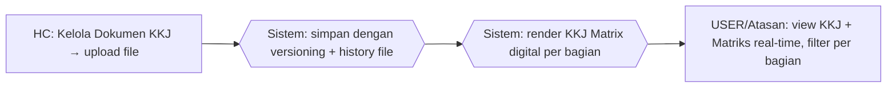

# Process Flow — KKJ & Matriks Kompetensi

## Konteks (Eksekutif)

Kebutuhan Kompetensi Jabatan (KKJ) adalah dokumen referensi standar kompetensi per jabatan. Sebelum HC Portal, file KKJ tersimpan di share folder Excel/PDF tanpa versioning yang jelas, dan matriks kompetensi bagian disusun manual per request. HC Portal menyediakan menu upload terpusat dengan history versi otomatis + matriks KKJ digital per bagian.

## Flow SEBELUM — Share Folder + Manual (6 Step, 3 Tools)

```mermaid
flowchart LR
    HC1[HC: update KKJ di Excel] --> EX1(Excel KKJ Master)
    EX1 --> HC2[HC: simpan ke share folder]
    HC2 --> SF1(Share Folder)
    SF1 --> HC3[HC: email link ke atasan terkait]
    HC3 --> EMAIL(Email Pertamina)
    EMAIL --> AT1[Atasan: download Excel KKJ]
    AT1 --> AT2[Atasan: minta matriks bagian via email ke HC]
    AT2 --> HC4[HC: susun matriks manual di Excel]
```

## Flow SESUDAH — HC Portal (3 Step, 1 Portal)

## Tabel Komparasi Step

| Aspek | Sebelum | Sesudah | Improvement |
|-------|---------|---------|-------------|
| Jumlah step HC | 4 step (update, simpan, email, susun matriks) | 1 step (upload) | **-75% step** |
| Tools | Excel + Share Folder + Email | 1 portal | **-67% tools** |
| Versioning file | Manual (rename file `_v2`, `_final`, ...) | Otomatis dengan timestamp + GUID | **kualitatif: traceable** |
| Matriks kompetensi | On-demand manual susun | Real-time digital | **kualitatif: instant** |
| Akses Atasan | Bergantung email berkala | Self-service di portal | **kualitatif: empowerment** |
| Waktu susun matriks (estimasi) | ~3 jam per request | ~real-time (auto-render) | **~99% lebih cepat** |

## Issue yang Diselesaikan

Mapping ke `09-tabel-issue-resolved.md`: **A** (tools terfragmentasi), **B** (no single source of truth), **D** (reporting ad-hoc).

## Benefit

**Kuantitatif (estimasi):**
- Pengurangan step HC: -75%
- Pengurangan tools: 3 → 1 portal (-67%)
- Pengurangan waktu susun matriks: ~99%
- Versioning otomatis: 0 → 100% file ter-track

**Kualitatif:**
- History versi KKJ tersimpan otomatis (KkjFileHistory)
- Atasan akses matriks kompetensi self-service, tanpa permintaan ke HC
- Single source of truth — tidak ada lagi file `KKJ_v3_final_REAL.xlsx`
- Visibility gap kompetensi per pekerja terstruktur di KKJ Matrix
