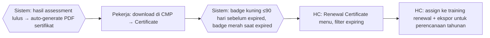

# Process Flow — Sertifikat & Renewal

## Konteks (Eksekutif)

Sertifikat kompetensi (hasil assessment) dan sertifikat training (mandatory: Safety for Refinery, SUPREME, ERP, Confined Space, dll.) memiliki tanggal expired yang harus di-track agar compliance terjaga. Sebelum HC Portal, sertifikat dibuat manual di Word/PDF tanpa tracking expired terstruktur, sehingga sering ada sertifikat kelewat expired sebelum diingatkan. HC Portal auto-generate sertifikat dari hasil assessment, menampilkan badge expired di profil pekerja, dan menyediakan menu Renewal Certificate untuk perencanaan training renewal.

## Flow SEBELUM — Manual + Reaktif (7 Step, 3 Tools)

```mermaid
flowchart LR
    HC1[HC: buat sertifikat di Word] --> WORD(Template Word/PDF)
    WORD --> HC2[HC: print + tanda tangan basah]
    HC2 --> HC3[HC: serah ke pekerja]
    HC3 --> P1[Pekerja: simpan hardcopy]
    P1 --> HC4[HC: catat expiry di Excel master]
    HC4 --> EX1(Excel Master Sertifikat)
    EX1 --> HC5[HC: cek manual setiap bulan / saat audit]
    HC5 --> HC6[HC: koordinasi training renewal via email]
```

## Flow SESUDAH — HC Portal (4 Step, 1 Portal)

## Tabel Komparasi Step

| Aspek | Sebelum | Sesudah | Improvement |
|-------|---------|---------|-------------|
| Jumlah step HC | 6 step (buat, print, catat, cek, koordinasi) | 2 step (auto + plan) | **-67% step** |
| Tools | Word + Excel + Email + Hardcopy | 1 portal | **-75% tools** |
| Generasi sertifikat | Manual per pekerja | Otomatis dari hasil assessment | **kualitatif: skalabel** |
| Tracking expired | Manual check Excel, reaktif | Badge otomatis (kuning/merah) | **kualitatif: proaktif** |
| Renewal planning | Reaktif (sering kelewat) | Menu Renewal Certificate + filter expiring | **kualitatif: compliance** |
| Waktu generate sertifikat (estimasi) | ~10 menit per pekerja | ~instant | **~99% lebih cepat** |

## Issue yang Diselesaikan

Mapping ke `09-tabel-issue-resolved.md`: **A** (tools terfragmentasi), **C** (no audit trail), **F** (renewal sertifikat reaktif).

## Benefit

**Kuantitatif (estimasi):**
- Pengurangan step HC: -67%
- Pengurangan tools: 4 → 1 portal (-75%)
- Pengurangan waktu generate per sertifikat: ~99% (manual ~10 menit → instant)
- 100% sertifikat ter-track expiry-nya (sebelumnya bergantung Excel manual)

**Kualitatif:**
- Auto-generate eliminasi risiko typo / format inkonsisten
- Badge visual (kuning/merah) memberi early warning ke pekerja & HC
- Menu Renewal Certificate memungkinkan planning training renewal tahunan terstruktur
- Audit-ready: setiap sertifikat memiliki referensi ke assessment / training source
- Compliance posture berubah dari **reaktif** → **proaktif**
