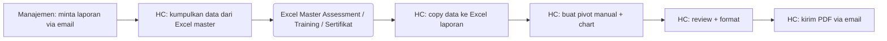
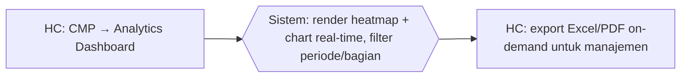

# Process Flow — Reporting & Analytics

## Konteks (Eksekutif)

Reporting kompetensi HC ke manajemen mencakup heatmap gap kompetensi, progress assessment per bagian, coaching completion rate, training adoption, dan lainnya. Sebelum HC Portal, setiap permintaan laporan dari manajemen memerlukan HC melakukan pivot Excel ad-hoc dari beberapa file master. HC Portal menyediakan Analytics Dashboard real-time dengan filter periode & bagian, plus export Excel/PDF on-demand.

## Flow SEBELUM — Pivot Manual (6 Step, 2 Tools)

## Flow SESUDAH — HC Portal (2 Step, 1 Portal)

## Tabel Komparasi Step

| Aspek | Sebelum | Sesudah | Improvement |
|-------|---------|---------|-------------|
| Jumlah step HC | 5 step (kumpul, copy, pivot, format, kirim) | 2 step (lihat + export) | **-60% step** |
| Tools | Excel master + Excel laporan + Email | 1 portal | **-67% tools** |
| Data freshness | Snapshot saat HC buat laporan | Real-time | **kualitatif: timeliness** |
| Self-service manajemen | Tidak (bergantung HC) | Bisa (dashboard role-based) | **kualitatif: empowerment** |
| Konsistensi metric | Bergantung formula Excel HC | Standar di dashboard | **kualitatif: trust** |
| Waktu per laporan ad-hoc (estimasi) | ~4 jam | ~10 menit | **~96% lebih cepat** |

## Issue yang Diselesaikan

Mapping ke `09-tabel-issue-resolved.md`: **B** (no single source of truth), **D** (reporting ad-hoc).

## Benefit

**Kuantitatif (estimasi):**
- Pengurangan step HC: -60%
- Pengurangan tools: 3 → 1 portal (-67%)
- Pengurangan waktu per laporan: ~96%
- Data refresh: snapshot → real-time

**Kualitatif:**
- Manajemen dapat akses dashboard sendiri (self-service) — HC fokus ke analisis, bukan pivot manual
- Metric standar dan konsisten — tidak ada lagi laporan dengan formula Excel berbeda-beda
- Heatmap gap kompetensi memberi visibility per bagian / per kompetensi
- Export Excel/PDF tetap tersedia untuk distribusi formal
- Auditable: chart bersumber dari DB, bukan pivot Excel yang sulit diaudit
