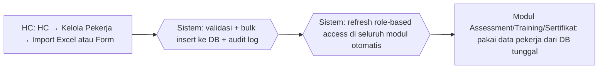

# Process Flow — Pengelolaan Data Pekerja

## Konteks (Eksekutif)

Data pekerja CSU Process (NIP, nama, jabatan, bagian, role) menjadi fondasi seluruh modul HC Portal. Sebelum HC Portal, data pekerja tersebar di beberapa Excel master per fungsi (assessment, training, KKJ) dengan update manual yang sering tidak sinkron. HC Portal memusatkan data pekerja di satu DB dengan import Excel + form CRUD + role-based access + audit log seluruh perubahan.

## Flow SEBELUM — Excel Scattered (8 Step, 2 Tools)

## Flow SESUDAH — HC Portal (3 Step, 1 Portal)

## Tabel Komparasi Step

| Aspek | Sebelum | Sesudah | Improvement |
|-------|---------|---------|-------------|
| Jumlah step HC saat pekerja baru | 6 step (input + 4 copy ke Excel berbeda + maintain) | 1 step (input/import sekali) | **-83% step** |
| Tools | 4 Excel master + Email | 1 portal | **-80% tools** |
| Risiko data mismatch antar modul | Tinggi (4 file Excel berbeda) | Nol (1 DB) | **kualitatif: integritas** |
| Update mutasi/role | Manual di 4 Excel | Otomatis di seluruh modul | **kualitatif: konsistensi** |
| Audit perubahan data | Tidak ada | Audit log lengkap | **kualitatif: governance** |
| Import massal | Manual copy-paste | Import Excel + preview + validasi | **kualitatif: bulk operation** |
| Waktu input pekerja baru (estimasi) | ~30 menit per pekerja (5 file) | ~5 menit (1 form atau bulk) | **~83% lebih cepat** |

## Issue yang Diselesaikan

Mapping ke `09-tabel-issue-resolved.md`: **A** (tools terfragmentasi), **B** (no single source of truth), **C** (no audit trail).

## Benefit

**Kuantitatif (estimasi):**
- Pengurangan step input HC: -83%
- Pengurangan tools: 5 → 1 portal (-80%)
- Pengurangan waktu input per pekerja baru: ~83%
- Mismatch antar modul: tinggi → nol

**Kualitatif:**
- Single source of truth data pekerja menjadi fondasi seluruh modul
- Update mutasi jabatan/role otomatis ter-refleksi di seluruh fitur (assessment, IDP, sertifikat)
- Audit log mencatat siapa mengubah data apa, kapan — siap audit eksternal
- Import Excel mendukung onboarding massal (bulk insert) dengan validasi otomatis (duplikat NIP, email invalid)
- Role-based access otomatis aktif begitu role pekerja di-assign
