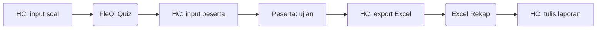
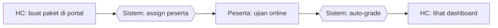

# Legend — Aktor & Konvensi Swimlane

> Dipakai konsisten di seluruh diagram process flow §3.4 (`01..07-flow-*.md`).

## Aktor

| Kode | Nama | Definisi |
|------|------|----------|
| `USER` | User / Pekerja | Pekerja umum CSU Process (pembaca/pengguna fitur) |
| `COACHEE` | Coachee | Pekerja yang mengikuti program pengembangan PROTON |
| `COACH` | Coach | Pekerja senior pendamping coachee |
| `ATASAN` | Atasan | Sr Supervisor / Section Head / Manager / VP |
| `HC` | Human Capital | Fungsi pengelola kompetensi & pengembangan |
| `SISTEM` | Sistem HC Portal | Web application (otomatis, tanpa intervensi manual) |

## Tools / Lane di Workflow SEBELUM

Diagram "Sebelum" menampilkan tools manual yang dipakai sebelum HC Portal:

| Tools | Tipe | Fungsi |
|-------|------|--------|
| Excel Master | Spreadsheet lokal/share folder | Data pekerja, KKJ, training, anggaran |
| FleQi Quiz | Aplikasi web eksternal | Ujian assessment online |
| Form PROTON cetak | Paperwork | Form coaching 5 fase |
| Word / PDF | Dokumen statis | Sertifikat, laporan |
| Email Pertamina | Channel komunikasi | Distribusi dokumen, approval |
| WhatsApp | Channel komunikasi | Koordinasi cepat, approval lisan tertulis |
| Arsip fisik | Map / lemari | Bukti coaching, evidence hardcopy |

## Notasi Mermaid (Standar)

**Tipe diagram utama:** `flowchart LR` (left-right) untuk alur step-by-step.

**Konvensi node:**
- `[Aktor]` rectangle = aksi manual oleh aktor
- `(Tools eksternal)` rounded = penggunaan tools non-portal
- `{{Sistem}}` hexagon = aksi otomatis oleh HC Portal
- `[/Decision/]` parallelogram = percabangan
- Tebal garis: tipis = manual; tebal = digital/otomatis

**Contoh skeleton SEBELUM:**

**Contoh skeleton SESUDAH:**

## Konvensi Warna (untuk redraw final)

Saat redraw ke PowerPoint, gunakan:
- Manual / tools eksternal: warna **abu-abu / merah muda** (menandakan pain point)
- Portal / digital: warna **biru / hijau Pertamina** (menandakan improvement)
- Decision: warna **kuning**
- Aktor swimlane: highlight nama aktor dengan warna konsisten per peran
