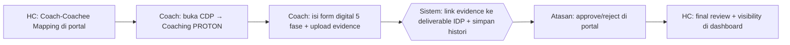

# Process Flow — PROTON Coaching

## Konteks (Eksekutif)

PROTON = metodologi coaching 5 fase (Purpose, Realita, Options, To-do, Outcome & Next-step). Sebelum HC Portal, sesi dicatat di form cetak, bukti via WhatsApp/email, progress di-track manual. HC Portal menyediakan form digital 5 fase + upload evidence + auto-link deliverable IDP + workflow approval terstruktur.

## Flow SEBELUM — Paperwork + Channel Manual (9 Step, 4 Tools)

```mermaid
flowchart LR
    HC0[HC: assign coachee-coach via email] --> CO1[Coach: jadwalkan sesi]
    CO1 --> CO2[Coach: print form PROTON]
    CO2 --> FORM(Form PROTON cetak)
    FORM --> CO3[Coach: isi 5 fase manual]
    CO3 --> CO4[Coach: foto bukti / upload WhatsApp]
    CO4 --> WA(WhatsApp / Email)
    WA --> CO5[Coach: simpan form di map fisik]
    CO5 --> ARSIP(Arsip fisik)
    ARSIP --> HC1[HC: track progress manual via WA]
    HC1 --> AT1[Atasan: approval lisan / WA]
```

## Flow SESUDAH — HC Portal (5 Step, 1 Portal)

## Tabel Komparasi Step

| Aspek | Sebelum | Sesudah | Improvement |
|-------|---------|---------|-------------|
| Jumlah step Coach | 5 step | 2 step | **-60%** |
| Tools | Form cetak + WA + Email + Arsip | 1 portal | **-75%** |
| Bukti coaching | File terserak | Tersimpan + linked deliverable | kualitatif: traceable |
| Workflow approval | Lisan/WA, no trail | Coach→Atasan→HC + status history | kualitatif: governance |
| Histori sesi | Tidak terstruktur (map fisik) | Timeline digital | kualitatif: longitudinal |
| Waktu rekap HC | ~3 jam/bulan/coach | ~10 menit (dashboard) | **~95%** |

## Issue yang Diselesaikan

Mapping ke `pendukung/tabel-issue-resolved.md`: **A**, **C**, **E**.

## Benefit

**Kuantitatif:**
- Step Coach: -60%
- Tools: 4 → 1 portal (-75%)
- Waktu rekap HC: ~95%
- Histori coaching: 0 → 100% terlacak

**Kualitatif:**
- SSoT sesi PROTON + evidence
- Auto-link evidence ke deliverable IDP
- Workflow approval bertingkat terdokumentasi
- Eliminasi risiko form fisik hilang
- Real-time visibility Atasan & HC
