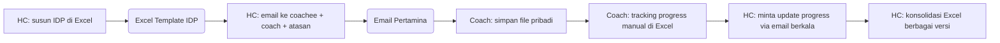
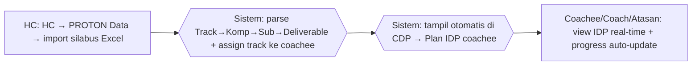

# Process Flow — IDP / Plan

## Konteks (Eksekutif)

Individual Development Plan (IDP) = rencana pengembangan kompetensi per coachee (struktur Track → Kompetensi → Sub-Kompetensi → Deliverable). Sebelum HC Portal, IDP disusun di Excel template, didistribusi via email, progress di-track manual. HC Portal: HC upload silabus Excel sekali, IDP langsung tampil di Plan IDP coachee dengan progress auto-update.

## Flow SEBELUM — Excel + Email (7 Step, 3 Tools)

## Flow SESUDAH — HC Portal (3 Step, 1 Portal)

## Tabel Komparasi Step

| Aspek | Sebelum | Sesudah | Improvement |
|-------|---------|---------|-------------|
| Step HC distribusi | 4 step | 1 step (import sekali) | **-75%** |
| Tools | Excel + Email + arsip | 1 portal | **-67%** |
| Versi file IDP | Banyak versi tersebar | 1 versi terpusat | kualitatif: konsistensi |
| Update struktur IDP | Re-distribusi email | Upload ulang, auto-refleksi | kualitatif: agility |
| Progress tracking | Manual per coach | Auto-update dari deliverable | kualitatif: visibility |
| Waktu konsolidasi | ~4 jam/siklus | ~15 menit | **~94%** |

## Issue yang Diselesaikan

Mapping: **A**, **B**, **E**.

## Benefit

**Kuantitatif:**
- Step distribusi HC: -75%
- Tools: 3 → 1 portal (-67%)
- Waktu konsolidasi: ~94%
- 100% coachee lihat IDP versi terkini

**Kualitatif:**
- IDP tunggal sebagai SSoT
- Progress deliverable auto-update dari coaching (no double-entry)
- Konsistensi view lintas role
- Refresh struktur kompetensi instant tanpa email blast
