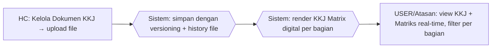

# Process Flow — KKJ & Matriks Kompetensi

## Konteks (Eksekutif)

Kebutuhan Kompetensi Jabatan (KKJ) = dokumen referensi standar kompetensi per jabatan. Sebelum HC Portal, file KKJ di share folder tanpa versioning, matriks bagian disusun manual per request. HC Portal: upload terpusat + history versi otomatis + KKJ Matrix digital per bagian.

## Flow SEBELUM — Share Folder + Manual (6 Step, 3 Tools)

## Flow SESUDAH — HC Portal (3 Step, 1 Portal)

## Tabel Komparasi Step

| Aspek | Sebelum | Sesudah | Improvement |
|-------|---------|---------|-------------|
| Step HC | 4 step | 1 step (upload) | **-75%** |
| Tools | Excel + Share Folder + Email | 1 portal | **-67%** |
| Versioning | Manual (rename file) | Otomatis (timestamp + GUID) | kualitatif: traceable |
| Matriks kompetensi | On-demand manual | Real-time digital | kualitatif: instant |
| Akses Atasan | Bergantung email | Self-service | kualitatif: empowerment |
| Waktu susun matriks | ~3 jam/request | real-time | **~99%** |

## Issue yang Diselesaikan

Mapping: **A**, **B**, **D**.

## Benefit

**Kuantitatif:**
- Step HC: -75%
- Tools: 3 → 1 portal (-67%)
- Waktu susun matriks: ~99%
- Versioning otomatis: 0 → 100%

**Kualitatif:**
- History versi KKJ tersimpan otomatis
- Atasan self-service matriks kompetensi
- SSoT (tidak ada lagi `KKJ_v3_final_REAL.xlsx`)
- Visibility gap kompetensi via KKJ Matrix
