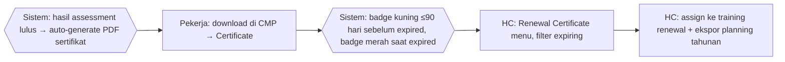

# Process Flow — Sertifikat & Renewal

## Konteks (Eksekutif)

Sertifikat kompetensi (hasil assessment) + sertifikat training (Safety, SUPREME, ERP, Confined Space) punya expired yang harus di-track. Sebelum HC Portal, sertifikat dibuat manual di Word/PDF tanpa tracking expired terstruktur, sering kelewat. HC Portal: auto-generate dari hasil assessment + badge expiry + menu Renewal Certificate.

## Flow SEBELUM — Manual + Reaktif (7 Step, 3 Tools)

```mermaid
flowchart LR
    HC1[HC: buat sertifikat di Word] --> WORD(Template Word/PDF)
    WORD --> HC2[HC: print + tanda tangan basah]
    HC2 --> HC3[HC: serah ke pekerja]
    HC3 --> P1[Pekerja: simpan hardcopy]
    P1 --> HC4[HC: catat expiry di Excel master]
    HC4 --> EX1(Excel Master Sertifikat)
    EX1 --> HC5[HC: cek manual setiap bulan / saat audit]
    HC5 --> HC6[HC: koordinasi training renewal via email]
```

## Flow SESUDAH — HC Portal (4 Step, 1 Portal)

## Tabel Komparasi Step

| Aspek | Sebelum | Sesudah | Improvement |
|-------|---------|---------|-------------|
| Step HC | 6 step | 2 step (auto + plan) | **-67%** |
| Tools | Word + Excel + Email + Hardcopy | 1 portal | **-75%** |
| Generasi sertifikat | Manual per pekerja | Otomatis dari assessment | kualitatif: skalabel |
| Tracking expired | Manual Excel, reaktif | Badge otomatis (kuning/merah) | kualitatif: proaktif |
| Renewal planning | Reaktif | Menu Renewal + filter expiring | kualitatif: compliance |
| Waktu generate (estimasi) | ~10 menit/pekerja | instant | **~99%** |

## Issue yang Diselesaikan

Mapping: **A**, **C**, **F**.

## Benefit

**Kuantitatif:**
- Step HC: -67%
- Tools: 4 → 1 portal (-75%)
- Waktu generate per sertifikat: ~99%
- 100% sertifikat ter-track expiry

**Kualitatif:**
- Auto-generate eliminasi typo / format inkonsisten
- Badge visual early warning
- Renewal planning training tahunan terstruktur
- Audit-ready: sertifikat punya referensi assessment/training source
- Compliance posture: reaktif → proaktif
