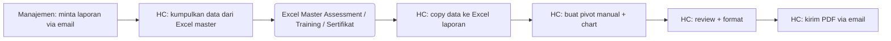
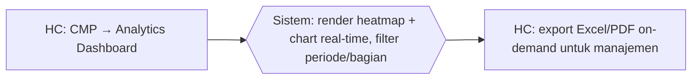

# Process Flow — Reporting & Analytics

## Konteks (Eksekutif)

Reporting kompetensi HC ke manajemen = heatmap gap kompetensi, progress assessment per bagian, coaching completion, training adoption. Sebelum HC Portal, tiap permintaan = HC pivot Excel ad-hoc dari beberapa file master. HC Portal: Analytics Dashboard real-time + filter periode/bagian + export Excel/PDF on-demand.

## Flow SEBELUM — Pivot Manual (6 Step, 2 Tools)

## Flow SESUDAH — HC Portal (2 Step, 1 Portal)

## Tabel Komparasi Step

| Aspek | Sebelum | Sesudah | Improvement |
|-------|---------|---------|-------------|
| Step HC | 5 step | 2 step | **-60%** |
| Tools | Excel master + Excel laporan + Email | 1 portal | **-67%** |
| Data freshness | Snapshot saat dibuat | Real-time | kualitatif: timeliness |
| Self-service manajemen | Tidak | Ya (dashboard role-based) | kualitatif: empowerment |
| Konsistensi metric | Bergantung formula HC | Standar di dashboard | kualitatif: trust |
| Waktu per laporan | ~4 jam | ~10 menit | **~96%** |

## Issue yang Diselesaikan

Mapping: **B**, **D**.

## Benefit

**Kuantitatif:**
- Step HC: -60%
- Tools: 3 → 1 portal (-67%)
- Waktu per laporan: ~96%
- Data: snapshot → real-time

**Kualitatif:**
- Manajemen self-service — HC fokus ke analisis
- Metric standar, no formula inkonsisten
- Heatmap gap kompetensi per bagian
- Export Excel/PDF tetap tersedia
- Auditable: chart dari DB, bukan pivot Excel
