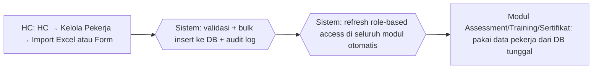

# Process Flow — Pengelolaan Data Pekerja

## Konteks (Eksekutif)

Data pekerja CSU Process (NIP, nama, jabatan, bagian, role) = fondasi seluruh modul. Sebelum HC Portal, data tersebar di beberapa Excel master per fungsi dengan update manual yang sering tidak sinkron. HC Portal: data terpusat di 1 DB + import Excel + form CRUD + role-based + audit log.

## Flow SEBELUM — Excel Scattered (8 Step, 2 Tools)

```mermaid
flowchart LR
    HC1[HC: data pekerja baru dari fungsi terkait via email] --> EMAIL(Email Pertamina)
    EMAIL --> HC2[HC: input ke Excel Master Pekerja]
    HC2 --> EX1(Excel Master Pekerja)
    EX1 --> HC3[HC: copy data ke Excel Assessment]
    HC3 --> EX2(Excel Master Assessment)
    EX2 --> HC4[HC: copy data ke Excel Training]
    HC4 --> EX3(Excel Master Training)
    EX3 --> HC5[HC: copy data ke Excel Sertifikat]
    HC5 --> EX4(Excel Master Sertifikat)
    EX4 --> HC6[HC: update bila ada mutasi jabatan/role di seluruh file]
```

## Flow SESUDAH — HC Portal (3 Step, 1 Portal)

## Tabel Komparasi Step

| Aspek | Sebelum | Sesudah | Improvement |
|-------|---------|---------|-------------|
| Step HC (pekerja baru) | 6 step (input + 4 copy + maintain) | 1 step (sekali) | **-83%** |
| Tools | 4 Excel master + Email | 1 portal | **-80%** |
| Risiko data mismatch | Tinggi (4 Excel) | Nol (1 DB) | kualitatif: integritas |
| Update mutasi/role | Manual di 4 Excel | Otomatis seluruh modul | kualitatif: konsistensi |
| Audit perubahan | Tidak ada | Audit log lengkap | kualitatif: governance |
| Import massal | Copy-paste | Import Excel + preview + validasi | kualitatif: bulk |
| Waktu input pekerja baru | ~30 menit (5 file) | ~5 menit (1 form/bulk) | **~83%** |

## Issue yang Diselesaikan

Mapping: **A**, **B**, **C**.

## Benefit

**Kuantitatif:**
- Step input HC: -83%
- Tools: 5 → 1 portal (-80%)
- Waktu input per pekerja: ~83%
- Mismatch antar modul: tinggi → nol

**Kualitatif:**
- SSoT data pekerja = fondasi seluruh modul
- Update mutasi auto-refleksi di assessment/IDP/sertifikat
- Audit log siap audit eksternal
- Bulk insert via Excel + validasi duplikat NIP/email
- Role-based access otomatis aktif
