# PCP HC Portal §3.4 Implementation Plan

> **For agentic workers:** REQUIRED SUB-SKILL: Use superpowers:subagent-driven-development (recommended) or superpowers:executing-plans to implement this plan task-by-task. Steps use checkbox (`- [ ]`) syntax for tracking.

**Goal:** Membuat 12 dokumen Markdown + Mermaid untuk PCP SMART 2026 §3.4 (Solusi Terpilih HC Portal), siap di-redraw manual ke PowerPoint untuk slide PCP final.

**Architecture:** Markdown files dengan Mermaid embedded diagram di folder `docs/pcp-HCPortal-2026/3.4-solusi-terpilih/`. Setiap file fokus satu fitur (process flow before/after) atau satu artefak (arsitektur, tabel, legend). Source-of-truth versionable di git; redraw ke PPT manual oleh user.

**Tech Stack:** Markdown (CommonMark), Mermaid (sequence/flowchart syntax), Git versioning. No build pipeline. Render verify via VS Code preview / GitHub markdown.

**Spec reference:** `docs/superpowers/specs/2026-05-21-pcp-hcportal-3.4-design.md`

---

## Konvensi Umum

**Tone:**
- Konteks/narasi → eksekutif (untuk reviewer PCP)
- Tabel/diagram/data → teknis

**Bahasa:** Bahasa Indonesia (per CLAUDE.md)

**Aktor swimlane (konsisten di semua file):**
- `USER` — pekerja umum
- `COACHEE` — pekerja program pengembangan
- `COACH` — pendamping
- `ATASAN` — Sr Spv / Section Head / Manager
- `HC` — fungsi Human Capital
- `SISTEM` — HC Portal

**Notasi Mermaid:** Pakai `flowchart LR` untuk swimlane horizontal, atau `sequenceDiagram` bila interaksi antar aktor. Konsisten dalam 1 file.

**Verifikasi tiap file:**
1. Mermaid render benar (no syntax error) via VS Code Markdown preview
2. Tone konsisten (eksekutif narasi + teknis data)
3. Tidak ada placeholder TBD/TODO
4. Bahasa Indonesia full

**Commit message convention:** `docs(pcp-3.4): <wave>/<file> — <summary>`

---

## Wave 1 — Foundation

### Task 1: Folder + README index

**Files:**
- Create: `docs/pcp-HCPortal-2026/3.4-solusi-terpilih/README.md`

- [ ] **Step 1: Pastikan folder ada**

Run: `ls docs/pcp-HCPortal-2026/3.4-solusi-terpilih/`
Expected: folder exists (sudah dibuat di sesi sebelumnya); kalau belum, `mkdir -p`.

- [ ] **Step 2: Tulis README.md**

Isi:

```markdown
# PCP SMART 2026 §3.4 — Solusi Terpilih HC Portal

> **Audience:** Reviewer PCP, manajemen HC, tim implementasi.
> **Domain:** HC Portal (PortalHC_KPB) — web app pengelolaan kompetensi CSU Process KPB.

## Executive Summary

HC Portal menggantikan workflow manual berbasis Excel + FleQi + paperwork + email/WhatsApp dengan single web portal terintegrasi. Hasilnya: pengurangan jumlah tools, jumlah step proses, dan waktu rekap; ditambah audit trail, single source of truth, dan governance compliance.

## Cakupan §3.4

Dokumen ini berisi visualisasi solusi terpilih HC Portal dalam dua bentuk yang valid di PCP §3.4:

1. **Gambar Teknik** — arsitektur sistem 3-tier HC Portal (`00-arsitektur-sistem.md`)
2. **Flow Proses** — process flow before/after untuk 7 fitur impactful (`01..07`)

## Index Dokumen

| File | Topik | Kategori |
|------|-------|----------|
| `00-arsitektur-sistem.md` | Arsitektur Sistem HC Portal | Gambar Teknik |
| `01-flow-assessment.md` | Process Flow Assessment Online | Flow Proses |
| `02-flow-proton-coaching.md` | Process Flow PROTON Coaching | Flow Proses |
| `03-flow-idp-plan.md` | Process Flow IDP / Plan | Flow Proses |
| `04-flow-kkj-matriks.md` | Process Flow KKJ & Matriks Kompetensi | Flow Proses |
| `05-flow-sertifikat-renewal.md` | Process Flow Sertifikat & Renewal | Flow Proses |
| `06-flow-reporting-analytics.md` | Process Flow Reporting / Analytics | Flow Proses |
| `07-flow-data-pekerja.md` | Process Flow Pengelolaan Data Pekerja | Flow Proses |
| `08-tabel-improvement.md` | Tabel Improvement Kuantitatif | Ringkasan |
| `09-tabel-issue-resolved.md` | Tabel Issue A-F & Mapping | Ringkasan |
| `10-legend-aktor.md` | Legend Swimlane & Aktor | Konvensi |

## Format Dokumen

- **Source:** Markdown + Mermaid (versionable di git)
- **Final delivery:** Manual redraw ke PowerPoint / Draw.io oleh tim untuk slide PCP

## Catatan Data Kuantitatif

Angka kuantitatif (jumlah step, waktu hemat, %) menggunakan **estimasi internal** berdasarkan inventory workflow manual sebelum HC Portal dan observasi proses HC. Akan di-refine dengan data riil pasca-implementasi.

## Referensi

- TKI: `wwwroot/documents/TKI/Draft-BAB-X-INSTRUKSI-KERJA-outline.md`
- Spec design: `docs/superpowers/specs/2026-05-21-pcp-hcportal-3.4-design.md`
```

- [ ] **Step 3: Verify Mermaid-less render**

Open in VS Code preview. Confirm Markdown rendered, tabel terformat.

- [ ] **Step 4: Commit**

```bash
git add docs/pcp-HCPortal-2026/3.4-solusi-terpilih/README.md
git commit -m "docs(pcp-3.4): wave1/README — index + executive summary"
```

---

### Task 2: Legend Aktor & Konvensi Swimlane

**Files:**
- Create: `docs/pcp-HCPortal-2026/3.4-solusi-terpilih/10-legend-aktor.md`

- [ ] **Step 1: Tulis file legend**

Isi:

````markdown
# Legend — Aktor & Konvensi Swimlane

> Dipakai konsisten di seluruh diagram process flow §3.4 (`01..07-flow-*.md`).

## Aktor

| Kode | Nama | Definisi |
|------|------|----------|
| `USER` | User / Pekerja | Pekerja umum CSU Process (pembaca/pengguna fitur) |
| `COACHEE` | Coachee | Pekerja yang mengikuti program pengembangan PROTON |
| `COACH` | Coach | Pekerja senior pendamping coachee |
| `ATASAN` | Atasan | Sr Supervisor / Section Head / Manager / VP |
| `HC` | Human Capital | Fungsi pengelola kompetensi & pengembangan |
| `SISTEM` | Sistem HC Portal | Web application (otomatis, tanpa intervensi manual) |

## Tools / Lane di Workflow SEBELUM

Diagram "Sebelum" menampilkan tools manual yang dipakai sebelum HC Portal:

| Tools | Tipe | Fungsi |
|-------|------|--------|
| Excel Master | Spreadsheet lokal/share folder | Data pekerja, KKJ, training, anggaran |
| FleQi Quiz | Aplikasi web eksternal | Ujian assessment online |
| Form PROTON cetak | Paperwork | Form coaching 5 fase |
| Word / PDF | Dokumen statis | Sertifikat, laporan |
| Email Pertamina | Channel komunikasi | Distribusi dokumen, approval |
| WhatsApp | Channel komunikasi | Koordinasi cepat, approval lisan tertulis |
| Arsip fisik | Map / lemari | Bukti coaching, evidence hardcopy |

## Notasi Mermaid (Standar)

**Tipe diagram utama:** `flowchart LR` (left-right) untuk alur step-by-step.

**Konvensi node:**
- `[Aktor]` rectangle = aksi manual oleh aktor
- `(Tools eksternal)` rounded = penggunaan tools non-portal
- `{{Sistem}}` hexagon = aksi otomatis oleh HC Portal
- `[/Decision/]` parallelogram = percabangan
- Tebal garis: tipis = manual; tebal = digital/otomatis

**Contoh skeleton SEBELUM:**

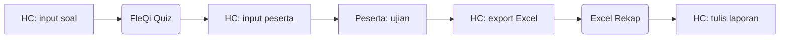

**Contoh skeleton SESUDAH:**

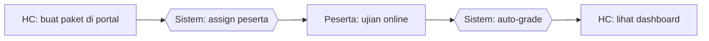

## Konvensi Warna (untuk redraw final)

Saat redraw ke PowerPoint, gunakan:
- Manual / tools eksternal: warna **abu-abu / merah muda** (menandakan pain point)
- Portal / digital: warna **biru / hijau Pertamina** (menandakan improvement)
- Decision: warna **kuning**
- Aktor swimlane: highlight nama aktor dengan warna konsisten per peran
````

- [ ] **Step 2: Verify Mermaid render**

Buka VS Code preview. Pastikan 2 contoh diagram (Sebelum & Sesudah) render tanpa error.

- [ ] **Step 3: Commit**

```bash
git add docs/pcp-HCPortal-2026/3.4-solusi-terpilih/10-legend-aktor.md
git commit -m "docs(pcp-3.4): wave1/legend — aktor + konvensi swimlane + notasi Mermaid"
```

---

### Task 3: Arsitektur Sistem HC Portal

**Files:**
- Create: `docs/pcp-HCPortal-2026/3.4-solusi-terpilih/00-arsitektur-sistem.md`

- [ ] **Step 1: Tulis file arsitektur**

Isi:

````markdown
# Arsitektur Sistem HC Portal — Gambar Teknik

## Konteks (Eksekutif)

HC Portal adalah aplikasi web 3-tier yang menyatukan workflow pengelolaan kompetensi (Competency Management, Career Development, PROTON Coaching) ke dalam satu platform tunggal. Arsitektur dipilih agar mendukung akses multi-role (Pekerja, Coach, Atasan, HC), monitoring real-time, audit trail menyeluruh, dan integrasi dengan dokumen kompetensi yang sebelumnya tersebar di Excel dan paperwork.

## Diagram Arsitektur 3-Tier

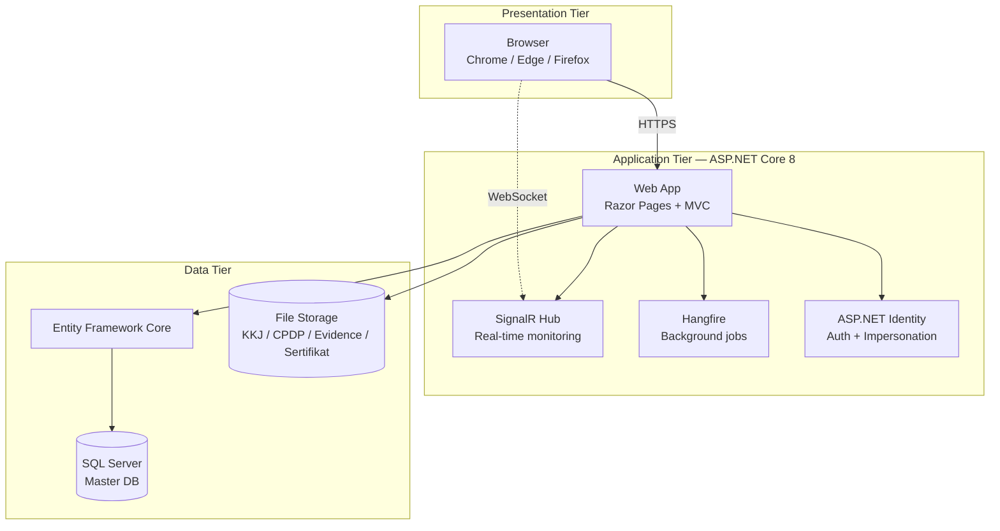

## Komponen Utama (Teknis)

| Layer | Komponen | Fungsi | Justifikasi |
|-------|----------|--------|-------------|
| Presentation | Razor Pages + Bootstrap 5 | Server-rendered UI, responsive | Konsisten Pertamina internal tooling, low front-end maintenance |
| Application | ASP.NET Core 8 | Web framework | Long-term support, performant, sesuai standar IT Pertamina |
| Application | SignalR | Real-time push (assessment monitoring) | Native ASP.NET, no third-party broker |
| Application | Hangfire | Background job (reminder, notifikasi expired sertifikat) | Persisted job storage di SQL, no external scheduler |
| Application | ASP.NET Identity | Otentikasi + role-based access + impersonation | Built-in, audit-ready, integrasi LDAP siap |
| Data | Entity Framework Core | ORM | Code-first migration, type-safe query |
| Data | SQL Server | RDBMS master data | Standar Pertamina, backup/restore matang |
| Storage | File System | Upload KKJ/CPDP/Evidence/Sertifikat | Path versioned dengan timestamp + GUID + filename |

## Karakteristik Non-Fungsional

| Aspek | Penanganan |
|-------|-----------|
| Skalabilitas | Vertical scale-up di server Dev 10.55.3.3; horizontal scaling tersedia bila migrasi ke load-balanced production |
| Keamanan | HTTPS only, anti-forgery token, role-based authorization, audit log seluruh aksi CRUD, impersonation dengan banner peringatan |
| Reliability | Database backup harian, file storage backup mingguan, maintenance mode untuk patching |
| Observability | Audit log per user-action, log file aplikasi, Hangfire dashboard |

## Modul Fungsional (Mapping ke Fitur Impactful)

| Modul | Fitur §3.4 yang Didukung |
|-------|-------------------------|
| CMP — Competency Management | Assessment Online (01), KKJ & Matriks (04), Sertifikat (05) |
| CDP — Career Development / PROTON | PROTON Coaching (02), IDP / Plan (03) |
| Modul HC (Admin) | Data Pekerja (07), Reporting / Analytics (06), input ke semua modul |
| Sistem (cross-cutting) | Notifikasi, Audit Log, Maintenance — out of scope §3.4 narrative |

## Justifikasi Pemilihan Stack

1. **ASP.NET Core 8** — standar internal Pertamina untuk web internal; long-term support sampai 2026; integrasi mudah dengan Active Directory.
2. **SQL Server** — sesuai lisensi korporat; tooling backup/restore matang; tim IT familiar.
3. **Bootstrap 5 + Razor Pages** — server-rendered, tidak butuh SPA tooling; mempercepat development dan deployment internal.
4. **SignalR** — built-in ke ASP.NET; tidak perlu broker eksternal (Redis/RabbitMQ); ideal untuk monitoring assessment volume KPB.
5. **Hangfire** — persisted job di SQL DB; dashboard built-in; eliminasi cron eksternal.
````

- [ ] **Step 2: Verify Mermaid render**

Buka VS Code preview. Konfirmasi diagram 3-tier render lengkap dengan subgraph + arah arrow benar.

- [ ] **Step 3: Commit**

```bash
git add docs/pcp-HCPortal-2026/3.4-solusi-terpilih/00-arsitektur-sistem.md
git commit -m "docs(pcp-3.4): wave1/00 — arsitektur sistem 3-tier HC Portal"
```

---

**🛑 CHECKPOINT — End of Wave 1**

Pastikan 3 file ada: `README.md`, `10-legend-aktor.md`, `00-arsitektur-sistem.md`. Render Mermaid OK. Tone konsisten. Lanjut Wave 2.

---

## Wave 2 — Flow Impactful

### Task 4: Flow Assessment Online (01)

**Files:**
- Create: `docs/pcp-HCPortal-2026/3.4-solusi-terpilih/01-flow-assessment.md`

- [ ] **Step 1: Tulis file flow assessment**

Isi:

````markdown
# Process Flow — Assessment Online

## Konteks (Eksekutif)

Assessment kompetensi adalah aktivitas pengukuran kemampuan teknis pekerja CSU Process terhadap matriks KKJ. Sebelum HC Portal, proses ini melibatkan tiga aplikasi (FleQi Quiz, Excel master, rekap manual) dengan banyak titik koordinasi HC–peserta–atasan. HC Portal menyatukan seluruh siklus assessment (buat paket → assign → ujian → grading → laporan) dalam satu portal dengan auto-grading dan dashboard real-time.

## Flow SEBELUM — Workflow Manual (8 Step, 3 Tools)

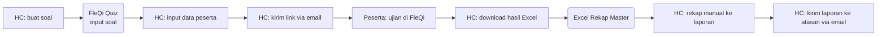

## Flow SESUDAH — HC Portal (4 Step, 1 Portal)

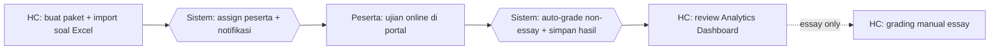

## Tabel Komparasi Step

| Aspek | Sebelum | Sesudah | Improvement |
|-------|---------|---------|-------------|
| Jumlah step HC | 6 step | 2 step (3 bila essay) | **-50% s.d. -67%** |
| Tools yang dipakai | FleQi Quiz + Excel Master + Email + Word laporan | 1 portal | **-75% tools** |
| Waktu rekap hasil (estimasi) | ~2 jam manual Excel per paket | ~5 menit (otomatis) | **~95% lebih cepat** |
| Real-time monitoring HC | Tidak ada | Ada (SignalR) | **kualitatif: visibility baru** |
| Audit trail aksi | Tidak ada | Lengkap (audit log) | **kualitatif: compliance** |
| Risiko data hilang | Tinggi (Excel scattered, email lost) | Rendah (DB terpusat + backup) | **kualitatif: data integrity** |
| Auto-grading | Manual | Otomatis untuk single/multiple choice | **kualitatif: akurasi 100% non-essay** |

## Issue yang Diselesaikan

Mapping ke `09-tabel-issue-resolved.md`: **A** (tools terfragmentasi), **B** (no single source of truth), **C** (no audit trail), **D** (reporting ad-hoc).

## Benefit

**Kuantitatif (estimasi):**
- Pengurangan step proses HC: -50% s.d. -67%
- Pengurangan jumlah tools: 4 tools → 1 portal (-75%)
- Pengurangan waktu rekap hasil: ~95%
- Real-time monitoring: 0 → tersedia (SignalR)

**Kualitatif:**
- Single source of truth untuk hasil assessment per pekerja
- Audit trail menyeluruh (siapa buat paket, siapa assign, kapan peserta submit)
- Visibility manajemen via Analytics Dashboard
- Eliminasi risiko file Excel rekap hilang/rusak
- Auto-grading menghilangkan human error pada soal single/multiple choice
````

- [ ] **Step 2: Verify Mermaid render**

VS Code preview — konfirmasi 2 diagram render benar. Cek arah arrow + label.

- [ ] **Step 3: Commit**

```bash
git add docs/pcp-HCPortal-2026/3.4-solusi-terpilih/01-flow-assessment.md
git commit -m "docs(pcp-3.4): wave2/01 — flow Assessment Online before/after + komparasi"
```

---

### Task 5: Flow PROTON Coaching (02)

**Files:**
- Create: `docs/pcp-HCPortal-2026/3.4-solusi-terpilih/02-flow-proton-coaching.md`

- [ ] **Step 1: Tulis file flow PROTON**

Isi:

````markdown
# Process Flow — PROTON Coaching

## Konteks (Eksekutif)

PROTON adalah metodologi coaching 5 fase (Purpose, Realita, Options, To-do, Outcome & Next-step) yang digunakan HC KPB untuk mengembangkan kompetensi coachee. Sebelum HC Portal, sesi coaching dicatat di form cetak, bukti coaching dikirim via WhatsApp / email, dan progress deliverable di-track manual oleh HC. HC Portal menyediakan form digital 5 fase + upload evidence + auto-link ke deliverable IDP + workflow approval terstruktur.

## Flow SEBELUM — Paperwork + Channel Manual (9 Step, 4 Tools)

```mermaid
flowchart LR
    HC0[HC: assign coachee-coach via email] --> CO1[Coach: jadwalkan sesi]
    CO1 --> CO2[Coach: print form PROTON]
    CO2 --> FORM(Form PROTON cetak)
    FORM --> CO3[Coach: isi 5 fase manual]
    CO3 --> CO4[Coach: foto bukti / upload WhatsApp]
    CO4 --> WA(WhatsApp / Email)
    WA --> CO5[Coach: simpan form di map fisik]
    CO5 --> ARSIP(Arsip fisik)
    ARSIP --> HC1[HC: track progress manual via WA]
    HC1 --> AT1[Atasan: approval lisan / WA]
```

## Flow SESUDAH — HC Portal (5 Step, 1 Portal)

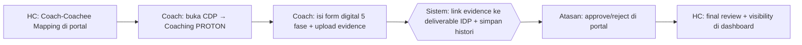

## Tabel Komparasi Step

| Aspek | Sebelum | Sesudah | Improvement |
|-------|---------|---------|-------------|
| Jumlah step Coach | 5 step | 2 step | **-60% step** |
| Tools yang dipakai | Form cetak + WhatsApp + Email + Arsip fisik | 1 portal | **-75% tools** |
| Bukti coaching | File terserak (WA media, email attachment) | Tersimpan terpusat + linked ke deliverable | **kualitatif: traceable** |
| Workflow approval | Lisan / WA, no trail | Coach→Atasan(Reviewer)→HC dengan status history | **kualitatif: governance** |
| Histori sesi coachee | Tidak terstruktur (map fisik) | Timeline digital lengkap (Histori PROTON) | **kualitatif: longitudinal view** |
| Waktu rekap progress (estimasi HC) | ~3 jam per bulan per coach | ~10 menit (otomatis dari dashboard) | **~95% lebih cepat** |

## Issue yang Diselesaikan

Mapping ke `09-tabel-issue-resolved.md`: **A** (tools terfragmentasi), **C** (no audit trail), **E** (workflow tanpa tracking).

## Benefit

**Kuantitatif (estimasi):**
- Pengurangan step Coach: -60%
- Pengurangan tools: 4 → 1 portal (-75%)
- Pengurangan waktu rekap progress HC: ~95%
- Histori coaching tersedia 100% (sebelumnya ~ tidak terlacak)

**Kualitatif:**
- Single source of truth untuk seluruh sesi PROTON + evidence
- Auto-link evidence ke deliverable IDP — Coach upload sekali, deliverable progress otomatis update
- Workflow approval bertingkat (Coach → Atasan → HC) terdokumentasi
- Eliminasi risiko form fisik hilang / coretan tidak terbaca
- Atasan dan HC mendapat visibility coaching per coachee secara real-time
````

- [ ] **Step 2: Verify Mermaid render**

VS Code preview — pastikan 2 diagram render rapi.

- [ ] **Step 3: Commit**

```bash
git add docs/pcp-HCPortal-2026/3.4-solusi-terpilih/02-flow-proton-coaching.md
git commit -m "docs(pcp-3.4): wave2/02 — flow PROTON Coaching before/after + komparasi"
```

---

**🛑 CHECKPOINT — End of Wave 2**

5 file selesai. Pattern flow file sudah stabil. Lanjut Wave 3 (5 file flow tambahan dengan struktur sama).

---

## Wave 3 — Flow Tambahan

### Task 6: Flow IDP / Plan (03)

**Files:**
- Create: `docs/pcp-HCPortal-2026/3.4-solusi-terpilih/03-flow-idp-plan.md`

- [ ] **Step 1: Tulis file flow IDP**

Isi:

````markdown
# Process Flow — IDP / Plan

## Konteks (Eksekutif)

Individual Development Plan (IDP) adalah rencana pengembangan kompetensi per coachee, terdiri dari struktur Track → Kompetensi → Sub-Kompetensi → Deliverable. Sebelum HC Portal, IDP disusun HC di Excel template lalu didistribusikan via email dengan tracking progress manual; perubahan struktur memerlukan re-distribusi file. HC Portal menggunakan menu PROTON Data — HC upload silabus Excel sekali, dan IDP langsung tampil di halaman Plan IDP coachee dengan progress auto-update dari deliverable.

## Flow SEBELUM — Excel + Email (7 Step, 3 Tools)

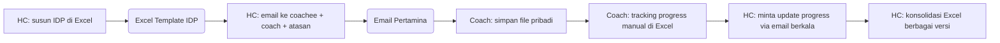

## Flow SESUDAH — HC Portal (3 Step, 1 Portal)

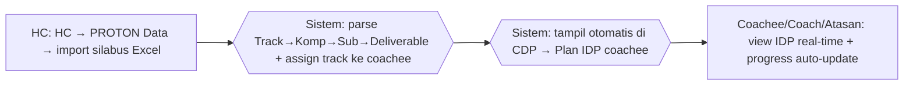

## Tabel Komparasi Step

| Aspek | Sebelum | Sesudah | Improvement |
|-------|---------|---------|-------------|
| Jumlah step HC distribusi | 4 step (susun, email, update, konsolidasi) | 1 step (import sekali) | **-75% step** |
| Tools | Excel + Email + arsip pribadi coachee | 1 portal | **-67% tools** |
| Versi file IDP | Banyak versi tersebar | 1 versi terpusat | **kualitatif: konsistensi** |
| Update struktur IDP | Re-distribusi email ke semua pihak | Upload ulang Excel di portal, langsung ter-refleksi | **kualitatif: agility** |
| Progress tracking | Manual per coach, no aggregation | Auto-update dari deliverable + visible ke semua role | **kualitatif: visibility** |
| Waktu konsolidasi IDP (estimasi) | ~4 jam per siklus | ~15 menit | **~94% lebih cepat** |

## Issue yang Diselesaikan

Mapping ke `09-tabel-issue-resolved.md`: **A** (tools terfragmentasi), **B** (no single source of truth), **E** (workflow tanpa tracking).

## Benefit

**Kuantitatif (estimasi):**
- Pengurangan step distribusi HC: -75%
- Pengurangan tools: 3 → 1 portal (-67%)
- Pengurangan waktu konsolidasi: ~94%
- 100% coachee melihat IDP versi terkini (sebelumnya bergantung email terakhir diterima)

**Kualitatif:**
- IDP tunggal sebagai single source of truth — HC update sekali, semua role lihat versi sama
- Progress deliverable auto-update dari sesi coaching (no double-entry)
- Atasan dan Coach memiliki view yang konsisten dengan coachee
- Refresh struktur kompetensi (track baru, sub-kompetensi baru) tidak butuh email blast
````

- [ ] **Step 2: Verify + Commit**

```bash
git add docs/pcp-HCPortal-2026/3.4-solusi-terpilih/03-flow-idp-plan.md
git commit -m "docs(pcp-3.4): wave3/03 — flow IDP / Plan before/after + komparasi"
```

---

### Task 7: Flow KKJ & Matriks Kompetensi (04)

**Files:**
- Create: `docs/pcp-HCPortal-2026/3.4-solusi-terpilih/04-flow-kkj-matriks.md`

- [ ] **Step 1: Tulis file flow KKJ**

Isi:

````markdown
# Process Flow — KKJ & Matriks Kompetensi

## Konteks (Eksekutif)

Kebutuhan Kompetensi Jabatan (KKJ) adalah dokumen referensi standar kompetensi per jabatan. Sebelum HC Portal, file KKJ tersimpan di share folder Excel/PDF tanpa versioning yang jelas, dan matriks kompetensi bagian disusun manual per request. HC Portal menyediakan menu upload terpusat dengan history versi otomatis + matriks KKJ digital per bagian.

## Flow SEBELUM — Share Folder + Manual (6 Step, 3 Tools)

```mermaid
flowchart LR
    HC1[HC: update KKJ di Excel] --> EX1(Excel KKJ Master)
    EX1 --> HC2[HC: simpan ke share folder]
    HC2 --> SF1(Share Folder)
    SF1 --> HC3[HC: email link ke atasan terkait]
    HC3 --> EMAIL(Email Pertamina)
    EMAIL --> AT1[Atasan: download Excel KKJ]
    AT1 --> AT2[Atasan: minta matriks bagian via email ke HC]
    AT2 --> HC4[HC: susun matriks manual di Excel]
```

## Flow SESUDAH — HC Portal (3 Step, 1 Portal)

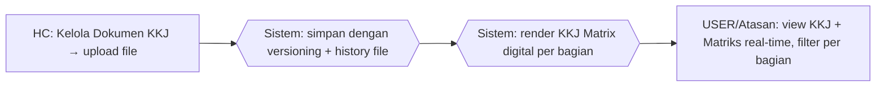

## Tabel Komparasi Step

| Aspek | Sebelum | Sesudah | Improvement |
|-------|---------|---------|-------------|
| Jumlah step HC | 4 step (update, simpan, email, susun matriks) | 1 step (upload) | **-75% step** |
| Tools | Excel + Share Folder + Email | 1 portal | **-67% tools** |
| Versioning file | Manual (rename file `_v2`, `_final`, ...) | Otomatis dengan timestamp + GUID | **kualitatif: traceable** |
| Matriks kompetensi | On-demand manual susun | Real-time digital | **kualitatif: instant** |
| Akses Atasan | Bergantung email berkala | Self-service di portal | **kualitatif: empowerment** |
| Waktu susun matriks (estimasi) | ~3 jam per request | ~real-time (auto-render) | **~99% lebih cepat** |

## Issue yang Diselesaikan

Mapping ke `09-tabel-issue-resolved.md`: **A** (tools terfragmentasi), **B** (no single source of truth), **D** (reporting ad-hoc).

## Benefit

**Kuantitatif (estimasi):**
- Pengurangan step HC: -75%
- Pengurangan tools: 3 → 1 portal (-67%)
- Pengurangan waktu susun matriks: ~99%
- Versioning otomatis: 0 → 100% file ter-track

**Kualitatif:**
- History versi KKJ tersimpan otomatis (KkjFileHistory)
- Atasan akses matriks kompetensi self-service, tanpa permintaan ke HC
- Single source of truth — tidak ada lagi file `KKJ_v3_final_REAL.xlsx`
- Visibility gap kompetensi per pekerja terstruktur di KKJ Matrix
````

- [ ] **Step 2: Verify + Commit**

```bash
git add docs/pcp-HCPortal-2026/3.4-solusi-terpilih/04-flow-kkj-matriks.md
git commit -m "docs(pcp-3.4): wave3/04 — flow KKJ & Matriks before/after + komparasi"
```

---

### Task 8: Flow Sertifikat & Renewal (05)

**Files:**
- Create: `docs/pcp-HCPortal-2026/3.4-solusi-terpilih/05-flow-sertifikat-renewal.md`

- [ ] **Step 1: Tulis file flow sertifikat**

Isi:

````markdown
# Process Flow — Sertifikat & Renewal

## Konteks (Eksekutif)

Sertifikat kompetensi (hasil assessment) dan sertifikat training (mandatory: Safety for Refinery, SUPREME, ERP, Confined Space, dll.) memiliki tanggal expired yang harus di-track agar compliance terjaga. Sebelum HC Portal, sertifikat dibuat manual di Word/PDF tanpa tracking expired terstruktur, sehingga sering ada sertifikat kelewat expired sebelum diingatkan. HC Portal auto-generate sertifikat dari hasil assessment, menampilkan badge expired di profil pekerja, dan menyediakan menu Renewal Certificate untuk perencanaan training renewal.

## Flow SEBELUM — Manual + Reaktif (7 Step, 3 Tools)

```mermaid
flowchart LR
    HC1[HC: buat sertifikat di Word] --> WORD(Template Word/PDF)
    WORD --> HC2[HC: print + tanda tangan basah]
    HC2 --> HC3[HC: serah ke pekerja]
    HC3 --> P1[Pekerja: simpan hardcopy]
    P1 --> HC4[HC: catat expiry di Excel master]
    HC4 --> EX1(Excel Master Sertifikat)
    EX1 --> HC5[HC: cek manual setiap bulan / saat audit]
    HC5 --> HC6[HC: koordinasi training renewal via email]
```

## Flow SESUDAH — HC Portal (4 Step, 1 Portal)

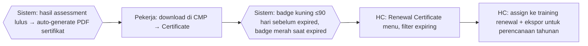

## Tabel Komparasi Step

| Aspek | Sebelum | Sesudah | Improvement |
|-------|---------|---------|-------------|
| Jumlah step HC | 6 step (buat, print, catat, cek, koordinasi) | 2 step (auto + plan) | **-67% step** |
| Tools | Word + Excel + Email + Hardcopy | 1 portal | **-75% tools** |
| Generasi sertifikat | Manual per pekerja | Otomatis dari hasil assessment | **kualitatif: skalabel** |
| Tracking expired | Manual check Excel, reaktif | Badge otomatis (kuning/merah) | **kualitatif: proaktif** |
| Renewal planning | Reaktif (sering kelewat) | Menu Renewal Certificate + filter expiring | **kualitatif: compliance** |
| Waktu generate sertifikat (estimasi) | ~10 menit per pekerja | ~instant | **~99% lebih cepat** |

## Issue yang Diselesaikan

Mapping ke `09-tabel-issue-resolved.md`: **A** (tools terfragmentasi), **C** (no audit trail), **F** (renewal sertifikat reaktif).

## Benefit

**Kuantitatif (estimasi):**
- Pengurangan step HC: -67%
- Pengurangan tools: 4 → 1 portal (-75%)
- Pengurangan waktu generate per sertifikat: ~99% (manual ~10 menit → instant)
- 100% sertifikat ter-track expiry-nya (sebelumnya bergantung Excel manual)

**Kualitatif:**
- Auto-generate eliminasi risiko typo / format inkonsisten
- Badge visual (kuning/merah) memberi early warning ke pekerja & HC
- Menu Renewal Certificate memungkinkan planning training renewal tahunan terstruktur
- Audit-ready: setiap sertifikat memiliki referensi ke assessment / training source
- Compliance posture berubah dari **reaktif** → **proaktif**
````

- [ ] **Step 2: Verify + Commit**

```bash
git add docs/pcp-HCPortal-2026/3.4-solusi-terpilih/05-flow-sertifikat-renewal.md
git commit -m "docs(pcp-3.4): wave3/05 — flow Sertifikat & Renewal before/after + komparasi"
```

---

### Task 9: Flow Reporting / Analytics (06)

**Files:**
- Create: `docs/pcp-HCPortal-2026/3.4-solusi-terpilih/06-flow-reporting-analytics.md`

- [ ] **Step 1: Tulis file flow reporting**

Isi:

````markdown
# Process Flow — Reporting & Analytics

## Konteks (Eksekutif)

Reporting kompetensi HC ke manajemen mencakup heatmap gap kompetensi, progress assessment per bagian, coaching completion rate, training adoption, dan lainnya. Sebelum HC Portal, setiap permintaan laporan dari manajemen memerlukan HC melakukan pivot Excel ad-hoc dari beberapa file master. HC Portal menyediakan Analytics Dashboard real-time dengan filter periode & bagian, plus export Excel/PDF on-demand.

## Flow SEBELUM — Pivot Manual (6 Step, 2 Tools)

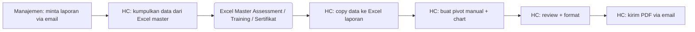

## Flow SESUDAH — HC Portal (2 Step, 1 Portal)

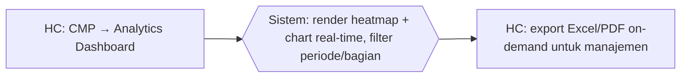

## Tabel Komparasi Step

| Aspek | Sebelum | Sesudah | Improvement |
|-------|---------|---------|-------------|
| Jumlah step HC | 5 step (kumpul, copy, pivot, format, kirim) | 2 step (lihat + export) | **-60% step** |
| Tools | Excel master + Excel laporan + Email | 1 portal | **-67% tools** |
| Data freshness | Snapshot saat HC buat laporan | Real-time | **kualitatif: timeliness** |
| Self-service manajemen | Tidak (bergantung HC) | Bisa (dashboard role-based) | **kualitatif: empowerment** |
| Konsistensi metric | Bergantung formula Excel HC | Standar di dashboard | **kualitatif: trust** |
| Waktu per laporan ad-hoc (estimasi) | ~4 jam | ~10 menit | **~96% lebih cepat** |

## Issue yang Diselesaikan

Mapping ke `09-tabel-issue-resolved.md`: **B** (no single source of truth), **D** (reporting ad-hoc).

## Benefit

**Kuantitatif (estimasi):**
- Pengurangan step HC: -60%
- Pengurangan tools: 3 → 1 portal (-67%)
- Pengurangan waktu per laporan: ~96%
- Data refresh: snapshot → real-time

**Kualitatif:**
- Manajemen dapat akses dashboard sendiri (self-service) — HC fokus ke analisis, bukan pivot manual
- Metric standar dan konsisten — tidak ada lagi laporan dengan formula Excel berbeda-beda
- Heatmap gap kompetensi memberi visibility per bagian / per kompetensi
- Export Excel/PDF tetap tersedia untuk distribusi formal
- Auditable: chart bersumber dari DB, bukan pivot Excel yang sulit diaudit
````

- [ ] **Step 2: Verify + Commit**

```bash
git add docs/pcp-HCPortal-2026/3.4-solusi-terpilih/06-flow-reporting-analytics.md
git commit -m "docs(pcp-3.4): wave3/06 — flow Reporting / Analytics before/after + komparasi"
```

---

### Task 10: Flow Data Pekerja (07)

**Files:**
- Create: `docs/pcp-HCPortal-2026/3.4-solusi-terpilih/07-flow-data-pekerja.md`

- [ ] **Step 1: Tulis file flow data pekerja**

Isi:

````markdown
# Process Flow — Pengelolaan Data Pekerja

## Konteks (Eksekutif)

Data pekerja CSU Process (NIP, nama, jabatan, bagian, role) menjadi fondasi seluruh modul HC Portal. Sebelum HC Portal, data pekerja tersebar di beberapa Excel master per fungsi (assessment, training, KKJ) dengan update manual yang sering tidak sinkron. HC Portal memusatkan data pekerja di satu DB dengan import Excel + form CRUD + role-based access + audit log seluruh perubahan.

## Flow SEBELUM — Excel Scattered (8 Step, 2 Tools)

```mermaid
flowchart LR
    HC1[HC: data pekerja baru dari fungsi terkait via email] --> EMAIL(Email Pertamina)
    EMAIL --> HC2[HC: input ke Excel Master Pekerja]
    HC2 --> EX1(Excel Master Pekerja)
    EX1 --> HC3[HC: copy data ke Excel Assessment]
    HC3 --> EX2(Excel Master Assessment)
    EX2 --> HC4[HC: copy data ke Excel Training]
    HC4 --> EX3(Excel Master Training)
    EX3 --> HC5[HC: copy data ke Excel Sertifikat]
    HC5 --> EX4(Excel Master Sertifikat)
    EX4 --> HC6[HC: update bila ada mutasi jabatan/role di seluruh file]
```

## Flow SESUDAH — HC Portal (3 Step, 1 Portal)

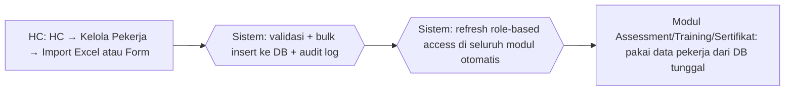

## Tabel Komparasi Step

| Aspek | Sebelum | Sesudah | Improvement |
|-------|---------|---------|-------------|
| Jumlah step HC saat pekerja baru | 6 step (input + 4 copy ke Excel berbeda + maintain) | 1 step (input/import sekali) | **-83% step** |
| Tools | 4 Excel master + Email | 1 portal | **-80% tools** |
| Risiko data mismatch antar modul | Tinggi (4 file Excel berbeda) | Nol (1 DB) | **kualitatif: integritas** |
| Update mutasi/role | Manual di 4 Excel | Otomatis di seluruh modul | **kualitatif: konsistensi** |
| Audit perubahan data | Tidak ada | Audit log lengkap | **kualitatif: governance** |
| Import massal | Manual copy-paste | Import Excel + preview + validasi | **kualitatif: bulk operation** |
| Waktu input pekerja baru (estimasi) | ~30 menit per pekerja (5 file) | ~5 menit (1 form atau bulk) | **~83% lebih cepat** |

## Issue yang Diselesaikan

Mapping ke `09-tabel-issue-resolved.md`: **A** (tools terfragmentasi), **B** (no single source of truth), **C** (no audit trail).

## Benefit

**Kuantitatif (estimasi):**
- Pengurangan step input HC: -83%
- Pengurangan tools: 5 → 1 portal (-80%)
- Pengurangan waktu input per pekerja baru: ~83%
- Mismatch antar modul: tinggi → nol

**Kualitatif:**
- Single source of truth data pekerja menjadi fondasi seluruh modul
- Update mutasi jabatan/role otomatis ter-refleksi di seluruh fitur (assessment, IDP, sertifikat)
- Audit log mencatat siapa mengubah data apa, kapan — siap audit eksternal
- Import Excel mendukung onboarding massal (bulk insert) dengan validasi otomatis (duplikat NIP, email invalid)
- Role-based access otomatis aktif begitu role pekerja di-assign
````

- [ ] **Step 2: Verify + Commit**

```bash
git add docs/pcp-HCPortal-2026/3.4-solusi-terpilih/07-flow-data-pekerja.md
git commit -m "docs(pcp-3.4): wave3/07 — flow Data Pekerja before/after + komparasi"
```

---

**🛑 CHECKPOINT — End of Wave 3**

10 file selesai (README + 00 + 10 + 01-07). Lanjut Wave 4 untuk tabel ringkasan.

---

## Wave 4 — Ringkasan

### Task 11: Tabel Improvement Kuantitatif (08)

**Files:**
- Create: `docs/pcp-HCPortal-2026/3.4-solusi-terpilih/08-tabel-improvement.md`

- [ ] **Step 1: Tulis file tabel improvement**

Isi:

````markdown
# Tabel Improvement Kuantitatif — Ringkasan 7 Fitur

## Tujuan

Ringkasan kuantitatif impact HC Portal terhadap workflow manual sebelumnya, untuk 7 fitur impactful yang masuk cakupan §3.4. Angka berasal dari estimasi internal hasil inventory workflow + observasi proses HC; akan di-refine dengan data riil pasca-implementasi.

## Tabel Ringkasan Per Fitur

| # | Fitur | Step Sebelum | Step Sesudah | Δ Step | Tools Sebelum | Tools Sesudah | Δ Tools | Waktu Sebelum (estimasi) | Waktu Sesudah (estimasi) | Δ Waktu |
|---|-------|:-----------:|:------------:|:------:|:------------:|:------------:|:------:|:------------------------:|:-------------------------:|:------:|
| 01 | Assessment Online | 6 | 2 | **-67%** | 4 | 1 | **-75%** | ~2 jam/paket | ~5 menit/paket | **~95%** |
| 02 | PROTON Coaching | 5 | 2 | **-60%** | 4 | 1 | **-75%** | ~3 jam/bulan/coach | ~10 menit/bulan/coach | **~95%** |
| 03 | IDP / Plan | 4 | 1 | **-75%** | 3 | 1 | **-67%** | ~4 jam/siklus | ~15 menit/siklus | **~94%** |
| 04 | KKJ & Matriks | 4 | 1 | **-75%** | 3 | 1 | **-67%** | ~3 jam/request | real-time | **~99%** |
| 05 | Sertifikat & Renewal | 6 | 2 | **-67%** | 4 | 1 | **-75%** | ~10 menit/pekerja | instant | **~99%** |
| 06 | Reporting / Analytics | 5 | 2 | **-60%** | 3 | 1 | **-67%** | ~4 jam/laporan | ~10 menit | **~96%** |
| 07 | Data Pekerja | 6 | 1 | **-83%** | 5 | 1 | **-80%** | ~30 menit/pekerja | ~5 menit/pekerja | **~83%** |

## Agregat Lintas Fitur

| Metrik | Range | Median |
|--------|-------|--------|
| Pengurangan step proses | -60% s.d. -83% | **-67%** |
| Pengurangan tools | -67% s.d. -80% | **-75%** |
| Pengurangan waktu (estimasi) | -83% s.d. -99% | **~95%** |

## Aspek Kualitatif (Lintas Fitur)

| Aspek | Sebelum | Sesudah |
|-------|---------|---------|
| Single source of truth | Tidak ada (data tersebar 4-5 Excel) | Ada (1 DB) |
| Audit trail | Tidak ada / manual | Lengkap (audit log per aksi) |
| Real-time data | Snapshot manual | Real-time (DB + SignalR) |
| Self-service manajemen | Tidak (bergantung rekap HC) | Ya (dashboard role-based) |
| Workflow approval | Lisan / WA | Terstruktur (Coach → Atasan → HC) |
| Versioning dokumen | Manual (rename file) | Otomatis (timestamp + GUID) |
| Bulk operation | Copy-paste manual | Import Excel + validasi |
| Compliance posture | Reaktif (sering kelewat) | Proaktif (badge expiry, renewal menu) |

## Sumber Estimasi

- **Step count:** dihitung dari diagram swimlane file `01-07-flow-*.md`
- **Tools count:** inventory aplikasi/medium yang dipakai pra-HC Portal (Excel master per modul, FleQi Quiz, Word, Email Pertamina, WhatsApp, arsip fisik)
- **Waktu:** estimasi internal berdasarkan observasi proses HC + benchmark workflow umum manual

## Catatan untuk Reviewer

Angka kuantitatif bersifat **estimasi internal**, bukan hasil time-motion study formal. Tujuan utama adalah menunjukkan **magnitude order improvement** per fitur, bukan presisi absolut. Data riil akan dikumpulkan pasca-implementasi via:
- Audit log untuk durasi proses aktual
- Wawancara HC pasca-1 siklus
- Telemetri Hangfire untuk background job
````

- [ ] **Step 2: Verify + Commit**

```bash
git add docs/pcp-HCPortal-2026/3.4-solusi-terpilih/08-tabel-improvement.md
git commit -m "docs(pcp-3.4): wave4/08 — tabel improvement kuantitatif 7 fitur + agregat"
```

---

### Task 12: Tabel Issue Resolved (09)

**Files:**
- Create: `docs/pcp-HCPortal-2026/3.4-solusi-terpilih/09-tabel-issue-resolved.md`

- [ ] **Step 1: Tulis file tabel issue**

Isi:

````markdown
# Tabel Issue Resolved — Pain Point Manual & Mapping ke Fitur

## Tujuan

Identifikasi 6 pain point sistemik dari workflow manual sebelum HC Portal, beserta mapping ke fitur HC Portal yang menyelesaikan pain point tersebut.

## Daftar Issue (A — F)

| Code | Issue | Deskripsi |
|------|-------|-----------|
| **A** | Tools Terfragmentasi | Workflow tersebar di 4-5 tools terpisah (Excel master + FleQi Quiz + Word + Email + WhatsApp + arsip fisik) tanpa integrasi otomatis. HC harus copy-paste antar tools dengan risiko inkonsistensi |
| **B** | Tidak Ada Single Source of Truth | Data sama disalin di beberapa Excel berbeda (per modul). Update di satu file tidak ter-refleksi di file lain, menimbulkan data mismatch yang menyulitkan rekonsiliasi |
| **C** | Tidak Ada Audit Trail | Perubahan data, approval coaching, generasi sertifikat dilakukan manual tanpa pencatatan siapa-apa-kapan. Sulit ditelusur saat audit eksternal atau investigasi insiden |
| **D** | Reporting Ad-Hoc & Non-Real-Time | Setiap permintaan laporan dari manajemen memerlukan HC melakukan pivot Excel ad-hoc dari beberapa file. Data bersifat snapshot (bukan real-time) dan formula bisa berbeda per laporan |
| **E** | Workflow Tanpa Tracking | Coaching, approval deliverable, dan progress IDP berjalan via koordinasi WhatsApp / email / lisan tanpa workflow terstruktur dengan status history |
| **F** | Renewal Sertifikat Reaktif | Tracking expired sertifikat dilakukan manual di Excel master. HC sering baru menyadari sertifikat expired saat audit, sehingga compliance posture menjadi reaktif |

## Mapping Issue ↔ Fitur HC Portal

| Issue | Fitur yang Menyelesaikan | Mekanisme |
|-------|--------------------------|-----------|
| **A** Tools Terfragmentasi | 01, 02, 03, 04, 05, 07 | Konsolidasi seluruh workflow ke 1 portal; eliminasi FleQi, Excel master per modul, paperwork, WhatsApp koordinasi |
| **B** Tidak Ada Single Source of Truth | 01, 03, 04, 06, 07 | DB SQL Server terpusat; entity pekerja, KKJ, assessment, IDP, deliverable saling-link via foreign key; perubahan di satu modul otomatis ter-refleksi di modul lain |
| **C** Tidak Ada Audit Trail | 01, 02, 05, 07 | Audit log mencatat seluruh aksi CRUD + login + impersonation; status history per deliverable/sertifikat; ASP.NET Identity dengan timestamp |
| **D** Reporting Ad-Hoc & Non-Real-Time | 01, 04, 06 | Analytics Dashboard real-time dengan filter periode/bagian; export Excel/PDF on-demand; KKJ Matrix digital auto-render |
| **E** Workflow Tanpa Tracking | 02, 03 | Workflow Coach → Reviewer (Atasan) → HC dengan status approval (Pending / Approved / Rejected) tersimpan di DB; histori coaching timeline |
| **F** Renewal Sertifikat Reaktif | 05 | Badge expiry (kuning ≤ 90 hari, merah ≥ expired) otomatis; menu Renewal Certificate dengan filter expiring; ekspor untuk perencanaan training tahunan |

## Matriks Coverage

| | 01 Assessment | 02 PROTON | 03 IDP | 04 KKJ | 05 Sertifikat | 06 Reporting | 07 Data Pekerja |
|---|:---:|:---:|:---:|:---:|:---:|:---:|:---:|
| **A** Tools | ✓ | ✓ | ✓ | ✓ | ✓ | — | ✓ |
| **B** SSoT | ✓ | — | ✓ | ✓ | — | ✓ | ✓ |
| **C** Audit | ✓ | ✓ | — | — | ✓ | — | ✓ |
| **D** Reporting | ✓ | — | — | ✓ | — | ✓ | — |
| **E** Workflow | — | ✓ | ✓ | — | — | — | — |
| **F** Renewal | — | — | — | — | ✓ | — | — |

> Cell `✓` = fitur menyelesaikan / mitigate issue tersebut.

## Konsolidasi Risiko Sebelum vs Sesudah

| Risiko (Sebelum) | Status (Sesudah) |
|------------------|------------------|
| Data Excel rekap hilang/rusak | Mitigated — DB + backup |
| Inkonsistensi data antar modul | Mitigated — 1 DB referensial |
| Sertifikat kelewat expired tanpa renewal | Mitigated — badge expiry + menu Renewal |
| Approval coaching tidak terdokumentasi | Mitigated — workflow Coach→Atasan→HC dengan status history |
| Laporan ke manajemen tidak real-time | Mitigated — Analytics Dashboard |
| HC overload rekap manual | Mitigated — auto-grading, auto-rekap, auto-aggregate |
| Audit eksternal sulit (no trail) | Mitigated — audit log lengkap |
````

- [ ] **Step 2: Verify + Commit**

```bash
git add docs/pcp-HCPortal-2026/3.4-solusi-terpilih/09-tabel-issue-resolved.md
git commit -m "docs(pcp-3.4): wave4/09 — tabel issue A-F + mapping fitur + matriks coverage"
```

---

**🛑 CHECKPOINT — End of Wave 4 (Selesai)**

12 file ada di folder. Verifikasi akhir di Task 13.

---

## Wave 5 — Verifikasi Akhir

### Task 13: Final Verification + Index Sanity Check

**Files:**
- Verify only (no create)

- [ ] **Step 1: List semua file**

Run: `ls docs/pcp-HCPortal-2026/3.4-solusi-terpilih/`

Expected output (12 file):
```
00-arsitektur-sistem.md
01-flow-assessment.md
02-flow-proton-coaching.md
03-flow-idp-plan.md
04-flow-kkj-matriks.md
05-flow-sertifikat-renewal.md
06-flow-reporting-analytics.md
07-flow-data-pekerja.md
08-tabel-improvement.md
09-tabel-issue-resolved.md
10-legend-aktor.md
README.md
```

- [ ] **Step 2: Cek render Mermaid di tiap file flow**

Buka tiap file `01..07-flow-*.md` di VS Code preview. Konfirmasi 2 diagram (Sebelum + Sesudah) render tanpa syntax error.

- [ ] **Step 3: Cek konsistensi aktor & tone**

Skim tiap file. Pastikan:
- Aktor pakai kode konsisten (HC, Coach, Atasan, dst.)
- Tone: konteks eksekutif, tabel teknis
- Bahasa Indonesia full
- Tidak ada TBD/TODO

- [ ] **Step 4: Sanity check angka di 08-tabel-improvement.md**

Buka `08-tabel-improvement.md`. Bandingkan angka step / tools / waktu dengan file `01-07-flow-*.md` masing-masing. Pastikan konsisten.

- [ ] **Step 5: Sanity check mapping issue di 09-tabel-issue-resolved.md**

Buka `09-tabel-issue-resolved.md`. Bandingkan kolom "Issue yang Diselesaikan" di tiap file flow dengan matriks coverage di 09. Pastikan mapping konsisten.

- [ ] **Step 6: Update memory + tag final commit**

Update `MEMORY.md` entry untuk PCP §3.4 dengan status SHIPPED.

```bash
git tag pcp-hcportal-3.4-v1.0
git log --oneline pcp-hcportal-3.4-v1.0 | head -15
```

- [ ] **Step 7: Notifikasi user**

Inform user:
1. 12 file selesai di `docs/pcp-HCPortal-2026/3.4-solusi-terpilih/`
2. Tag `pcp-hcportal-3.4-v1.0` dibuat
3. Next step: manual redraw ke PowerPoint untuk slide PCP final (di luar scope plan ini)

---

## Acceptance Criteria (Plan-Level)

| Criteria | Pass |
|----------|:----:|
| 12 file ada di folder target | ☐ |
| Setiap file flow (01-07) punya 2 Mermaid + tabel komparasi + benefit | ☐ |
| File 00 punya diagram arsitektur 3-tier + tabel komponen | ☐ |
| File 08 menampilkan ringkasan 7 fitur + agregat | ☐ |
| File 09 punya 6 issue (A-F) + matriks coverage | ☐ |
| Tone: konteks eksekutif, data teknis | ☐ |
| Bahasa Indonesia full | ☐ |
| Tidak ada placeholder TBD/TODO | ☐ |
| Mermaid render benar di VS Code preview | ☐ |
| Tag `pcp-hcportal-3.4-v1.0` dibuat | ☐ |

---

## Self-Review

**Spec coverage:**
- §2 Tujuan → covered di README + tabel 08
- §3 Cakupan 7 fitur → Task 4-10 (01-07-flow)
- §4 Format dual pipeline + hybrid metrics → konvensi di README + 08
- §5 Struktur 12 file → Task 1-12 cover semua
- §6 Template per file → Task 4-12 ikut template konsisten
- §7 Urutan wave-based → Wave 1-4 sesuai
- §8 Data pre-execution → estimasi internal disebut eksplisit di 08
- §9 Verifikasi → Task 13 cover seluruh AC
- §10 Out of scope → tidak ditulis (manual redraw, data riil) ✓

**Placeholder scan:** Tidak ada TBD/TODO.

**Type consistency:** Aktor `HC/COACH/COACHEE/ATASAN/USER/SISTEM` konsisten lintas task. Tools name (FleQi Quiz, Excel Master, Email Pertamina, WhatsApp) konsisten.

**Issue mapping:** A-F konsisten antara file flow individual dan 09-tabel-issue-resolved.md.

Plan ready for execution.
