# PCP HC Portal §3.4 v2 Implementation Plan

> **For agentic workers:** REQUIRED SUB-SKILL: Use superpowers:subagent-driven-development (recommended) or superpowers:executing-plans to implement this plan task-by-task. Steps use checkbox (`- [ ]`) syntax for tracking.

**Goal:** Membuat dokumen PCP SMART 2026 §3.4 HC Portal versi 2 dengan strategi hybrid — Gambar Teknik (2 versi landscape) + Flow Proses (7 swimlane lampiran) + Tabel pendukung + Master HTML viewer.

**Architecture:** Folder `docs/pcp-HCPortal-2026/3.4-solusi-terpilih/` dengan subfolder `gambar-teknik/`, `flow-proses/`, `pendukung/`, `archive/`. Sumber file Markdown + Mermaid (versionable). Output HTML standalone untuk review browser. Final delivery = manual redraw ke PowerPoint untuk slide PCP.

**Tech Stack:** Markdown (CommonMark), Mermaid (flowchart syntax), HTML5 + CSS3 (standalone, no framework), Git versioning. No build pipeline. Render verify via VS Code preview / browser.

**Spec reference:** `docs/superpowers/specs/2026-05-21-pcp-hcportal-3.4-v2-design.md`

---

## Konvensi Umum

**Tone:**
- Konteks/narasi eksekutif
- Tabel/diagram/data teknis
- Bahasa Indonesia full (per CLAUDE.md)

**Aktor swimlane konsisten:**
- `USER` — pekerja umum
- `COACHEE` — pekerja program pengembangan
- `COACH` — pendamping
- `ATASAN` — Sr Spv / Section Head / Manager
- `HC` — Human Capital
- `SISTEM` — HC Portal
- `MANAJEMEN` — Direktur / VP

**Mermaid:** `flowchart LR` untuk swimlane.

**Verifikasi tiap file:**
1. Render benar (no syntax error)
2. Tone konsisten
3. Tidak ada placeholder TBD/TODO
4. Bahasa Indonesia full

**Commit convention:** `docs(pcp-3.4-v2): <wave>/<file> — <summary>`

---

## Wave 1 — Foundation

### Task 1: Folder structure + archive move

**Files:**
- Create dirs: `gambar-teknik/`, `flow-proses/`, `pendukung/`, `archive/`
- Move: `docs/pcp-HCPortal-2026/diagram-landscape-options.html` → `docs/pcp-HCPortal-2026/3.4-solusi-terpilih/archive/`

- [ ] **Step 1: Setup folders**

Run:
```bash
mkdir -p docs/pcp-HCPortal-2026/3.4-solusi-terpilih/gambar-teknik
mkdir -p docs/pcp-HCPortal-2026/3.4-solusi-terpilih/flow-proses
mkdir -p docs/pcp-HCPortal-2026/3.4-solusi-terpilih/pendukung
mkdir -p docs/pcp-HCPortal-2026/3.4-solusi-terpilih/archive
```

- [ ] **Step 2: Move existing discussion mockup ke archive**

Run:
```bash
mv "docs/pcp-HCPortal-2026/diagram-landscape-options.html" "docs/pcp-HCPortal-2026/3.4-solusi-terpilih/archive/diagram-landscape-options.html"
```

- [ ] **Step 3: Verify struktur**

Run: `find docs/pcp-HCPortal-2026/3.4-solusi-terpilih -type d`

Expected:
```
docs/pcp-HCPortal-2026/3.4-solusi-terpilih
docs/pcp-HCPortal-2026/3.4-solusi-terpilih/archive
docs/pcp-HCPortal-2026/3.4-solusi-terpilih/flow-proses
docs/pcp-HCPortal-2026/3.4-solusi-terpilih/gambar-teknik
docs/pcp-HCPortal-2026/3.4-solusi-terpilih/pendukung
```

- [ ] **Step 4: Commit**

```bash
git add docs/pcp-HCPortal-2026/3.4-solusi-terpilih/archive/diagram-landscape-options.html
git commit -m "docs(pcp-3.4-v2): wave1/scaffold — folder structure + archive discussion mockup"
```

---

### Task 2: Legend & Konvensi (pendukung/legend-konvensi.md)

**Files:**
- Create: `docs/pcp-HCPortal-2026/3.4-solusi-terpilih/pendukung/legend-konvensi.md`

- [ ] **Step 1: Tulis file**

Isi:

````markdown
# Legend & Konvensi — §3.4 HC Portal

> Dipakai konsisten di seluruh diagram & file §3.4.

## Aktor

| Kode | Nama | Definisi |
|------|------|----------|
| `MANAJEMEN` | Manajemen | Direktur / VP / VP Mgr — strategic view |
| `HC` | Human Capital | Fungsi pengelola kompetensi & pengembangan |
| `ATASAN` | Atasan | Sr Supervisor / Section Head / Manager |
| `COACH` | Coach | Pekerja senior pendamping coachee |
| `COACHEE` | Coachee | Pekerja yang mengikuti program pengembangan |
| `USER` | User / Pekerja | Pekerja umum CSU Process |
| `SISTEM` | Sistem HC Portal | Web app (otomatis, tanpa intervensi manual) |

## Layer Aktor (untuk Gambar Teknik Versi A)

| Level | Aktor | Posisi Strategis |
|-------|-------|-------------------|
| **L5** | Manajemen | Strategic — laporan kompetensi & insight |
| **L4** | HC | Governance — kelola master data |
| **L3** | Atasan | Supervisory — review & approval |
| **L2** | Coach | Coaching — pendampingan pengembangan |
| **L1** | Pekerja (USER/COACHEE) | Operational — eksekusi assessment & coaching |

## Tools Sebelum (Manual Workflow)

| Tools | Tipe | Fungsi |
|-------|------|--------|
| Excel Master | Spreadsheet share folder | Data pekerja, KKJ, training, anggaran |
| FleQi Quiz | Aplikasi web eksternal | Ujian assessment online |
| Form PROTON cetak | Paperwork | Form coaching 5 fase |
| Word / PDF | Dokumen statis | Sertifikat, laporan |
| Email Pertamina | Channel komunikasi | Distribusi dokumen, approval |
| WhatsApp | Channel komunikasi | Koordinasi cepat, approval lisan |
| Arsip fisik | Map / lemari | Bukti coaching, evidence hardcopy |

## Notasi Mermaid (Flow Proses)

Tipe diagram: `flowchart LR` (left-right).

Konvensi node:
- `[Aktor: aksi]` rectangle = aksi manual oleh aktor
- `(Tools eksternal)` rounded = tools non-portal (Excel, FleQi, dll.)
- `{{Sistem: aksi}}` hexagon = aksi otomatis HC Portal
- `[/Decision/]` parallelogram = percabangan

## Konvensi Warna (Redraw PowerPoint)

| Element | Warna | Hex |
|---------|-------|-----|
| Manual / tools eksternal (pain) | Merah muda / abu-abu | #fce8eb / #e8e8e8 |
| Portal / digital (gain) | Biru Pertamina | #00558C |
| Hijau improvement (gain) | Hijau Pertamina | #00A551 |
| Kuning warning / decision | Kuning Pertamina | #FFC72C |
| Merah pain point marker | Merah Pertamina | #C8102E |
| Hub HC Portal (gradient) | Biru→Hijau | linear-gradient #00558C → #00A551 |

## Marker

- **Issue marker:** lingkaran merah, huruf A-F, lokasi pain point di diagram Sebelum
- **Improvement marker:** lingkaran hijau, angka 1-N, lokasi intervensi di diagram Sesudah

## Mapping Fitur ke File Flow Proses

| Fitur | File |
|-------|------|
| Assessment Online | `flow-proses/01-assessment.md` |
| PROTON Coaching | `flow-proses/02-proton-coaching.md` |
| IDP / Plan | `flow-proses/03-idp-plan.md` |
| KKJ & Matriks | `flow-proses/04-kkj-matriks.md` |
| Sertifikat & Renewal | `flow-proses/05-sertifikat-renewal.md` |
| Reporting / Analytics | `flow-proses/06-reporting-analytics.md` |
| Data Pekerja | `flow-proses/07-data-pekerja.md` |
````

- [ ] **Step 2: Verify + Commit**

```bash
git add docs/pcp-HCPortal-2026/3.4-solusi-terpilih/pendukung/legend-konvensi.md
git commit -m "docs(pcp-3.4-v2): wave1/legend — aktor + tools + notasi Mermaid + warna"
```

---

### Task 3: Tabel Issue Resolved (pendukung/tabel-issue-resolved.md)

**Files:**
- Create: `docs/pcp-HCPortal-2026/3.4-solusi-terpilih/pendukung/tabel-issue-resolved.md`

- [ ] **Step 1: Tulis file**

Isi:

````markdown
# Tabel Issue Resolved — Pain Point Manual & Mapping Fitur

## Tujuan

Identifikasi 6 pain point sistemik dari workflow manual sebelum HC Portal, beserta mapping ke fitur HC Portal yang menyelesaikan.

## Daftar Issue (A — F)

| Code | Issue | Deskripsi |
|------|-------|-----------|
| **A** | Tools Terfragmentasi | Workflow tersebar di 4-5 tools terpisah (Excel + FleQi + Word + Email + WhatsApp + arsip fisik) tanpa integrasi. HC copy-paste antar tools dengan risiko inkonsistensi |
| **B** | Tidak Ada Single Source of Truth | Data sama disalin di beberapa Excel berbeda (per modul). Update di satu file tidak ter-refleksi di file lain, menimbulkan data mismatch |
| **C** | Tidak Ada Audit Trail | Perubahan data, approval coaching, generasi sertifikat dilakukan manual tanpa pencatatan siapa-apa-kapan. Sulit ditelusur saat audit eksternal |
| **D** | Reporting Ad-Hoc & Non-Real-Time | Setiap permintaan laporan dari manajemen memerlukan HC pivot Excel ad-hoc. Data snapshot (bukan real-time) dan formula bisa berbeda per laporan |
| **E** | Workflow Tanpa Tracking | Coaching, approval deliverable, dan progress IDP via koordinasi WhatsApp/email/lisan tanpa workflow terstruktur |
| **F** | Renewal Sertifikat Reaktif | Tracking expired manual di Excel master. HC sering baru menyadari sertifikat expired saat audit, sehingga compliance posture reaktif |

## Mapping Issue ↔ Fitur HC Portal

| Issue | Fitur yang Menyelesaikan | Mekanisme |
|-------|--------------------------|-----------|
| **A** Tools Terfragmentasi | 01, 02, 03, 04, 05, 07 | Konsolidasi ke 1 portal; eliminasi FleQi, Excel master per modul, paperwork, WhatsApp koordinasi |
| **B** No Single Source of Truth | 01, 03, 04, 06, 07 | DB SQL Server terpusat; entity saling-link via FK; perubahan di satu modul auto ter-refleksi |
| **C** No Audit Trail | 01, 02, 05, 07 | Audit log seluruh aksi CRUD + login + impersonation; status history; ASP.NET Identity + timestamp |
| **D** Reporting Ad-Hoc | 01, 04, 06 | Analytics Dashboard real-time; export Excel/PDF on-demand; KKJ Matrix digital auto-render |
| **E** Workflow Tanpa Tracking | 02, 03 | Coach → Reviewer (Atasan) → HC dengan status approval di DB; histori coaching timeline |
| **F** Renewal Reaktif | 05 | Badge expiry (kuning ≤90 hari, merah expired) otomatis; menu Renewal Certificate; ekspor planning |

## Matriks Coverage

| | 01 Assessment | 02 PROTON | 03 IDP | 04 KKJ | 05 Sertifikat | 06 Reporting | 07 Data Pekerja |
|---|:---:|:---:|:---:|:---:|:---:|:---:|:---:|
| **A** Tools | ✓ | ✓ | ✓ | ✓ | ✓ | — | ✓ |
| **B** SSoT | ✓ | — | ✓ | ✓ | — | ✓ | ✓ |
| **C** Audit | ✓ | ✓ | — | — | ✓ | — | ✓ |
| **D** Reporting | ✓ | — | — | ✓ | — | ✓ | — |
| **E** Workflow | — | ✓ | ✓ | — | — | — | — |
| **F** Renewal | — | — | — | — | ✓ | — | — |

> Cell `✓` = fitur menyelesaikan / mitigate issue tersebut.

## Konsolidasi Risiko Sebelum vs Sesudah

| Risiko (Sebelum) | Status (Sesudah) |
|------------------|------------------|
| Data Excel rekap hilang/rusak | Mitigated — DB + backup |
| Inkonsistensi data antar modul | Mitigated — 1 DB referensial |
| Sertifikat kelewat expired tanpa renewal | Mitigated — badge expiry + menu Renewal |
| Approval coaching tidak terdokumentasi | Mitigated — workflow Coach→Atasan→HC + status history |
| Laporan ke manajemen tidak real-time | Mitigated — Analytics Dashboard |
| HC overload rekap manual | Mitigated — auto-grading, auto-rekap, auto-aggregate |
| Audit eksternal sulit (no trail) | Mitigated — audit log lengkap |
````

- [ ] **Step 2: Verify + Commit**

```bash
git add docs/pcp-HCPortal-2026/3.4-solusi-terpilih/pendukung/tabel-issue-resolved.md
git commit -m "docs(pcp-3.4-v2): wave1/issue — tabel A-F + mapping fitur + matriks coverage"
```

---

### Task 4: README.md (root)

**Files:**
- Create: `docs/pcp-HCPortal-2026/3.4-solusi-terpilih/README.md`

- [ ] **Step 1: Tulis file**

Isi:

```markdown
# PCP SMART 2026 §3.4 — Solusi Terpilih HC Portal (v2)

> **Audience:** Reviewer PCP, manajemen HC, tim implementasi.
> **Domain:** HC Portal (PortalHC_KPB) — web app pengelolaan kompetensi CSU Process KPB.

## Executive Summary

HC Portal menggantikan workflow manual berbasis Excel + FleQi + paperwork + email/WhatsApp dengan single web portal terintegrasi. Hasilnya: pengurangan jumlah tools, jumlah step proses, dan waktu rekap; ditambah audit trail, single source of truth, dan governance compliance.

## Cakupan §3.4

Dokumen ini berisi visualisasi solusi terpilih HC Portal dalam **2 jenis valid** dari 4 pilihan §3.4 ("Design / Gambar Teknik / Flow Proses / Formula"):

1. **Gambar Teknik (utama)** — diagram landscape Sebelum vs Sesudah, dalam 2 versi style untuk reviewer memilih
2. **Flow Proses (lampiran)** — swimlane workflow per 7 fitur impactful

Skip:
- Design (mockup UI) — optional, tidak masuk submission
- Formula — N/A untuk web app HR

## Struktur Folder

```
3.4-solusi-terpilih/
├─ README.md                       (this file)
├─ index.html                      (Master consolidated HTML viewer)
│
├─ gambar-teknik/
│  ├─ versi-a-layered-aktor.html   ← Diagram landscape Layered (5 layer aktor)
│  ├─ versi-b-c4-context.html      ← Diagram landscape C4 (hub-and-spoke)
│  └─ tabel-komparasi.md           ← Tabel Aspek × Sebelum × Sesudah lintas 7 fitur
│
├─ flow-proses/
│  ├─ 01-assessment.md             ← Swimlane Assessment Sebelum + Sesudah
│  ├─ 02-proton-coaching.md
│  ├─ 03-idp-plan.md
│  ├─ 04-kkj-matriks.md
│  ├─ 05-sertifikat-renewal.md
│  ├─ 06-reporting-analytics.md
│  └─ 07-data-pekerja.md
│
├─ pendukung/
│  ├─ tabel-issue-resolved.md      ← Issue A-F + mapping fitur
│  └─ legend-konvensi.md           ← Legend aktor + notasi Mermaid + warna
│
└─ archive/
   └─ diagram-landscape-options.html  ← (discussion mockup, reference)
```

## 2 Versi Gambar Teknik

| Versi | Style | Standar | Match Slide PCP Referensi |
|-------|-------|---------|:--------------------------:|
| **A** | Layered Aktor (5 layer vertikal) | Industry de-facto Layered Architecture | ⭐⭐⭐⭐⭐ |
| **B** | C4 System Context (hub-and-spoke) | C4 Model (Simon Brown) | ⭐⭐⭐ |

**Rekomendasi:** Versi A untuk submission utama (paling match slide referensi). Versi B sebagai alternative kalau audience IT-savvy.

## 7 Fitur Impactful (Flow Proses)

| # | Fitur | Pain Point Sebelum | Value Sesudah |
|---|-------|---------------------|----------------|
| 01 | Assessment Online | FleQi + Excel + grading manual | Online + auto-grade + dashboard |
| 02 | PROTON Coaching | Form cetak + WA + arsip fisik | Form digital 5 fase + evidence link |
| 03 | IDP / Plan | Excel + email + tracking manual | Upload silabus → tampil otomatis |
| 04 | KKJ & Matriks | Share folder + no versioning | Upload terpusat + history + matriks digital |
| 05 | Sertifikat & Renewal | Word + Excel + reactive | Auto-generate + badge expiry + Renewal menu |
| 06 | Reporting / Analytics | Pivot Excel ad-hoc | Dashboard real-time + export |
| 07 | Data Pekerja | 4-5 Excel scattered | DB terpusat + import Excel + audit log |

## Format & Pipeline

- **Source:** Markdown + Mermaid (versionable di git)
- **Review:** HTML standalone (buka di browser)
- **Final submission:** Manual redraw ke PowerPoint untuk slide PCP
- **Lampiran formal:** PDF export

## Catatan Data Kuantitatif

Angka kuantitatif (step, waktu, %) menggunakan **estimasi internal** berdasarkan inventory workflow manual + observasi proses HC. Akan di-refine dengan data riil pasca-implementasi.

## Referensi

- Slide PCP template: `C:\Users\Administrator\OneDrive - PT Pertamina (Persero)\Documents\PCP SMART 2026 APQ Rev 9999 Final_1.png`
- TKI: `wwwroot/documents/TKI/Draft-BAB-X-INSTRUKSI-KERJA-outline.md`
- Spec design v2: `docs/superpowers/specs/2026-05-21-pcp-hcportal-3.4-v2-design.md`
- Plan v2: `docs/superpowers/plans/2026-05-21-pcp-hcportal-3.4-v2-implementation.md`
- Recovery v1.0: tag `pcp-hcportal-3.4-v1.0` (git checkout)
```

- [ ] **Step 2: Verify + Commit**

```bash
git add docs/pcp-HCPortal-2026/3.4-solusi-terpilih/README.md
git commit -m "docs(pcp-3.4-v2): wave1/README — index + struktur + 2 versi rationale"
```

---

**🛑 CHECKPOINT Wave 1**

3 file pendukung selesai (README + legend + tabel-issue). Lanjut Wave 2.

---

## Wave 2 — Gambar Teknik Versi A (Layered Aktor)

### Task 5: versi-a-layered-aktor.html

**Files:**
- Create: `docs/pcp-HCPortal-2026/3.4-solusi-terpilih/gambar-teknik/versi-a-layered-aktor.html`

- [ ] **Step 1: Tulis file (HTML standalone, ~700 line)**

Isi (skeleton + konten lengkap):

```html
<!DOCTYPE html>
<html lang="id">
<head>
<meta charset="UTF-8" />
<meta name="viewport" content="width=device-width, initial-scale=1.0" />
<title>§3.4 — Gambar Teknik Versi A (Layered Aktor)</title>
<style>
  :root {
    --pertamina-red: #C8102E;
    --pertamina-blue: #00558C;
    --pertamina-blue-dark: #003D63;
    --pertamina-green: #00A551;
    --pertamina-yellow: #FFC72C;
    --pain-bg: #fce8eb;
    --pain-border: #C8102E;
    --gain-bg: #e6f0f7;
    --gain-border: #00558C;
    --hub-grad: linear-gradient(135deg, #00558C, #00A551);
    --layer-bg: #f3f4f6;
    --text: #1f2937;
    --muted: #6b7280;
    --border: #d1d5db;
  }
  * { box-sizing: border-box; }
  body { margin: 0; font-family: -apple-system, BlinkMacSystemFont, "Segoe UI", Roboto, sans-serif; background: #f6f7fb; color: var(--text); padding: 2rem; }
  h1 { text-align: center; color: var(--pertamina-blue); border-bottom: 4px solid var(--pertamina-red); padding-bottom: .5rem; margin: 0 auto 2rem; max-width: 1400px; }
  h1 small { display: block; font-size: .9rem; color: var(--muted); font-weight: normal; margin-top: .35rem; }
  .diagram-wrap { max-width: 1400px; margin: 0 auto 3rem; background: white; border-radius: 1rem; box-shadow: 0 6px 30px rgba(0,0,0,.08); padding: 1.5rem 2rem; }
  .diagram-wrap.before-style { border-top: 6px solid var(--pertamina-red); }
  .diagram-wrap.after-style { border-top: 6px solid var(--pertamina-green); }
  .diagram-header { display: flex; justify-content: space-between; align-items: center; margin-bottom: 1.5rem; padding-bottom: .75rem; border-bottom: 2px dashed var(--border); }
  .diagram-header h2 { margin: 0; font-size: 1.5rem; }
  .before-style .diagram-header h2 { color: var(--pertamina-red); }
  .after-style .diagram-header h2 { color: var(--pertamina-blue); }
  .layer-row { display: grid; grid-template-columns: 180px 1fr; gap: 1rem; margin-bottom: .75rem; align-items: stretch; }
  .layer-label { background: var(--layer-bg); border-left: 5px solid var(--pertamina-blue); padding: .75rem; border-radius: .35rem; display: flex; flex-direction: column; justify-content: center; text-align: center; font-weight: 600; }
  .layer-label .level-num { font-size: 1.4rem; color: var(--pertamina-blue); line-height: 1; }
  .layer-label .level-name { font-size: .8rem; color: var(--muted); text-transform: uppercase; letter-spacing: .05em; margin-top: .25rem; }
  .layer-label .level-actor { font-size: 1rem; margin-top: .35rem; color: var(--text); }
  .layer-label .icon { font-size: 1.8rem; margin-bottom: .25rem; }
  .layer-content { display: flex; flex-wrap: wrap; gap: .65rem; align-items: center; background: #fafbfc; border: 1px solid var(--border); border-radius: .35rem; padding: .75rem; position: relative; }
  .comp { padding: .5rem .75rem; border-radius: .35rem; font-size: .82rem; font-weight: 500; box-shadow: 0 1px 2px rgba(0,0,0,.08); border: 1px solid; white-space: nowrap; }
  .comp.manual { background: var(--pain-bg); border-color: var(--pain-border); color: var(--pertamina-red); }
  .comp.portal { background: var(--gain-bg); border-color: var(--gain-border); color: var(--pertamina-blue-dark); }
  .comp.tool-ext { background: #fff3cd; border-color: #d4a017; color: #856404; font-style: italic; }
  .comp.paper { background: #e8e8e8; border-color: #999; color: #555; }
  .portal-hub { background: var(--hub-grad); color: white; padding: 1rem 1.5rem; border-radius: .75rem; text-align: center; font-weight: 700; font-size: 1.1rem; margin: 1rem 0; box-shadow: 0 4px 12px rgba(0,85,140,.3); }
  .portal-hub small { display: block; font-size: .75rem; font-weight: 400; opacity: .9; margin-top: .25rem; }
  .marker { display: inline-flex; align-items: center; justify-content: center; width: 22px; height: 22px; border-radius: 50%; color: white; font-weight: 700; font-size: .75rem; margin-left: .35rem; }
  .marker.issue { background: var(--pertamina-red); }
  .marker.improvement { background: var(--pertamina-green); }
  .legend-table { width: 100%; border-collapse: collapse; margin-top: 1.5rem; font-size: .85rem; }
  .legend-table th { background: var(--pertamina-blue); color: white; text-align: left; padding: .5rem .75rem; }
  .legend-table td { padding: .5rem .75rem; border-bottom: 1px solid var(--border); vertical-align: top; }
  .legend-table td:first-child { width: 50px; text-align: center; }
  .legend-marker { display: inline-flex; align-items: center; justify-content: center; width: 28px; height: 28px; border-radius: 50%; color: white; font-weight: 700; font-size: .85rem; }
  .legend-marker.issue { background: var(--pertamina-red); }
  .legend-marker.improvement { background: var(--pertamina-green); }
  .toolbar { max-width: 1400px; margin: 0 auto 1.5rem; display: flex; justify-content: space-between; align-items: center; padding: 1rem; background: white; border-radius: .5rem; box-shadow: 0 1px 3px rgba(0,0,0,.06); }
  .toolbar button { background: var(--pertamina-red); color: white; border: none; padding: .5rem 1rem; border-radius: .35rem; font-weight: 600; cursor: pointer; }
  @media print { body { padding: 0; } .toolbar { display: none; } .diagram-wrap { box-shadow: none; page-break-inside: avoid; } }
</style>
</head>
<body>

<div class="toolbar">
  <div>📐 <b>Gambar Teknik Versi A</b> — Layered Aktor (5 layer vertikal)</div>
  <button onclick="window.print()">🖨️ Print / Save PDF</button>
</div>

<h1>
  PCP SMART 2026 §3.4 — Solusi Terpilih HC Portal
  <small>Versi A: Layered Aktor • Mirip slide PCP referensi (5 layer Purdue-style adapted)</small>
</h1>

<!-- SEBELUM -->
<div class="diagram-wrap before-style">
  <div class="diagram-header">
    <h2>❌ Sebelum (Kondisi Aktual)</h2>
    <div style="font-style:italic; color:var(--muted); font-size:.85rem;">Workflow manual tersebar — multi-tools, no integration</div>
  </div>

  <div class="layer-row">
    <div class="layer-label">
      <div class="icon">📊</div>
      <div class="level-num">Level 5</div>
      <div class="level-name">Strategic</div>
      <div class="level-actor">Manajemen</div>
    </div>
    <div class="layer-content">
      <div class="comp manual">Laporan PDF/Excel (kirim via email)</div>
      <div class="comp tool-ext">Email Pertamina</div>
      <span class="marker issue">D</span>
    </div>
  </div>

  <div class="layer-row">
    <div class="layer-label">
      <div class="icon">👤</div>
      <div class="level-num">Level 4</div>
      <div class="level-name">Governance</div>
      <div class="level-actor">HC</div>
    </div>
    <div class="layer-content">
      <div class="comp manual">Excel Master Pekerja</div>
      <div class="comp manual">Excel Master Assessment</div>
      <div class="comp manual">Excel Master Training</div>
      <div class="comp manual">Excel Master KKJ</div>
      <div class="comp manual">Excel Master Sertifikat</div>
      <div class="comp manual">Word Template Sertifikat</div>
      <span class="marker issue">A</span>
      <span class="marker issue">B</span>
    </div>
  </div>

  <div class="layer-row">
    <div class="layer-label">
      <div class="icon">🏢</div>
      <div class="level-num">Level 3</div>
      <div class="level-name">Supervisory</div>
      <div class="level-actor">Atasan</div>
    </div>
    <div class="layer-content">
      <div class="comp tool-ext">Email (kotak masuk laporan)</div>
      <div class="comp tool-ext">WhatsApp (approval lisan)</div>
      <span class="marker issue">C</span>
      <span class="marker issue">E</span>
    </div>
  </div>

  <div class="layer-row">
    <div class="layer-label">
      <div class="icon">🧑‍🏫</div>
      <div class="level-num">Level 2</div>
      <div class="level-name">Coaching</div>
      <div class="level-actor">Coach</div>
    </div>
    <div class="layer-content">
      <div class="comp paper">Form PROTON cetak</div>
      <div class="comp paper">Arsip fisik (map)</div>
      <div class="comp tool-ext">WhatsApp (bukti foto)</div>
      <div class="comp tool-ext">Email (lampiran)</div>
      <span class="marker issue">A</span>
      <span class="marker issue">E</span>
    </div>
  </div>

  <div class="layer-row">
    <div class="layer-label">
      <div class="icon">👷</div>
      <div class="level-num">Level 1</div>
      <div class="level-name">Operational</div>
      <div class="level-actor">Pekerja</div>
    </div>
    <div class="layer-content">
      <div class="comp tool-ext">FleQi Quiz (web eksternal)</div>
      <div class="comp paper">Sertifikat hardcopy</div>
      <div class="comp manual">Excel pribadi (IDP)</div>
      <span class="marker issue">A</span>
      <span class="marker issue">F</span>
    </div>
  </div>

  <table class="legend-table">
    <thead><tr><th>Code</th><th>Issue Sebelum</th><th>Lokasi di Diagram</th></tr></thead>
    <tbody>
      <tr><td><span class="legend-marker issue">A</span></td><td><b>Tools Terfragmentasi</b> — workflow tersebar di 4-5 aplikasi/medium berbeda</td><td>Level 1, 2, 4 (Excel + FleQi + Word + Paperwork)</td></tr>
      <tr><td><span class="legend-marker issue">B</span></td><td><b>Tidak Ada Single Source of Truth</b> — data sama dicopy ke beberapa Excel</td><td>Level 4 (HC) — 5 Excel master berbeda</td></tr>
      <tr><td><span class="legend-marker issue">C</span></td><td><b>Tidak Ada Audit Trail</b> — approval lisan, no record</td><td>Level 3 (Atasan) — WhatsApp/lisan</td></tr>
      <tr><td><span class="legend-marker issue">D</span></td><td><b>Reporting Ad-Hoc</b> — laporan manual pivot tiap request</td><td>Level 5↔4 (Manajemen ↔ HC)</td></tr>
      <tr><td><span class="legend-marker issue">E</span></td><td><b>Workflow Tanpa Tracking</b> — coaching/approval no status history</td><td>Level 2-3 (Coach ↔ Atasan)</td></tr>
      <tr><td><span class="legend-marker issue">F</span></td><td><b>Renewal Sertifikat Reaktif</b> — expired sering kelewat</td><td>Level 1 (sertifikat hardcopy)</td></tr>
    </tbody>
  </table>
</div>

<!-- SESUDAH -->
<div class="diagram-wrap after-style">
  <div class="diagram-header">
    <h2>✅ Sesudah (Konsep Improvement — HC Portal)</h2>
    <div style="font-style:italic; color:var(--muted); font-size:.85rem;">Single web portal terpusat — semua aktor lewat 1 hub digital</div>
  </div>

  <div class="layer-row">
    <div class="layer-label">
      <div class="icon">📊</div>
      <div class="level-num">Level 5</div>
      <div class="level-name">Strategic</div>
      <div class="level-actor">Manajemen</div>
    </div>
    <div class="layer-content">
      <div class="comp portal">Analytics Dashboard</div>
      <div class="comp portal">Heatmap Gap Kompetensi</div>
      <div class="comp portal">Export Excel/PDF on-demand</div>
      <span class="marker improvement">1</span>
    </div>
  </div>

  <div class="layer-row">
    <div class="layer-label">
      <div class="icon">👤</div>
      <div class="level-num">Level 4</div>
      <div class="level-name">Governance</div>
      <div class="level-actor">HC</div>
    </div>
    <div class="layer-content">
      <div class="comp portal">Kelola Pekerja</div>
      <div class="comp portal">PROTON Data (Setup IDP)</div>
      <div class="comp portal">Kelola Paket Assessment</div>
      <div class="comp portal">Kelola Dokumen KKJ</div>
      <div class="comp portal">Renewal Certificate</div>
      <div class="comp portal">Audit Log</div>
      <span class="marker improvement">2</span>
      <span class="marker improvement">3</span>
    </div>
  </div>

  <div class="portal-hub">
    🌐 HC PORTAL — Single Source of Truth
    <small>ASP.NET Core 8 • SQL Server • SignalR • Audit Log • Role-Based Access</small>
    <span class="marker improvement" style="background: white; color: var(--pertamina-blue); margin-left: .5rem;">4</span>
  </div>

  <div class="layer-row">
    <div class="layer-label">
      <div class="icon">🏢</div>
      <div class="level-num">Level 3</div>
      <div class="level-name">Supervisory</div>
      <div class="level-actor">Atasan</div>
    </div>
    <div class="layer-content">
      <div class="comp portal">Records Team</div>
      <div class="comp portal">Approval Deliverable (workflow)</div>
      <div class="comp portal">View Matriks KKJ Bagian</div>
      <span class="marker improvement">5</span>
    </div>
  </div>

  <div class="layer-row">
    <div class="layer-label">
      <div class="icon">🧑‍🏫</div>
      <div class="level-num">Level 2</div>
      <div class="level-name">Coaching</div>
      <div class="level-actor">Coach</div>
    </div>
    <div class="layer-content">
      <div class="comp portal">Coaching PROTON (form 5 fase)</div>
      <div class="comp portal">Upload Evidence</div>
      <div class="comp portal">Histori PROTON</div>
      <span class="marker improvement">6</span>
    </div>
  </div>

  <div class="layer-row">
    <div class="layer-label">
      <div class="icon">👷</div>
      <div class="level-num">Level 1</div>
      <div class="level-name">Operational</div>
      <div class="level-actor">Pekerja</div>
    </div>
    <div class="layer-content">
      <div class="comp portal">Assessment Online</div>
      <div class="comp portal">Plan IDP</div>
      <div class="comp portal">Certificate Download</div>
      <div class="comp portal">Notifikasi In-App</div>
      <span class="marker improvement">7</span>
    </div>
  </div>

  <table class="legend-table">
    <thead><tr><th>No</th><th>Improvement</th><th>Deskripsi</th></tr></thead>
    <tbody>
      <tr><td><span class="legend-marker improvement">1</span></td><td><b>Analytics Dashboard Real-Time</b></td><td>Manajemen self-service untuk laporan kompetensi, eliminasi pivot Excel ad-hoc</td></tr>
      <tr><td><span class="legend-marker improvement">2</span></td><td><b>Master Data Terpusat</b></td><td>HC kelola pekerja, KKJ, paket assessment, IDP, training di 1 portal</td></tr>
      <tr><td><span class="legend-marker improvement">3</span></td><td><b>Audit Log Lengkap</b></td><td>Setiap aksi (CRUD, approval, impersonation) tercatat untuk compliance</td></tr>
      <tr><td><span class="legend-marker improvement">4</span></td><td><b>HC Portal sebagai Hub</b></td><td>Single source of truth — semua aktor pakai 1 portal, no scattered tools</td></tr>
      <tr><td><span class="legend-marker improvement">5</span></td><td><b>Workflow Approval Terstruktur</b></td><td>Atasan approve/reject deliverable dengan status history (Coach → Atasan → HC)</td></tr>
      <tr><td><span class="legend-marker improvement">6</span></td><td><b>Coaching Digital + Evidence Link</b></td><td>Form PROTON 5 fase digital + upload evidence auto-link ke deliverable IDP</td></tr>
      <tr><td><span class="legend-marker improvement">7</span></td><td><b>Pekerja Self-Service</b></td><td>Ujian online + auto-grade + download sertifikat + lihat IDP + notifikasi in-app</td></tr>
    </tbody>
  </table>
</div>

<div style="text-align:center; padding:2rem; color:var(--muted); font-size:.85rem;">
  <p>📌 Versi A — Layered Aktor • Untuk redraw PowerPoint slide PCP</p>
</div>

</body>
</html>
```

- [ ] **Step 2: Verify**

Buka file di browser. Konfirmasi:
- 2 diagram (Sebelum + Sesudah) render rapi
- 5 layer di tiap diagram
- Hub HC Portal terlihat di Sesudah
- Issue marker A-F + Improvement marker 1-7

- [ ] **Step 3: Commit**

```bash
git add docs/pcp-HCPortal-2026/3.4-solusi-terpilih/gambar-teknik/versi-a-layered-aktor.html
git commit -m "docs(pcp-3.4-v2): wave2/versi-A — layered aktor 5 layer + hub portal + marker A-F & 1-7"
```

---

**🛑 CHECKPOINT Wave 2**

Versi A selesai. Lanjut Wave 3 — Versi B (C4).

---

## Wave 3 — Gambar Teknik Versi B (C4 Context)

### Task 6: versi-b-c4-context.html

**Files:**
- Create: `docs/pcp-HCPortal-2026/3.4-solusi-terpilih/gambar-teknik/versi-b-c4-context.html`

- [ ] **Step 1: Tulis file**

Isi:

```html
<!DOCTYPE html>
<html lang="id">
<head>
<meta charset="UTF-8" />
<meta name="viewport" content="width=device-width, initial-scale=1.0" />
<title>§3.4 — Gambar Teknik Versi B (C4 System Context)</title>
<style>
  :root {
    --pertamina-red: #C8102E;
    --pertamina-blue: #00558C;
    --pertamina-blue-dark: #003D63;
    --pertamina-green: #00A551;
    --pertamina-yellow: #FFC72C;
    --text: #1f2937;
    --muted: #6b7280;
    --border: #d1d5db;
  }
  * { box-sizing: border-box; }
  body { margin: 0; font-family: -apple-system, BlinkMacSystemFont, "Segoe UI", Roboto, sans-serif; background: #f6f7fb; color: var(--text); padding: 2rem; }
  h1 { text-align: center; color: var(--pertamina-blue); border-bottom: 4px solid var(--pertamina-red); padding-bottom: .5rem; margin: 0 auto 2rem; max-width: 1400px; }
  h1 small { display: block; font-size: .9rem; color: var(--muted); font-weight: normal; margin-top: .35rem; }
  .toolbar { max-width: 1400px; margin: 0 auto 1.5rem; display: flex; justify-content: space-between; align-items: center; padding: 1rem; background: white; border-radius: .5rem; box-shadow: 0 1px 3px rgba(0,0,0,.06); }
  .toolbar button { background: var(--pertamina-red); color: white; border: none; padding: .5rem 1rem; border-radius: .35rem; font-weight: 600; cursor: pointer; }
  .diagram-wrap { max-width: 1400px; margin: 0 auto 3rem; background: white; border-radius: 1rem; box-shadow: 0 6px 30px rgba(0,0,0,.08); padding: 1.5rem 2rem; }
  .diagram-wrap.before-style { border-top: 6px solid var(--pertamina-red); }
  .diagram-wrap.after-style { border-top: 6px solid var(--pertamina-green); }
  .diagram-header { display: flex; justify-content: space-between; align-items: center; margin-bottom: 1.5rem; padding-bottom: .75rem; border-bottom: 2px dashed var(--border); }
  .diagram-header h2 { margin: 0; font-size: 1.5rem; }
  .before-style .diagram-header h2 { color: var(--pertamina-red); }
  .after-style .diagram-header h2 { color: var(--pertamina-blue); }
  .c4-canvas { position: relative; height: 520px; background: linear-gradient(180deg, #f8f9fa, #fff); border: 1px solid var(--border); border-radius: .5rem; overflow: hidden; }
  .c4-hub { position: absolute; left: 50%; top: 50%; transform: translate(-50%, -50%); background: linear-gradient(135deg, var(--pertamina-blue), var(--pertamina-green)); color: white; padding: 1.5rem 2rem; border-radius: 1rem; text-align: center; font-weight: 700; font-size: 1.2rem; box-shadow: 0 8px 20px rgba(0,85,140,.4); width: 220px; z-index: 5; }
  .c4-hub small { display: block; font-weight: 400; font-size: .75rem; opacity: .9; margin-top: .35rem; }
  .c4-actor { position: absolute; background: white; border: 3px solid var(--pertamina-blue); padding: .85rem 1.25rem; border-radius: 999px; font-size: .95rem; font-weight: 700; text-align: center; color: var(--pertamina-blue); box-shadow: 0 4px 10px rgba(0,0,0,.12); z-index: 3; min-width: 140px; }
  .c4-actor small { display: block; font-weight: 400; font-size: .7rem; color: var(--muted); margin-top: .15rem; }
  .c4-tools { position: absolute; background: #fff3cd; border: 2px solid #d4a017; padding: .65rem .85rem; border-radius: .35rem; font-size: .8rem; color: #856404; text-align: center; box-shadow: 0 2px 6px rgba(0,0,0,.1); font-weight: 600; z-index: 2; }
  .c4-tools.scattered { background: #fce8eb; border-color: var(--pertamina-red); color: var(--pertamina-red); }
  .legend-box { margin-top: 1rem; padding: .75rem 1rem; background: #f8f9fa; border-left: 4px solid var(--pertamina-yellow); border-radius: .35rem; font-size: .85rem; }
  .legend-box b { color: var(--pertamina-blue); }
  @media print { body { padding: 0; } .toolbar { display: none; } .diagram-wrap { box-shadow: none; page-break-inside: avoid; } }
</style>
</head>
<body>

<div class="toolbar">
  <div>📡 <b>Gambar Teknik Versi B</b> — C4 System Context (hub-and-spoke)</div>
  <button onclick="window.print()">🖨️ Print / Save PDF</button>
</div>

<h1>
  PCP SMART 2026 §3.4 — Solusi Terpilih HC Portal
  <small>Versi B: C4 System Context Diagram • Standar Simon Brown C4 Model</small>
</h1>

<!-- SEBELUM -->
<div class="diagram-wrap before-style">
  <div class="diagram-header">
    <h2>❌ Sebelum — Tools Tersebar (No Centralized Hub)</h2>
    <div style="font-style:italic; color:var(--muted); font-size:.85rem;">Multi-tools scattered, no integration, koordinasi via channel non-formal</div>
  </div>

  <div class="c4-canvas">
    <div class="c4-actor" style="left:30px; top:30px;">👔 Manajemen<small>Strategic view</small></div>
    <div class="c4-actor" style="right:30px; top:30px;">👤 HC<small>Master data + reporting</small></div>
    <div class="c4-actor" style="left:30px; bottom:30px;">👷 Pekerja<small>Assessment & sertifikat</small></div>
    <div class="c4-actor" style="right:30px; bottom:30px;">🧑‍🏫 Atasan / Coach<small>Approval & coaching</small></div>

    <div class="c4-tools scattered" style="left:50%; top:25%; transform:translateX(-50%);">📑 Excel Master<br/>(5 file scattered)</div>
    <div class="c4-tools scattered" style="left:25%; top:50%; transform:translateY(-50%);">📝 Form PROTON cetak<br/>+ Arsip fisik</div>
    <div class="c4-tools scattered" style="right:25%; top:50%; transform:translateY(-50%);">📧 Email + 💬 WhatsApp<br/>(koordinasi manual)</div>
    <div class="c4-tools scattered" style="left:50%; bottom:25%; transform:translateX(-50%);">🌐 FleQi Quiz<br/>(web eksternal)</div>
  </div>

  <div class="legend-box">
    🔗 <b>Pola koneksi:</b> Tidak ada hub sentral. Aktor mengakses tools manual yang berbeda-beda.
    Komunikasi antar aktor melalui Email/WhatsApp. Data sama dicopy ulang di 5 Excel berbeda.
    <b>Issue:</b> Tools terfragmentasi (A), No SSoT (B), No audit trail (C), Reporting ad-hoc (D), Workflow tanpa tracking (E), Renewal reaktif (F).
  </div>
</div>

<!-- SESUDAH -->
<div class="diagram-wrap after-style">
  <div class="diagram-header">
    <h2>✅ Sesudah — HC Portal sebagai Hub Sentral</h2>
    <div style="font-style:italic; color:var(--muted); font-size:.85rem;">Single point of truth — semua aktor terhubung ke HC Portal via HTTPS</div>
  </div>

  <div class="c4-canvas">
    <div class="c4-hub">
      🌐 HC PORTAL<br/>
      <small>ASP.NET Core 8<br/>SQL Server + SignalR<br/>Audit Log + RBAC</small>
    </div>

    <div class="c4-actor" style="left:30px; top:30px;">👔 Manajemen<small>Analytics Dashboard</small></div>
    <div class="c4-actor" style="right:30px; top:30px;">👤 HC<small>Kelola master + setup IDP</small></div>
    <div class="c4-actor" style="left:30px; bottom:30px;">👷 Pekerja<small>Assessment + sertifikat + IDP</small></div>
    <div class="c4-actor" style="right:30px; bottom:30px;">🧑‍🏫 Atasan / Coach<small>Approval + coaching</small></div>

    <!-- Connection lines via SVG overlay -->
    <svg style="position:absolute; inset:0; width:100%; height:100%; pointer-events:none; z-index:1;" viewBox="0 0 1400 520" preserveAspectRatio="none">
      <line x1="150" y1="80" x2="700" y2="260" stroke="#00558C" stroke-width="2" stroke-dasharray="0" opacity="0.5"/>
      <line x1="1250" y1="80" x2="700" y2="260" stroke="#00558C" stroke-width="2" opacity="0.5"/>
      <line x1="150" y1="440" x2="700" y2="260" stroke="#00558C" stroke-width="2" opacity="0.5"/>
      <line x1="1250" y1="440" x2="700" y2="260" stroke="#00558C" stroke-width="2" opacity="0.5"/>
    </svg>
  </div>

  <div class="legend-box">
    🔗 <b>Pola koneksi:</b> Semua aktor terhubung ke <b>HC Portal hub</b> via HTTPS (web browser).
    Data tersimpan di 1 DB SQL Server. Workflow approval terstruktur. Audit log otomatis.
    No copy-paste antar tools. <b>Mitigated:</b> A (tools→1 portal), B (SSoT=DB), C (audit log), D (Dashboard real-time),
    E (workflow Coach→Atasan→HC), F (badge expiry + Renewal menu).
  </div>
</div>

<div style="text-align:center; padding:2rem; color:var(--muted); font-size:.85rem;">
  <p>📌 Versi B — C4 System Context • Untuk audience IT-savvy / executive overview</p>
</div>

</body>
</html>
```

- [ ] **Step 2: Verify**

Buka di browser. Konfirmasi:
- Sebelum: 4 aktor di corner, 4 tools scattered di tengah, no hub
- Sesudah: HC Portal hub di tengah, 4 aktor di corner, garis koneksi ke hub

- [ ] **Step 3: Commit**

```bash
git add docs/pcp-HCPortal-2026/3.4-solusi-terpilih/gambar-teknik/versi-b-c4-context.html
git commit -m "docs(pcp-3.4-v2): wave3/versi-B — C4 system context hub-and-spoke + SVG connections"
```

---

**🛑 CHECKPOINT Wave 3**

2 versi Gambar Teknik selesai. Lanjut Wave 4 — Tabel Komparasi.

---

## Wave 4 — Tabel Komparasi Master

### Task 7: tabel-komparasi.md

**Files:**
- Create: `docs/pcp-HCPortal-2026/3.4-solusi-terpilih/gambar-teknik/tabel-komparasi.md`

- [ ] **Step 1: Tulis file**

Isi:

````markdown
# Tabel Komparasi Master — Sebelum vs Sesudah Lintas 7 Fitur

## Tujuan

Ringkasan kuantitatif & kualitatif transformasi HC Portal. Angka kuantitatif = estimasi internal, refine pasca-implementasi.

## Tabel Per Fitur (Kuantitatif)

| # | Fitur | Step Sebelum | Step Sesudah | Δ Step | Tools Sebelum | Tools Sesudah | Δ Tools | Waktu Sebelum | Waktu Sesudah | Δ Waktu |
|---|-------|:-----------:|:------------:|:------:|:------------:|:------------:|:------:|:-------------:|:-------------:|:------:|
| 01 | Assessment Online | 6 | 2 | **-67%** | 4 | 1 | **-75%** | ~2 jam/paket | ~5 menit | **~95%** |
| 02 | PROTON Coaching | 5 | 2 | **-60%** | 4 | 1 | **-75%** | ~3 jam/bulan | ~10 menit | **~95%** |
| 03 | IDP / Plan | 4 | 1 | **-75%** | 3 | 1 | **-67%** | ~4 jam/siklus | ~15 menit | **~94%** |
| 04 | KKJ & Matriks | 4 | 1 | **-75%** | 3 | 1 | **-67%** | ~3 jam/request | real-time | **~99%** |
| 05 | Sertifikat & Renewal | 6 | 2 | **-67%** | 4 | 1 | **-75%** | ~10 menit/pekerja | instant | **~99%** |
| 06 | Reporting / Analytics | 5 | 2 | **-60%** | 3 | 1 | **-67%** | ~4 jam/laporan | ~10 menit | **~96%** |
| 07 | Data Pekerja | 6 | 1 | **-83%** | 5 | 1 | **-80%** | ~30 menit/pekerja | ~5 menit | **~83%** |

## Agregat Lintas Fitur

| Metrik | Range | Median |
|--------|-------|--------|
| Pengurangan step proses | -60% s.d. -83% | **-67%** |
| Pengurangan tools | -67% s.d. -80% | **-75%** |
| Pengurangan waktu (estimasi) | -83% s.d. -99% | **~95%** |

## Tabel Komparasi Aspek (Kualitatif)

| Aspek | Sebelum (Aktual) | Sesudah (Konsep Improvement) |
|-------|-------------------|------------------------------|
| Single Source of Truth | ❌ Tidak ada (data tersebar 4-5 Excel) | ✅ Ada — DB SQL Server terpusat |
| Tools yang Dipakai | ❌ 4-5 aplikasi (Excel, FleQi, Word, Email, WA) | ✅ 1 portal — HC Portal |
| Audit Trail | ❌ Tidak ada / catatan manual | ✅ Audit log lengkap (siapa-apa-kapan) |
| Real-Time Data | ❌ Snapshot manual | ✅ Real-time (DB + SignalR) |
| Workflow Approval | ❌ Lisan / WhatsApp, no trail | ✅ Terstruktur Coach→Atasan→HC dengan status history |
| Self-Service Manajemen | ❌ Bergantung rekap HC | ✅ Dashboard role-based |
| Versioning Dokumen | ❌ Manual rename file | ✅ Otomatis (timestamp + GUID) |
| Renewal Sertifikat | ❌ Reaktif (sering kelewat expired) | ✅ Proaktif (badge expiry + menu Renewal) |
| Compliance Posture | ❌ Reaktif | ✅ Proaktif + audit-ready |
| Bulk Operation | ❌ Copy-paste manual | ✅ Import Excel + validasi |

## Sumber Estimasi

- Step count: dihitung dari diagram swimlane file `flow-proses/01-07-*.md`
- Tools count: inventory aplikasi/medium pra-HC Portal
- Waktu: estimasi internal berdasarkan observasi proses HC

## Catatan untuk Reviewer

Angka kuantitatif bersifat **estimasi internal**. Tujuan: tunjukkan **magnitude order improvement** per fitur, bukan presisi absolut. Refine pasca-implementasi via:
- Audit log untuk durasi proses aktual
- Wawancara HC pasca-1 siklus
- Telemetri Hangfire
````

- [ ] **Step 2: Verify + Commit**

```bash
git add docs/pcp-HCPortal-2026/3.4-solusi-terpilih/gambar-teknik/tabel-komparasi.md
git commit -m "docs(pcp-3.4-v2): wave4/komparasi — tabel kuantitatif 7 fitur + agregat + aspek kualitatif"
```

---

## Wave 5 — Flow Proses (7 Swimlane)

### Task 8-14: 7 file flow

Pattern konsisten untuk tiap file. Kontekst, flow Sebelum (Mermaid), flow Sesudah (Mermaid), tabel komparasi step, issue, benefit.

### Task 8: 01-assessment.md

**Files:** Create `docs/pcp-HCPortal-2026/3.4-solusi-terpilih/flow-proses/01-assessment.md`

- [ ] **Step 1: Tulis file**

Isi:

````markdown
# Process Flow — Assessment Online

## Konteks (Eksekutif)

Assessment kompetensi = pengukuran kemampuan teknis pekerja CSU Process terhadap matriks KKJ. Sebelum HC Portal, proses ini melibatkan 3 aplikasi (FleQi Quiz, Excel master, rekap manual) dengan banyak titik koordinasi. HC Portal menyatukan siklus assessment (buat paket → assign → ujian → grading → laporan) dalam 1 portal dengan auto-grading dan dashboard real-time.

## Flow SEBELUM — Workflow Manual (8 Step, 3 Tools)

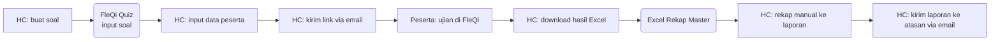

## Flow SESUDAH — HC Portal (4 Step, 1 Portal)

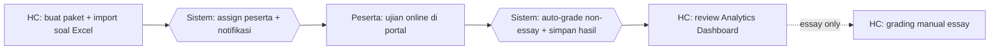

## Tabel Komparasi Step

| Aspek | Sebelum | Sesudah | Improvement |
|-------|---------|---------|-------------|
| Jumlah step HC | 6 step | 2 step (3 bila essay) | **-50% s.d. -67%** |
| Tools yang dipakai | FleQi Quiz + Excel + Email + Word | 1 portal | **-75% tools** |
| Waktu rekap hasil (estimasi) | ~2 jam Excel per paket | ~5 menit (otomatis) | **~95%** |
| Real-time monitoring HC | Tidak ada | Ada (SignalR) | kualitatif: visibility baru |
| Audit trail aksi | Tidak ada | Lengkap (audit log) | kualitatif: compliance |
| Auto-grading | Manual | Otomatis non-essay | kualitatif: akurasi 100% |

## Issue yang Diselesaikan

Mapping ke `pendukung/tabel-issue-resolved.md`: **A** (tools terfragmentasi), **B** (no SSoT), **C** (no audit), **D** (reporting ad-hoc).

## Benefit

**Kuantitatif (estimasi):**
- Step HC: -50% s.d. -67%
- Tools: 4 → 1 portal (-75%)
- Waktu rekap: ~95%

**Kualitatif:**
- Single source of truth hasil assessment
- Audit trail siapa buat paket, siapa assign, kapan submit
- Visibility manajemen via Analytics Dashboard
- Auto-grading eliminasi human error non-essay
````

- [ ] **Step 2: Verify + Commit**

```bash
git add docs/pcp-HCPortal-2026/3.4-solusi-terpilih/flow-proses/01-assessment.md
git commit -m "docs(pcp-3.4-v2): wave5/01 — flow Assessment Online before/after + komparasi"
```

---

### Task 9: 02-proton-coaching.md

**Files:** Create `docs/pcp-HCPortal-2026/3.4-solusi-terpilih/flow-proses/02-proton-coaching.md`

- [ ] **Step 1: Tulis file**

Isi:

````markdown
# Process Flow — PROTON Coaching

## Konteks (Eksekutif)

PROTON = metodologi coaching 5 fase (Purpose, Realita, Options, To-do, Outcome & Next-step). Sebelum HC Portal, sesi dicatat di form cetak, bukti via WhatsApp/email, progress di-track manual. HC Portal menyediakan form digital 5 fase + upload evidence + auto-link deliverable IDP + workflow approval terstruktur.

## Flow SEBELUM — Paperwork + Channel Manual (9 Step, 4 Tools)

```mermaid
flowchart LR
    HC0[HC: assign coachee-coach via email] --> CO1[Coach: jadwalkan sesi]
    CO1 --> CO2[Coach: print form PROTON]
    CO2 --> FORM(Form PROTON cetak)
    FORM --> CO3[Coach: isi 5 fase manual]
    CO3 --> CO4[Coach: foto bukti / upload WhatsApp]
    CO4 --> WA(WhatsApp / Email)
    WA --> CO5[Coach: simpan form di map fisik]
    CO5 --> ARSIP(Arsip fisik)
    ARSIP --> HC1[HC: track progress manual via WA]
    HC1 --> AT1[Atasan: approval lisan / WA]
```

## Flow SESUDAH — HC Portal (5 Step, 1 Portal)

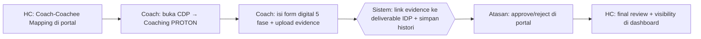

## Tabel Komparasi Step

| Aspek | Sebelum | Sesudah | Improvement |
|-------|---------|---------|-------------|
| Jumlah step Coach | 5 step | 2 step | **-60%** |
| Tools | Form cetak + WA + Email + Arsip | 1 portal | **-75%** |
| Bukti coaching | File terserak | Tersimpan + linked deliverable | kualitatif: traceable |
| Workflow approval | Lisan/WA, no trail | Coach→Atasan→HC + status history | kualitatif: governance |
| Histori sesi | Tidak terstruktur (map fisik) | Timeline digital | kualitatif: longitudinal |
| Waktu rekap HC | ~3 jam/bulan/coach | ~10 menit (dashboard) | **~95%** |

## Issue yang Diselesaikan

Mapping ke `pendukung/tabel-issue-resolved.md`: **A**, **C**, **E**.

## Benefit

**Kuantitatif:**
- Step Coach: -60%
- Tools: 4 → 1 portal (-75%)
- Waktu rekap HC: ~95%
- Histori coaching: 0 → 100% terlacak

**Kualitatif:**
- SSoT sesi PROTON + evidence
- Auto-link evidence ke deliverable IDP
- Workflow approval bertingkat terdokumentasi
- Eliminasi risiko form fisik hilang
- Real-time visibility Atasan & HC
````

- [ ] **Step 2: Verify + Commit**

```bash
git add docs/pcp-HCPortal-2026/3.4-solusi-terpilih/flow-proses/02-proton-coaching.md
git commit -m "docs(pcp-3.4-v2): wave5/02 — flow PROTON Coaching before/after + komparasi"
```

---

### Task 10: 03-idp-plan.md

**Files:** Create `docs/pcp-HCPortal-2026/3.4-solusi-terpilih/flow-proses/03-idp-plan.md`

- [ ] **Step 1: Tulis file**

Isi:

````markdown
# Process Flow — IDP / Plan

## Konteks (Eksekutif)

Individual Development Plan (IDP) = rencana pengembangan kompetensi per coachee (struktur Track → Kompetensi → Sub-Kompetensi → Deliverable). Sebelum HC Portal, IDP disusun di Excel template, didistribusi via email, progress di-track manual. HC Portal: HC upload silabus Excel sekali, IDP langsung tampil di Plan IDP coachee dengan progress auto-update.

## Flow SEBELUM — Excel + Email (7 Step, 3 Tools)

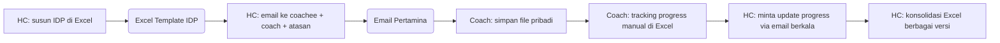

## Flow SESUDAH — HC Portal (3 Step, 1 Portal)

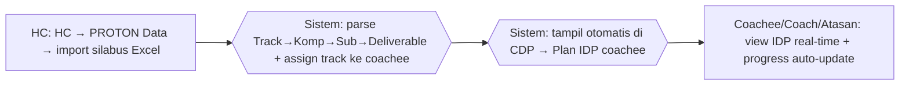

## Tabel Komparasi Step

| Aspek | Sebelum | Sesudah | Improvement |
|-------|---------|---------|-------------|
| Step HC distribusi | 4 step | 1 step (import sekali) | **-75%** |
| Tools | Excel + Email + arsip | 1 portal | **-67%** |
| Versi file IDP | Banyak versi tersebar | 1 versi terpusat | kualitatif: konsistensi |
| Update struktur IDP | Re-distribusi email | Upload ulang, auto-refleksi | kualitatif: agility |
| Progress tracking | Manual per coach | Auto-update dari deliverable | kualitatif: visibility |
| Waktu konsolidasi | ~4 jam/siklus | ~15 menit | **~94%** |

## Issue yang Diselesaikan

Mapping: **A**, **B**, **E**.

## Benefit

**Kuantitatif:**
- Step distribusi HC: -75%
- Tools: 3 → 1 portal (-67%)
- Waktu konsolidasi: ~94%
- 100% coachee lihat IDP versi terkini

**Kualitatif:**
- IDP tunggal sebagai SSoT
- Progress deliverable auto-update dari coaching (no double-entry)
- Konsistensi view lintas role
- Refresh struktur kompetensi instant tanpa email blast
````

- [ ] **Step 2: Verify + Commit**

```bash
git add docs/pcp-HCPortal-2026/3.4-solusi-terpilih/flow-proses/03-idp-plan.md
git commit -m "docs(pcp-3.4-v2): wave5/03 — flow IDP / Plan before/after + komparasi"
```

---

### Task 11: 04-kkj-matriks.md

**Files:** Create `docs/pcp-HCPortal-2026/3.4-solusi-terpilih/flow-proses/04-kkj-matriks.md`

- [ ] **Step 1: Tulis file**

Isi:

````markdown
# Process Flow — KKJ & Matriks Kompetensi

## Konteks (Eksekutif)

Kebutuhan Kompetensi Jabatan (KKJ) = dokumen referensi standar kompetensi per jabatan. Sebelum HC Portal, file KKJ di share folder tanpa versioning, matriks bagian disusun manual per request. HC Portal: upload terpusat + history versi otomatis + KKJ Matrix digital per bagian.

## Flow SEBELUM — Share Folder + Manual (6 Step, 3 Tools)

```mermaid
flowchart LR
    HC1[HC: update KKJ di Excel] --> EX1(Excel KKJ Master)
    EX1 --> HC2[HC: simpan ke share folder]
    HC2 --> SF1(Share Folder)
    SF1 --> HC3[HC: email link ke atasan terkait]
    HC3 --> EMAIL(Email Pertamina)
    EMAIL --> AT1[Atasan: download Excel KKJ]
    AT1 --> AT2[Atasan: minta matriks bagian via email ke HC]
    AT2 --> HC4[HC: susun matriks manual di Excel]
```

## Flow SESUDAH — HC Portal (3 Step, 1 Portal)

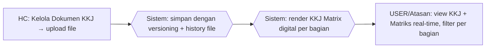

## Tabel Komparasi Step

| Aspek | Sebelum | Sesudah | Improvement |
|-------|---------|---------|-------------|
| Step HC | 4 step | 1 step (upload) | **-75%** |
| Tools | Excel + Share Folder + Email | 1 portal | **-67%** |
| Versioning | Manual (rename file) | Otomatis (timestamp + GUID) | kualitatif: traceable |
| Matriks kompetensi | On-demand manual | Real-time digital | kualitatif: instant |
| Akses Atasan | Bergantung email | Self-service | kualitatif: empowerment |
| Waktu susun matriks | ~3 jam/request | real-time | **~99%** |

## Issue yang Diselesaikan

Mapping: **A**, **B**, **D**.

## Benefit

**Kuantitatif:**
- Step HC: -75%
- Tools: 3 → 1 portal (-67%)
- Waktu susun matriks: ~99%
- Versioning otomatis: 0 → 100%

**Kualitatif:**
- History versi KKJ tersimpan otomatis
- Atasan self-service matriks kompetensi
- SSoT (tidak ada lagi `KKJ_v3_final_REAL.xlsx`)
- Visibility gap kompetensi via KKJ Matrix
````

- [ ] **Step 2: Verify + Commit**

```bash
git add docs/pcp-HCPortal-2026/3.4-solusi-terpilih/flow-proses/04-kkj-matriks.md
git commit -m "docs(pcp-3.4-v2): wave5/04 — flow KKJ & Matriks before/after + komparasi"
```

---

### Task 12: 05-sertifikat-renewal.md

**Files:** Create `docs/pcp-HCPortal-2026/3.4-solusi-terpilih/flow-proses/05-sertifikat-renewal.md`

- [ ] **Step 1: Tulis file**

Isi:

````markdown
# Process Flow — Sertifikat & Renewal

## Konteks (Eksekutif)

Sertifikat kompetensi (hasil assessment) + sertifikat training (Safety, SUPREME, ERP, Confined Space) punya expired yang harus di-track. Sebelum HC Portal, sertifikat dibuat manual di Word/PDF tanpa tracking expired terstruktur, sering kelewat. HC Portal: auto-generate dari hasil assessment + badge expiry + menu Renewal Certificate.

## Flow SEBELUM — Manual + Reaktif (7 Step, 3 Tools)

```mermaid
flowchart LR
    HC1[HC: buat sertifikat di Word] --> WORD(Template Word/PDF)
    WORD --> HC2[HC: print + tanda tangan basah]
    HC2 --> HC3[HC: serah ke pekerja]
    HC3 --> P1[Pekerja: simpan hardcopy]
    P1 --> HC4[HC: catat expiry di Excel master]
    HC4 --> EX1(Excel Master Sertifikat)
    EX1 --> HC5[HC: cek manual setiap bulan / saat audit]
    HC5 --> HC6[HC: koordinasi training renewal via email]
```

## Flow SESUDAH — HC Portal (4 Step, 1 Portal)

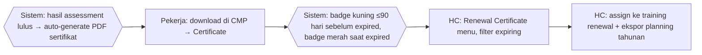

## Tabel Komparasi Step

| Aspek | Sebelum | Sesudah | Improvement |
|-------|---------|---------|-------------|
| Step HC | 6 step | 2 step (auto + plan) | **-67%** |
| Tools | Word + Excel + Email + Hardcopy | 1 portal | **-75%** |
| Generasi sertifikat | Manual per pekerja | Otomatis dari assessment | kualitatif: skalabel |
| Tracking expired | Manual Excel, reaktif | Badge otomatis (kuning/merah) | kualitatif: proaktif |
| Renewal planning | Reaktif | Menu Renewal + filter expiring | kualitatif: compliance |
| Waktu generate (estimasi) | ~10 menit/pekerja | instant | **~99%** |

## Issue yang Diselesaikan

Mapping: **A**, **C**, **F**.

## Benefit

**Kuantitatif:**
- Step HC: -67%
- Tools: 4 → 1 portal (-75%)
- Waktu generate per sertifikat: ~99%
- 100% sertifikat ter-track expiry

**Kualitatif:**
- Auto-generate eliminasi typo / format inkonsisten
- Badge visual early warning
- Renewal planning training tahunan terstruktur
- Audit-ready: sertifikat punya referensi assessment/training source
- Compliance posture: reaktif → proaktif
````

- [ ] **Step 2: Verify + Commit**

```bash
git add docs/pcp-HCPortal-2026/3.4-solusi-terpilih/flow-proses/05-sertifikat-renewal.md
git commit -m "docs(pcp-3.4-v2): wave5/05 — flow Sertifikat & Renewal before/after + komparasi"
```

---

### Task 13: 06-reporting-analytics.md

**Files:** Create `docs/pcp-HCPortal-2026/3.4-solusi-terpilih/flow-proses/06-reporting-analytics.md`

- [ ] **Step 1: Tulis file**

Isi:

````markdown
# Process Flow — Reporting & Analytics

## Konteks (Eksekutif)

Reporting kompetensi HC ke manajemen = heatmap gap kompetensi, progress assessment per bagian, coaching completion, training adoption. Sebelum HC Portal, tiap permintaan = HC pivot Excel ad-hoc dari beberapa file master. HC Portal: Analytics Dashboard real-time + filter periode/bagian + export Excel/PDF on-demand.

## Flow SEBELUM — Pivot Manual (6 Step, 2 Tools)

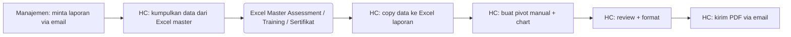

## Flow SESUDAH — HC Portal (2 Step, 1 Portal)

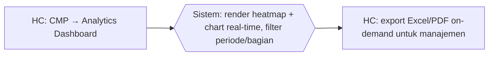

## Tabel Komparasi Step

| Aspek | Sebelum | Sesudah | Improvement |
|-------|---------|---------|-------------|
| Step HC | 5 step | 2 step | **-60%** |
| Tools | Excel master + Excel laporan + Email | 1 portal | **-67%** |
| Data freshness | Snapshot saat dibuat | Real-time | kualitatif: timeliness |
| Self-service manajemen | Tidak | Ya (dashboard role-based) | kualitatif: empowerment |
| Konsistensi metric | Bergantung formula HC | Standar di dashboard | kualitatif: trust |
| Waktu per laporan | ~4 jam | ~10 menit | **~96%** |

## Issue yang Diselesaikan

Mapping: **B**, **D**.

## Benefit

**Kuantitatif:**
- Step HC: -60%
- Tools: 3 → 1 portal (-67%)
- Waktu per laporan: ~96%
- Data: snapshot → real-time

**Kualitatif:**
- Manajemen self-service — HC fokus ke analisis
- Metric standar, no formula inkonsisten
- Heatmap gap kompetensi per bagian
- Export Excel/PDF tetap tersedia
- Auditable: chart dari DB, bukan pivot Excel
````

- [ ] **Step 2: Verify + Commit**

```bash
git add docs/pcp-HCPortal-2026/3.4-solusi-terpilih/flow-proses/06-reporting-analytics.md
git commit -m "docs(pcp-3.4-v2): wave5/06 — flow Reporting / Analytics before/after + komparasi"
```

---

### Task 14: 07-data-pekerja.md

**Files:** Create `docs/pcp-HCPortal-2026/3.4-solusi-terpilih/flow-proses/07-data-pekerja.md`

- [ ] **Step 1: Tulis file**

Isi:

````markdown
# Process Flow — Pengelolaan Data Pekerja

## Konteks (Eksekutif)

Data pekerja CSU Process (NIP, nama, jabatan, bagian, role) = fondasi seluruh modul. Sebelum HC Portal, data tersebar di beberapa Excel master per fungsi dengan update manual yang sering tidak sinkron. HC Portal: data terpusat di 1 DB + import Excel + form CRUD + role-based + audit log.

## Flow SEBELUM — Excel Scattered (8 Step, 2 Tools)

```mermaid
flowchart LR
    HC1[HC: data pekerja baru dari fungsi terkait via email] --> EMAIL(Email Pertamina)
    EMAIL --> HC2[HC: input ke Excel Master Pekerja]
    HC2 --> EX1(Excel Master Pekerja)
    EX1 --> HC3[HC: copy data ke Excel Assessment]
    HC3 --> EX2(Excel Master Assessment)
    EX2 --> HC4[HC: copy data ke Excel Training]
    HC4 --> EX3(Excel Master Training)
    EX3 --> HC5[HC: copy data ke Excel Sertifikat]
    HC5 --> EX4(Excel Master Sertifikat)
    EX4 --> HC6[HC: update bila ada mutasi jabatan/role di seluruh file]
```

## Flow SESUDAH — HC Portal (3 Step, 1 Portal)

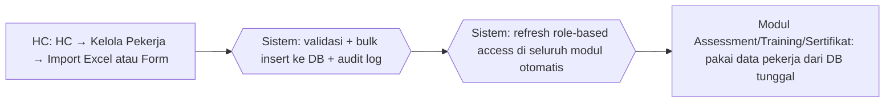

## Tabel Komparasi Step

| Aspek | Sebelum | Sesudah | Improvement |
|-------|---------|---------|-------------|
| Step HC (pekerja baru) | 6 step (input + 4 copy + maintain) | 1 step (sekali) | **-83%** |
| Tools | 4 Excel master + Email | 1 portal | **-80%** |
| Risiko data mismatch | Tinggi (4 Excel) | Nol (1 DB) | kualitatif: integritas |
| Update mutasi/role | Manual di 4 Excel | Otomatis seluruh modul | kualitatif: konsistensi |
| Audit perubahan | Tidak ada | Audit log lengkap | kualitatif: governance |
| Import massal | Copy-paste | Import Excel + preview + validasi | kualitatif: bulk |
| Waktu input pekerja baru | ~30 menit (5 file) | ~5 menit (1 form/bulk) | **~83%** |

## Issue yang Diselesaikan

Mapping: **A**, **B**, **C**.

## Benefit

**Kuantitatif:**
- Step input HC: -83%
- Tools: 5 → 1 portal (-80%)
- Waktu input per pekerja: ~83%
- Mismatch antar modul: tinggi → nol

**Kualitatif:**
- SSoT data pekerja = fondasi seluruh modul
- Update mutasi auto-refleksi di assessment/IDP/sertifikat
- Audit log siap audit eksternal
- Bulk insert via Excel + validasi duplikat NIP/email
- Role-based access otomatis aktif
````

- [ ] **Step 2: Verify + Commit**

```bash
git add docs/pcp-HCPortal-2026/3.4-solusi-terpilih/flow-proses/07-data-pekerja.md
git commit -m "docs(pcp-3.4-v2): wave5/07 — flow Data Pekerja before/after + komparasi"
```

---

**🛑 CHECKPOINT Wave 5**

7 flow proses selesai. Lanjut Wave 6 — Master HTML viewer.

---

## Wave 6 — Master HTML Viewer

### Task 15: index.html (consolidated viewer)

**Files:**
- Create: `docs/pcp-HCPortal-2026/3.4-solusi-terpilih/index.html`

- [ ] **Step 1: Tulis file**

Isi (HTML standalone dengan sidebar nav + Mermaid CDN + link ke 2 versi Gambar Teknik HTML):

```html
<!DOCTYPE html>
<html lang="id">
<head>
<meta charset="UTF-8" />
<meta name="viewport" content="width=device-width, initial-scale=1.0" />
<title>PCP §3.4 v2 — Master Viewer</title>
<script src="https://cdn.jsdelivr.net/npm/mermaid@10/dist/mermaid.min.js"></script>
<style>
  :root {
    --pertamina-red: #C8102E;
    --pertamina-blue: #00558C;
    --pertamina-green: #00A551;
    --bg: #f6f7fb;
    --card: #ffffff;
    --text: #1f2937;
    --muted: #6b7280;
    --border: #e5e7eb;
  }
  * { box-sizing: border-box; }
  body { margin: 0; font-family: -apple-system, BlinkMacSystemFont, "Segoe UI", Roboto, sans-serif; color: var(--text); background: var(--bg); line-height: 1.6; }
  .app { display: grid; grid-template-columns: 280px 1fr; min-height: 100vh; }
  .sidebar { background: linear-gradient(180deg, var(--pertamina-blue), #003D63); color: #fff; padding: 1.5rem 1rem; position: sticky; top: 0; height: 100vh; overflow-y: auto; }
  .sidebar h1 { font-size: 1.1rem; margin: 0 0 .25rem; line-height: 1.3; }
  .sidebar .subtitle { font-size: .8rem; opacity: .8; margin-bottom: 1.5rem; }
  .sidebar nav ul { list-style: none; padding: 0; margin: 0; }
  .sidebar nav li { margin-bottom: .25rem; }
  .sidebar nav a { color: #fff; text-decoration: none; display: block; padding: .5rem .75rem; border-radius: .35rem; font-size: .9rem; transition: background .15s; }
  .sidebar nav a:hover { background: rgba(255,255,255,.1); }
  .sidebar nav a.active { background: rgba(255,255,255,.18); font-weight: 600; }
  .sidebar .group-label { font-size: .7rem; text-transform: uppercase; letter-spacing: .08em; opacity: .7; margin: 1.25rem 0 .5rem .75rem; }
  main { padding: 2rem 3rem; max-width: 1100px; }
  section.doc { background: var(--card); border: 1px solid var(--border); border-radius: .75rem; padding: 2rem; margin-bottom: 2rem; box-shadow: 0 1px 3px rgba(0,0,0,.06); scroll-margin-top: 1rem; }
  section.doc h2 { margin: 0 0 .25rem; color: var(--pertamina-blue); border-bottom: 3px solid var(--pertamina-red); padding-bottom: .5rem; display: inline-block; }
  section.doc h3 { margin: 1.5rem 0 .5rem; color: var(--text); font-size: 1.1rem; }
  section.doc table { width: 100%; border-collapse: collapse; margin: 1rem 0; font-size: .9rem; }
  section.doc thead th { background: var(--pertamina-blue); color: #fff; text-align: left; padding: .55rem .75rem; }
  section.doc tbody td { padding: .5rem .75rem; border: 1px solid var(--border); vertical-align: top; }
  section.doc tbody tr:nth-child(even) td { background: #fafbfc; }
  .mermaid { background: #fff; border: 1px dashed var(--border); border-radius: .5rem; padding: 1rem; margin: 1rem 0; overflow-x: auto; text-align: center; }
  .gt-card { background: linear-gradient(135deg, var(--pertamina-blue), var(--pertamina-green)); color: white; padding: 1.5rem; border-radius: .75rem; margin: 1rem 0; }
  .gt-card a { color: white; text-decoration: underline; font-weight: 700; }
  .gt-card a:hover { opacity: .85; }
  blockquote { border-left: 4px solid var(--pertamina-blue); background: #f0f7fc; padding: .65rem 1rem; margin: 1rem 0; border-radius: 0 .35rem .35rem 0; }
</style>
</head>
<body>
<div class="app">
<aside class="sidebar">
  <h1>PCP §3.4 v2<br/>HC Portal</h1>
  <div class="subtitle">Master Viewer</div>
  <nav>
    <div class="group-label">Pendahuluan</div>
    <ul>
      <li><a href="#readme">📖 Executive Summary</a></li>
      <li><a href="#konvensi">🔖 Legend & Konvensi</a></li>
    </ul>
    <div class="group-label">Gambar Teknik (Utama)</div>
    <ul>
      <li><a href="gambar-teknik/versi-a-layered-aktor.html" target="_blank">🏛️ Versi A — Layered Aktor ↗</a></li>
      <li><a href="gambar-teknik/versi-b-c4-context.html" target="_blank">📡 Versi B — C4 Context ↗</a></li>
      <li><a href="#komparasi">📋 Tabel Komparasi</a></li>
    </ul>
    <div class="group-label">Flow Proses (Lampiran)</div>
    <ul>
      <li><a href="#flow-01">📝 01 Assessment</a></li>
      <li><a href="#flow-02">🎯 02 PROTON</a></li>
      <li><a href="#flow-03">📋 03 IDP</a></li>
      <li><a href="#flow-04">📊 04 KKJ</a></li>
      <li><a href="#flow-05">🏆 05 Sertifikat</a></li>
      <li><a href="#flow-06">📈 06 Reporting</a></li>
      <li><a href="#flow-07">👥 07 Data Pekerja</a></li>
    </ul>
    <div class="group-label">Pendukung</div>
    <ul>
      <li><a href="#issue">🛠️ Tabel Issue A-F</a></li>
    </ul>
  </nav>
</aside>

<main>
  <section class="doc" id="readme">
    <h2>📖 Executive Summary</h2>
    <blockquote>
      <strong>Audience:</strong> Reviewer PCP, manajemen HC, tim implementasi.<br/>
      <strong>Domain:</strong> HC Portal (PortalHC_KPB) — web app pengelolaan kompetensi CSU Process KPB.
    </blockquote>
    <p>HC Portal menggantikan workflow manual berbasis Excel + FleQi + paperwork + email/WhatsApp dengan single web portal terintegrasi. Hasilnya: pengurangan jumlah tools, jumlah step proses, dan waktu rekap; ditambah audit trail, single source of truth, dan governance compliance.</p>

    <h3>Cakupan §3.4</h3>
    <p>2 jenis valid dari 4 pilihan §3.4 ("Design / Gambar Teknik / Flow Proses / Formula"):</p>
    <ol>
      <li><strong>Gambar Teknik</strong> (utama) — diagram landscape Sebelum vs Sesudah, 2 versi style</li>
      <li><strong>Flow Proses</strong> (lampiran) — swimlane workflow per 7 fitur impactful</li>
    </ol>

    <h3>2 Versi Gambar Teknik</h3>
    <div class="gt-card">
      <h4 style="margin:0 0 .5rem">🏛️ Versi A — Layered Aktor</h4>
      <p style="margin:0 0 .5rem">5 layer vertikal per peran (Manajemen → HC → Atasan → Coach → Pekerja). Hub HC Portal di tengah. Mirip slide PCP referensi.</p>
      <a href="gambar-teknik/versi-a-layered-aktor.html" target="_blank">Buka Versi A →</a>
    </div>
    <div class="gt-card">
      <h4 style="margin:0 0 .5rem">📡 Versi B — C4 System Context</h4>
      <p style="margin:0 0 .5rem">Hub-and-spoke. HC Portal di tengah, 4 aktor mengelilingi. Standar Simon Brown C4 Model.</p>
      <a href="gambar-teknik/versi-b-c4-context.html" target="_blank">Buka Versi B →</a>
    </div>
  </section>

  <section class="doc" id="konvensi">
    <h2>🔖 Legend & Konvensi</h2>
    <p>Detail di <code>pendukung/legend-konvensi.md</code></p>
    <h3>Aktor (singkat)</h3>
    <table>
      <thead><tr><th>Kode</th><th>Nama</th></tr></thead>
      <tbody>
        <tr><td><code>MANAJEMEN</code></td><td>Direktur / VP</td></tr>
        <tr><td><code>HC</code></td><td>Human Capital</td></tr>
        <tr><td><code>ATASAN</code></td><td>Sr Spv / Section Head / Manager</td></tr>
        <tr><td><code>COACH</code></td><td>Pendamping coachee</td></tr>
        <tr><td><code>COACHEE</code></td><td>Program pengembangan</td></tr>
        <tr><td><code>USER</code></td><td>Pekerja umum</td></tr>
        <tr><td><code>SISTEM</code></td><td>HC Portal (otomatis)</td></tr>
      </tbody>
    </table>
  </section>

  <section class="doc" id="komparasi">
    <h2>📋 Tabel Komparasi Master</h2>
    <p>Detail di <code>gambar-teknik/tabel-komparasi.md</code></p>
    <h3>Per Fitur</h3>
    <table>
      <thead><tr><th>#</th><th>Fitur</th><th>Δ Step</th><th>Δ Tools</th><th>Δ Waktu</th></tr></thead>
      <tbody>
        <tr><td>01</td><td>Assessment Online</td><td><strong>-67%</strong></td><td><strong>-75%</strong></td><td><strong>~95%</strong></td></tr>
        <tr><td>02</td><td>PROTON Coaching</td><td><strong>-60%</strong></td><td><strong>-75%</strong></td><td><strong>~95%</strong></td></tr>
        <tr><td>03</td><td>IDP / Plan</td><td><strong>-75%</strong></td><td><strong>-67%</strong></td><td><strong>~94%</strong></td></tr>
        <tr><td>04</td><td>KKJ & Matriks</td><td><strong>-75%</strong></td><td><strong>-67%</strong></td><td><strong>~99%</strong></td></tr>
        <tr><td>05</td><td>Sertifikat & Renewal</td><td><strong>-67%</strong></td><td><strong>-75%</strong></td><td><strong>~99%</strong></td></tr>
        <tr><td>06</td><td>Reporting / Analytics</td><td><strong>-60%</strong></td><td><strong>-67%</strong></td><td><strong>~96%</strong></td></tr>
        <tr><td>07</td><td>Data Pekerja</td><td><strong>-83%</strong></td><td><strong>-80%</strong></td><td><strong>~83%</strong></td></tr>
      </tbody>
    </table>
  </section>

  <!-- Flow Proses sections placeholder — diisi via include manual atau referensi link -->
  <section class="doc" id="flow-01">
    <h2>📝 01 — Assessment Online</h2>
    <p>Detail: <a href="flow-proses/01-assessment.md" target="_blank">flow-proses/01-assessment.md</a></p>
    <h3>Flow SEBELUM</h3>
    <pre class="mermaid">
flowchart LR
    HC1[HC: buat soal] --> FQ1(FleQi Quiz)
    FQ1 --> HC2[HC: input peserta]
    HC2 --> HC3[HC: kirim email]
    HC3 --> P1[Peserta: ujian]
    P1 --> HC4[HC: download Excel]
    HC4 --> EX1(Excel Rekap)
    EX1 --> HC5[HC: rekap laporan]
    HC5 --> HC6[HC: kirim email]
    </pre>
    <h3>Flow SESUDAH</h3>
    <pre class="mermaid">
flowchart LR
    HC1[HC: buat paket + import soal] --> SYS1{{Sistem: assign + notifikasi}}
    SYS1 --> P1[Peserta: ujian online]
    P1 --> SYS2{{Sistem: auto-grade + simpan}}
    SYS2 --> HC2[HC: Analytics Dashboard]
    </pre>
  </section>

  <section class="doc" id="flow-02">
    <h2>🎯 02 — PROTON Coaching</h2>
    <p>Detail: <a href="flow-proses/02-proton-coaching.md" target="_blank">flow-proses/02-proton-coaching.md</a></p>
    <h3>Flow SEBELUM</h3>
    <pre class="mermaid">
flowchart LR
    HC0[HC: assign via email] --> CO1[Coach: jadwalkan]
    CO1 --> CO2[Coach: print form]
    CO2 --> FORM(Form PROTON cetak)
    FORM --> CO3[Coach: isi 5 fase]
    CO3 --> CO4[Coach: foto bukti WA]
    CO4 --> WA(WhatsApp / Email)
    WA --> CO5[Coach: arsip fisik]
    CO5 --> HC1[HC: track via WA]
    HC1 --> AT1[Atasan: approval lisan]
    </pre>
    <h3>Flow SESUDAH</h3>
    <pre class="mermaid">
flowchart LR
    HC0[HC: Coach-Coachee Mapping] --> CO1[Coach: form digital 5 fase]
    CO1 --> CO2[Coach: upload evidence]
    CO2 --> SYS1{{Sistem: link evidence + histori}}
    SYS1 --> AT1[Atasan: approve/reject portal]
    AT1 --> HC1[HC: final review dashboard]
    </pre>
  </section>

  <section class="doc" id="flow-03">
    <h2>📋 03 — IDP / Plan</h2>
    <p>Detail: <a href="flow-proses/03-idp-plan.md" target="_blank">flow-proses/03-idp-plan.md</a></p>
    <h3>Flow SEBELUM</h3>
    <pre class="mermaid">
flowchart LR
    HC1[HC: susun IDP Excel] --> EX1(Excel Template IDP)
    EX1 --> HC2[HC: email distribusi]
    HC2 --> CO1[Coach: simpan pribadi]
    CO1 --> CO2[Coach: tracking manual Excel]
    CO2 --> HC3[HC: minta update email]
    HC3 --> HC4[HC: konsolidasi versi]
    </pre>
    <h3>Flow SESUDAH</h3>
    <pre class="mermaid">
flowchart LR
    HC1[HC: PROTON Data import silabus] --> SYS1{{Sistem: parse Track-Komp-Sub-Deliv}}
    SYS1 --> SYS2{{Sistem: tampil di Plan IDP coachee}}
    SYS2 --> VIEW[Coachee/Coach/Atasan: view real-time]
    </pre>
  </section>

  <section class="doc" id="flow-04">
    <h2>📊 04 — KKJ & Matriks</h2>
    <p>Detail: <a href="flow-proses/04-kkj-matriks.md" target="_blank">flow-proses/04-kkj-matriks.md</a></p>
    <h3>Flow SEBELUM</h3>
    <pre class="mermaid">
flowchart LR
    HC1[HC: update KKJ Excel] --> EX1(Excel KKJ Master)
    EX1 --> HC2[HC: simpan share folder]
    HC2 --> SF1(Share Folder)
    SF1 --> HC3[HC: email link]
    HC3 --> AT1[Atasan: download Excel]
    AT1 --> AT2[Atasan: minta matriks via email]
    AT2 --> HC4[HC: susun matriks manual]
    </pre>
    <h3>Flow SESUDAH</h3>
    <pre class="mermaid">
flowchart LR
    HC1[HC: upload Dokumen KKJ] --> SYS1{{Sistem: simpan + versioning + history}}
    SYS1 --> SYS2{{Sistem: render KKJ Matrix digital}}
    SYS2 --> VIEW[USER/Atasan: view real-time filter bagian]
    </pre>
  </section>

  <section class="doc" id="flow-05">
    <h2>🏆 05 — Sertifikat & Renewal</h2>
    <p>Detail: <a href="flow-proses/05-sertifikat-renewal.md" target="_blank">flow-proses/05-sertifikat-renewal.md</a></p>
    <h3>Flow SEBELUM</h3>
    <pre class="mermaid">
flowchart LR
    HC1[HC: buat sertifikat Word] --> WORD(Template Word/PDF)
    WORD --> HC2[HC: print + ttd basah]
    HC2 --> HC3[HC: serah ke pekerja]
    HC3 --> P1[Pekerja: simpan hardcopy]
    P1 --> HC4[HC: catat expiry Excel]
    HC4 --> HC5[HC: cek bulanan/audit]
    HC5 --> HC6[HC: koordinasi renewal email]
    </pre>
    <h3>Flow SESUDAH</h3>
    <pre class="mermaid">
flowchart LR
    SYS1{{Sistem: auto-generate PDF lulus assessment}} --> P1[Pekerja: download Certificate]
    P1 --> SYS2{{Sistem: badge kuning/merah expiry}}
    SYS2 --> HC1[HC: Renewal Certificate filter]
    HC1 --> HC2[HC: assign training + export planning]
    </pre>
  </section>

  <section class="doc" id="flow-06">
    <h2>📈 06 — Reporting & Analytics</h2>
    <p>Detail: <a href="flow-proses/06-reporting-analytics.md" target="_blank">flow-proses/06-reporting-analytics.md</a></p>
    <h3>Flow SEBELUM</h3>
    <pre class="mermaid">
flowchart LR
    MGR1[Manajemen: minta laporan email] --> HC1[HC: kumpul data Excel]
    HC1 --> EX1(Excel Master)
    EX1 --> HC2[HC: copy ke Excel laporan]
    HC2 --> HC3[HC: pivot + chart manual]
    HC3 --> HC4[HC: review + format]
    HC4 --> HC5[HC: kirim PDF email]
    </pre>
    <h3>Flow SESUDAH</h3>
    <pre class="mermaid">
flowchart LR
    HC1[HC: Analytics Dashboard] --> SYS1{{Sistem: heatmap + chart real-time}}
    SYS1 --> HC2[HC: export Excel/PDF on-demand]
    </pre>
  </section>

  <section class="doc" id="flow-07">
    <h2>👥 07 — Data Pekerja</h2>
    <p>Detail: <a href="flow-proses/07-data-pekerja.md" target="_blank">flow-proses/07-data-pekerja.md</a></p>
    <h3>Flow SEBELUM</h3>
    <pre class="mermaid">
flowchart LR
    HC1[HC: data baru via email] --> HC2[HC: input Excel Master Pekerja]
    HC2 --> HC3[HC: copy ke Excel Assessment]
    HC3 --> HC4[HC: copy ke Excel Training]
    HC4 --> HC5[HC: copy ke Excel Sertifikat]
    HC5 --> HC6[HC: update mutasi di 4 file]
    </pre>
    <h3>Flow SESUDAH</h3>
    <pre class="mermaid">
flowchart LR
    HC1[HC: Kelola Pekerja Import/Form] --> SYS1{{Sistem: validasi + bulk insert + audit log}}
    SYS1 --> SYS2{{Sistem: refresh role-based access}}
    SYS2 --> VIEW[Modul A/T/S: pakai DB tunggal]
    </pre>
  </section>

  <section class="doc" id="issue">
    <h2>🛠️ Tabel Issue Resolved</h2>
    <p>Detail: <code>pendukung/tabel-issue-resolved.md</code></p>
    <table>
      <thead><tr><th>Code</th><th>Issue</th><th>Mapping Fitur</th></tr></thead>
      <tbody>
        <tr><td><strong>A</strong></td><td>Tools Terfragmentasi</td><td>01, 02, 03, 04, 05, 07</td></tr>
        <tr><td><strong>B</strong></td><td>No Single Source of Truth</td><td>01, 03, 04, 06, 07</td></tr>
        <tr><td><strong>C</strong></td><td>No Audit Trail</td><td>01, 02, 05, 07</td></tr>
        <tr><td><strong>D</strong></td><td>Reporting Ad-Hoc</td><td>01, 04, 06</td></tr>
        <tr><td><strong>E</strong></td><td>Workflow Tanpa Tracking</td><td>02, 03</td></tr>
        <tr><td><strong>F</strong></td><td>Renewal Sertifikat Reaktif</td><td>05</td></tr>
      </tbody>
    </table>
  </section>

  <footer style="text-align:center; padding:2rem; color:var(--muted); font-size:.85rem;">
    <p>PCP SMART 2026 §3.4 v2 — HC Portal • Master Viewer • Tag <code>pcp-hcportal-3.4-v2.0</code></p>
  </footer>
</main>
</div>

<script>
  mermaid.initialize({
    startOnLoad: true,
    theme: 'default',
    themeVariables: {
      primaryColor: '#00558C',
      primaryTextColor: '#fff',
      primaryBorderColor: '#003D63',
      lineColor: '#6b7280',
      secondaryColor: '#C8102E',
      tertiaryColor: '#f3f4f6'
    },
    flowchart: { curve: 'basis', useMaxWidth: true }
  });
  const links = document.querySelectorAll('.sidebar nav a[href^="#"]');
  const sections = document.querySelectorAll('section.doc');
  function onScroll() {
    let current = '';
    const scrollPos = window.scrollY + 80;
    sections.forEach(s => { if (s.offsetTop <= scrollPos) current = s.id; });
    links.forEach(l => l.classList.toggle('active', l.getAttribute('href') === '#' + current));
  }
  window.addEventListener('scroll', onScroll, { passive: true });
  onScroll();
</script>
</body>
</html>
```

- [ ] **Step 2: Verify**

Buka `index.html` di browser. Konfirmasi:
- Sidebar nav muncul + scroll-spy
- Link ke Versi A & B HTML buka di tab baru
- Mermaid diagram render di flow proses sections
- Tabel komparasi + issue render

- [ ] **Step 3: Commit**

```bash
git add docs/pcp-HCPortal-2026/3.4-solusi-terpilih/index.html
git commit -m "docs(pcp-3.4-v2): wave6/index — master HTML viewer sidebar nav + Mermaid CDN + link 2 versi"
```

---

## Wave 7 — Verifikasi Akhir + Tag

### Task 16: Final Verification

**Files:**
- Verify only (no create)

- [ ] **Step 1: List struktur final**

Run: `find docs/pcp-HCPortal-2026/3.4-solusi-terpilih -type f | sort`

Expected (15 file):
```
docs/pcp-HCPortal-2026/3.4-solusi-terpilih/README.md
docs/pcp-HCPortal-2026/3.4-solusi-terpilih/archive/diagram-landscape-options.html
docs/pcp-HCPortal-2026/3.4-solusi-terpilih/flow-proses/01-assessment.md
docs/pcp-HCPortal-2026/3.4-solusi-terpilih/flow-proses/02-proton-coaching.md
docs/pcp-HCPortal-2026/3.4-solusi-terpilih/flow-proses/03-idp-plan.md
docs/pcp-HCPortal-2026/3.4-solusi-terpilih/flow-proses/04-kkj-matriks.md
docs/pcp-HCPortal-2026/3.4-solusi-terpilih/flow-proses/05-sertifikat-renewal.md
docs/pcp-HCPortal-2026/3.4-solusi-terpilih/flow-proses/06-reporting-analytics.md
docs/pcp-HCPortal-2026/3.4-solusi-terpilih/flow-proses/07-data-pekerja.md
docs/pcp-HCPortal-2026/3.4-solusi-terpilih/gambar-teknik/tabel-komparasi.md
docs/pcp-HCPortal-2026/3.4-solusi-terpilih/gambar-teknik/versi-a-layered-aktor.html
docs/pcp-HCPortal-2026/3.4-solusi-terpilih/gambar-teknik/versi-b-c4-context.html
docs/pcp-HCPortal-2026/3.4-solusi-terpilih/index.html
docs/pcp-HCPortal-2026/3.4-solusi-terpilih/pendukung/legend-konvensi.md
docs/pcp-HCPortal-2026/3.4-solusi-terpilih/pendukung/tabel-issue-resolved.md
```

- [ ] **Step 2: Check placeholder TBD/TODO**

Run via Grep tool: pattern `TBD|TODO|FIXME|XXX` path `docs/pcp-HCPortal-2026/3.4-solusi-terpilih`
Expected: No files found

- [ ] **Step 3: Render check 2 HTML Gambar Teknik**

Buka manual:
- `versi-a-layered-aktor.html` → cek 5 layer Sebelum + 5 layer Sesudah + hub portal
- `versi-b-c4-context.html` → cek 4 aktor + tools scattered (Sebelum) + hub center + lines (Sesudah)

- [ ] **Step 4: Render check 7 Mermaid swimlane**

Buka tiap file `flow-proses/01-07-*.md` di VS Code preview. Konfirmasi 2 diagram (Sebelum + Sesudah) tanpa syntax error.

- [ ] **Step 5: Render check index.html**

Buka `index.html` di browser. Konfirmasi:
- Sidebar nav scroll-spy bekerja
- Link Versi A & B buka di tab baru
- 7 Mermaid diagram render
- Tabel komparasi + issue render

- [ ] **Step 6: Tag v2.0**

```bash
git tag pcp-hcportal-3.4-v2.0
git log --oneline pcp-hcportal-3.4-v2.0 | head -20
```

- [ ] **Step 7: Update memory + notifikasi user**

Update memory entry untuk PCP §3.4 status SHIPPED v2.0.

Inform user:
1. 15 file di `docs/pcp-HCPortal-2026/3.4-solusi-terpilih/`
2. 2 versi Gambar Teknik tersedia (Layered + C4)
3. 7 swimlane flow proses sebagai lampiran
4. Master index.html siap review
5. Tag `pcp-hcportal-3.4-v2.0`
6. v1.0 tag tetap preserved untuk recovery

---

## Acceptance Criteria (Plan-Level)

| Criteria | Pass |
|----------|:----:|
| README.md ada dengan struktur + 2 versi rationale | ☐ |
| Folder `gambar-teknik/` berisi 2 HTML + tabel-komparasi.md | ☐ |
| Versi A render: 5 layer Sebelum + 5 layer Sesudah + hub portal + marker A-F + 1-7 | ☐ |
| Versi B render: 4 aktor + tools scattered Sebelum + hub center Sesudah + SVG lines | ☐ |
| Folder `flow-proses/` berisi 7 file swimlane | ☐ |
| Tiap file flow punya 2 Mermaid (Sebelum + Sesudah) + tabel komparasi + benefit | ☐ |
| Folder `pendukung/` berisi legend + tabel-issue | ☐ |
| index.html consolidated sidebar nav + link 2 versi + 7 Mermaid | ☐ |
| Archive berisi diagram-landscape-options.html | ☐ |
| Tidak ada TBD/TODO | ☐ |
| Bahasa Indonesia full | ☐ |
| Tag `pcp-hcportal-3.4-v2.0` dibuat | ☐ |

---

## Self-Review

**Spec coverage:**
- §3.1 Gambar Teknik 2 versi → Task 5 (Versi A) + Task 6 (Versi B) ✓
- §3.2 Flow Proses 7 swimlane → Task 8-14 ✓
- §3.3 Tabel komparasi → Task 7 ✓
- §3.4 Out of scope (Design, Formula, ArchiMate) → tidak ada task ✓
- §4 Format pipeline → konvensi di README + commit pattern ✓
- §5 Struktur folder → Task 1 setup + tiap task pakai path correct ✓
- §6 Template per file → Task 5-14 ikut template ✓
- §7 Konvensi aktor & notasi → Task 2 (legend) ✓
- §8 Eksekusi wave-based → Wave 1-7 sesuai ✓
- §9 AC → Task 16 verify semua AC ✓
- §10 Risiko & mitigasi → tidak butuh task tambahan (mitigasi di konvensi) ✓

**Placeholder scan:** No TBD/TODO/FIXME.

**Type consistency:** Aktor (MANAJEMEN/HC/ATASAN/COACH/COACHEE/USER/SISTEM) konsisten. Issue code (A-F) konsisten. Improvement number (1-7) konsisten. Path file konsisten dengan struktur folder.

**Issue mapping cross-file:**
- 01 Assessment → A, B, C, D ✓ (match tabel-issue + matriks coverage)
- 02 PROTON → A, C, E ✓
- 03 IDP → A, B, E ✓
- 04 KKJ → A, B, D ✓
- 05 Sertifikat → A, C, F ✓
- 06 Reporting → B, D ✓
- 07 Data Pekerja → A, B, C ✓

Plan ready for execution.
