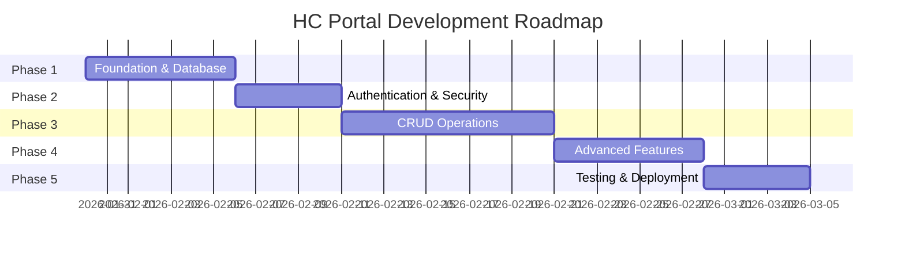
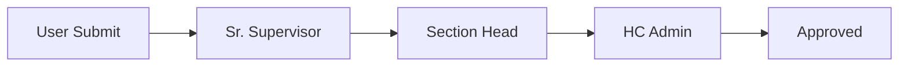

# 🚀 HC Portal - Production Roadmap

> **Dokumen ini berisi roadmap lengkap untuk mengembangkan HC Portal dari Prototype ke Production-Ready.**

---

## 📊 Status Saat Ini

| Komponen | Progress | Status |
|----------|----------|--------|
| Frontend UI | 90% | ✅ Ready |
| Navigation | 100% | ✅ Ready |
| Mock Data | 100% | ⚠️ Perlu diganti |
| Database | 0% | ❌ Belum ada |
| Authentication | 0% | ❌ Simulasi only |
| Authorization | 0% | ❌ Belum ada |

**Estimasi Total: 4-6 minggu untuk Production-Ready**

---

## 🗺️ Roadmap Overview



---

## 📋 PHASE 1: Foundation & Database Setup
**Durasi: ~1 minggu | Prioritas: CRITICAL**

### 1.1 Install NuGet Packages
```xml
<!-- Tambahkan ke HcPortal.csproj -->
<PackageReference Include="Microsoft.EntityFrameworkCore" Version="8.0.0" />
<PackageReference Include="Microsoft.EntityFrameworkCore.SqlServer" Version="8.0.0" />
<PackageReference Include="Microsoft.EntityFrameworkCore.Tools" Version="8.0.0" />
```

### 1.2 Buat Database Context
- [ ] Buat `Data/ApplicationDbContext.cs`
- [ ] Setup connection string di `appsettings.json`

### 1.3 Buat Entity Models
| Model | Tabel | Keterangan |
|-------|-------|------------|
| `User` | `Users` | Data user & credentials |
| `Employee` | `Employees` | Profil karyawan |
| `Competency` | `Competencies` | Master kompetensi |
| `Assessment` | `Assessments` | Record assessment |
| `IdpPlan` | `IdpPlans` | Individual Development Plan |
| `Training` | `Trainings` | Catatan pelatihan |
| `CoachingLog` | `CoachingLogs` | Log coaching |

### 1.4 Database Migration
```bash
dotnet ef migrations add InitialCreate
dotnet ef database update
```

### 1.5 Seed Data
- [ ] Buat `Data/DbSeeder.cs` untuk data awal

---

## 📋 PHASE 2: Authentication & Security
**Durasi: ~5 hari | Prioritas: CRITICAL**

### 2.1 Cookie Authentication
```csharp
// Program.cs
builder.Services.AddAuthentication(CookieAuthenticationDefaults.AuthenticationScheme)
    .AddCookie(options => {
        options.LoginPath = "/Account/Login";
        options.AccessDeniedPath = "/Account/AccessDenied";
        options.ExpireTimeSpan = TimeSpan.FromHours(8);
    });
```

### 2.2 User Roles
| Role | Akses |
|------|-------|
| `Admin` | Full access, manage users |
| `Manager` | Approve assessments, view reports |
| `Supervisor` | Approve team's IDP |
| `Employee` | Self-service portal |

### 2.3 Authorization Policies
- [ ] `[Authorize]` attribute di setiap Controller
- [ ] Role-based authorization
- [ ] Session timeout handling

### 2.4 Password Security
- [ ] Hashing dengan BCrypt atau Identity
- [ ] Password policy (min 8 char, complexity)
- [ ] Forgot password flow

---

## 📋 PHASE 3: CRUD Operations
**Durasi: ~2 minggu | Prioritas: HIGH**

### 3.1 Service Layer Architecture
```
Controllers/
├── CMPController.cs  → Panggil service, bukan hardcode
Services/
├── ICompetencyService.cs
├── CompetencyService.cs
├── IAssessmentService.cs
├── AssessmentService.cs
└── ... (per module)
```

### 3.2 CRUD per Module

#### CMP Module
| Feature | Operations |
|---------|------------|
| KKJ Matrix | Read (View Only) |
| Assessment | Create, Read, Update |
| Capability Records | Create, Read, Update, Delete |

#### CDP Module
| Feature | Operations |
|---------|------------|
| IDP Plan | Create, Read, Update |
| Coaching Log | Create, Read, Update, Delete |
| Progress Tracking | Read, Update |

#### BP Module
| Feature | Operations |
|---------|------------|
| Talent Profile | Read, Update |
| Point System | Read (auto-calculated) |
| Eligibility | Read (auto-calculated) |

### 3.3 Form Validations
- [ ] Client-side validation (JavaScript)
- [ ] Server-side validation (Model annotations)
- [ ] Error handling & user feedback

### 3.4 File Upload
- [ ] Evidence upload untuk Assessment
- [ ] Sertifikat upload untuk Training
- [ ] File storage strategy (local/Azure Blob)

---

## 📋 PHASE 4: Advanced Features
**Durasi: ~1 minggu | Prioritas: MEDIUM**

### 4.1 Approval Workflow


### 4.2 Notification System
| Trigger | Notification |
|---------|--------------|
| Assessment due | Email + In-app |
| IDP deadline | Email + In-app |
| Approval pending | Email |
| Certificate expiring | Email |

### 4.3 Dashboard & Reporting
- [ ] Real-time statistics dari database
- [ ] Export to Excel/PDF
- [ ] Chart.js untuk visualisasi

### 4.4 Audit Trail
- [ ] Log semua create/update/delete
- [ ] Track user yang melakukan perubahan
- [ ] Timestamp setiap aktivitas

---

## 📋 PHASE 5: Testing & Deployment
**Durasi: ~5 hari | Prioritas: HIGH**

### 5.1 Testing
| Type | Tool | Coverage |
|------|------|----------|
| Unit Test | xUnit | Services, Validators |
| Integration | xUnit + TestServer | API endpoints |
| Manual | Browser | UI/UX flows |

### 5.2 Performance Optimization
- [ ] Response caching
- [ ] Database query optimization
- [ ] Bundle & minify CSS/JS

### 5.3 Deployment Options

#### Option A: IIS (On-Premise)
```bash
dotnet publish -c Release -o ./publish
# Deploy ke IIS di server internal
```

#### Option B: Docker
```dockerfile
FROM mcr.microsoft.com/dotnet/aspnet:8.0
WORKDIR /app
COPY publish/ .
ENTRYPOINT ["dotnet", "HcPortal.dll"]
```

#### Option C: Azure App Service
```bash
az webapp up --name hc-portal-kpb --resource-group your-rg
```

### 5.4 Go-Live Checklist
- [ ] SSL Certificate
- [ ] Environment variables untuk production
- [ ] Backup strategy
- [ ] Monitoring & alerting
- [ ] User training documentation

---

## 📅 Timeline Summary

| Phase | Duration | Start → End |
|-------|----------|-------------|
| Phase 1: Database | 7 days | Week 1 |
| Phase 2: Auth | 5 days | Week 2 |
| Phase 3: CRUD | 10 days | Week 2-4 |
| Phase 4: Advanced | 7 days | Week 4-5 |
| Phase 5: Deploy | 5 days | Week 5-6 |
| **TOTAL** | **~34 days** | **~6 weeks** |

---

## 🎯 Quick Wins (Bisa Dikerjakan Segera)

1. **Add Database Context** - Langkah pertama sebelum yang lain
2. **Implement Real Login** - Dengan Cookie Authentication
3. **Convert Mock Data** - Pindahkan hardcoded data ke database
4. **Add [Authorize]** - Protect semua halaman

---

## ❓ Keputusan yang Perlu Ditentukan

> [!IMPORTANT]
> Beberapa keputusan teknis yang perlu Anda tentukan:

1. **Database Engine?**
   - SQL Server (Enterprise standard)
   - PostgreSQL (Free, cross-platform)
   - SQLite (Simple, file-based)

2. **Hosting Environment?**
   - On-premise IIS (Internal server)
   - Azure/Cloud (Scalable, managed)
   - Docker container

3. **Authentication Provider?**
   - Custom login (NIP + Password)
   - Integrasi Active Directory/LDAP
   - SSO dengan Microsoft Entra ID

4. **Scope Phase 1?**
   - Full implementation (semua module)
   - Subset dulu (misal CMP saja)

---

## 💡 Rekomendasi

Untuk **PT Kilang Pertamina Balikpapan**, saya merekomendasikan:

| Item | Rekomendasi | Alasan |
|------|-------------|--------|
| Database | **SQL Server** | Standard enterprise, familiar bagi IT |
| Auth | **Active Directory** | Single sign-on dengan Windows |
| Hosting | **IIS On-Premise** | Data sensitif, internal network |
| Approach | **Phased rollout** | Mulai CMP → CDP → BP |

---

*Roadmap ini dibuat berdasarkan analisis website pada 29 Januari 2026.*
